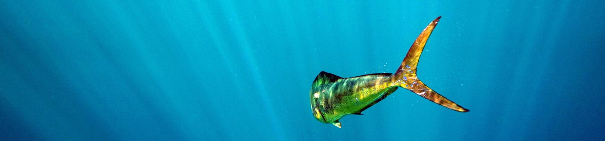
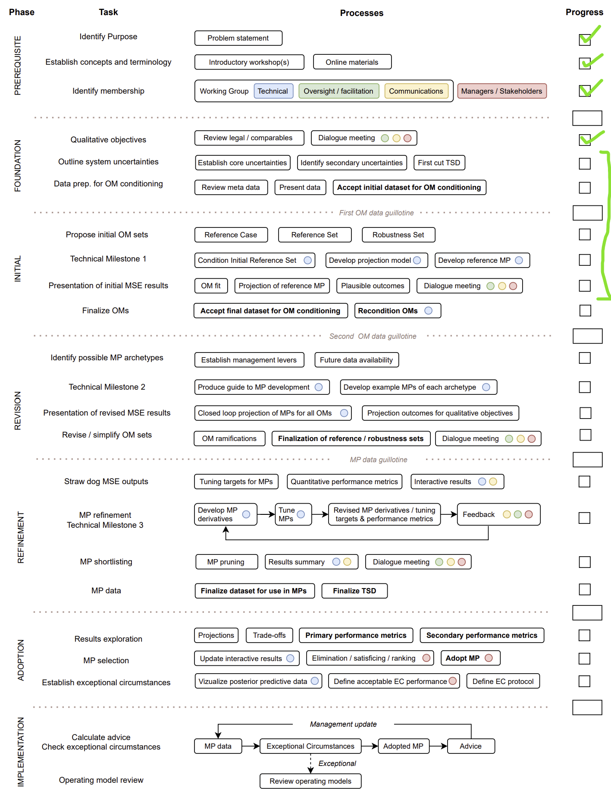

&nbsp;


<style>
  .col2 {
    columns: 2 200px;         /* number of columns and width in pixels*/
    -webkit-columns: 2 200px; /* chrome, safari */
    -moz-columns: 2 200px;    /* firefox */
  }
  .col3 {
    columns: 3 100px;
    -webkit-columns: 3 100px;
    -moz-columns: 3 100px;
  }
  .col4 {
    columns: 4 100px;
    -webkit-columns: 4 100px;
    -moz-columns: 4 100px;
  }
</style>

<style type="text/css">

body{ /* Normal  */
   font-size: 12px;
}
td {  /* Table  */
   font-size: 8px;
}
h1 { /* Header 1 */
 font-size: 18px;
 color: DarkBlue;
}
h2 { /* Header 2 */
 font-size: 15px;
 color: DarkBlue;
}
h3 { /* Header 3 */
 font-size: 14px;
 color: DarkBlue;
}
code.r{ /* Code block */
  font-size: 10px;
}
pre { /* Code block */
  font-size: 10px
}
</style>


***



***

&nbsp;


***

```{r setup, include=FALSE}
library(openMSE)
library(dplyr)
library(kableExtra)
library(readxl)

knitr::opts_chunk$set(echo = FALSE)

maketab <- function(dir,Alab="Statistical Area"){
  filenam = list.files(dir)
  nf = length(filenam)
  DF = data.frame(filenam)
  names(DF) = c("Area")
  #filepath = list.files(dir, full.names = T, include.dirs = T)
  fit.link = paste0('<a href=', file.path(dir, filenam), '> ', DF$Area , ' </a>')
  DF$Area <- fit.link
  DT::datatable(DF, escape=1,
                colnames=c(Alab),
                filter = 'top',
                options = list(
                  pageLength = 10, 
                  autoWidth = TRUE,
                  sDom  = '<"top">lrt<"bottom">ip'))
}


getprojectinfo<-function(page){
  tab=as.data.frame(read_excel("project_Info/Status Assumptions To do.xlsx", sheet = page))
  tab=tab[,2:3]
  tab[is.na(tab)]=""
  kable(tab,"simple")#,col.names=rep("",2)) 
}
  

getprog<-function(page){
  tab=as.data.frame(read_excel("Project_Info/Progress.xlsx", sheet = page))
  tab=tab[,2:3]
  tab[is.na(tab)]=""
  kable(tab,"simple")#,col.names=rep("",2)) 
}
 

```


### Disclaimer

The following work is preliminary and intended only as tool for eliciting feedback on data, modelling and other aspects of this fishery. 

None of these results are final. 

These analyses do not necessarily reflect the point of view of NOAA and in no way anticipate NOAA future policy.

***

### Objective

Develop an MSE framework for the Atlantic Dolphinfish (Mahi Mahi) fishery to test candidate management procedures and inform other management decision making including research prioritization, assessment methodology, specification of fishing regulations and enforcement. 

***

### Project details

Title: 'Lead Analyst for the Dolphin Management Strategy Evaluation Project IAW the Tasks included in the Statement of Work'

```{r ProjDets, eval=T}
dat<-data.frame(c("Term","Funding body","Funding stream","Solicitation No.","Contract No.","Project Partners","Blue Matter Team","NOAA Collaborators"),
                
                 c("June 2024 - May 2025, June 2025 - May 2026",
                   "U.S. National Oceanic and Atmospheric Administration",
                   "Sam.gov",
                   "# 1305M324Q0309, NA",
                   "1305M324P0270, NA",
                   "Blue Matter Science Ltd.",
                   "Tom Carruthers, Adrian Hordyk, Quang Huynh",
                   "Cassidy Peterson, Matt Damiano"))

kable(dat,"simple",col.names=rep("",2)) 

```

***

### Progress

The Prerequisite phase has been completed. MSE framework development is current in the Foundation and Initial phases (Figure 1). Rapid progress is expected towards the Revision phase since much of the supporting meetings, research and analyses have been completed. 



Figure 1. Progress in the MSE roadmap. For more information about the roadmap and the various steps see the [supporting document](supporting/MSE_roadmap_Carruthers.pdf)

### Study area and spatial structure 

Salt =  c("NED", "VBM", "NNC", "NCFL", "FLK", "SAR", "CAR") # map


### Operating model conditioning

Operating models were fitted to annual catch data by fleet ()

Fnames = c("US comm", "MRIP private north", "MRIP private south", "MRIP for-hire north",
           "MRIP for-hire south", "Intl (reported)", "Discards", "Unreported")


[A fit to an OM (lowM) (.html)](reports/OMs/index.html)

see example fit

&nbsp;


### Resources

harvest strategies


#### TSD


### Appendix A. About Management Strategy Evaluation

#### MSE Concepts 

#### MSE schematic

```{r C1, eval=T}

getwd()
 

```


### Operating models 

An operating model is a theoretical description of fishery and population dynamics used for the testing of management strategies that could include, for example,  data collection protocols, stock assessment methods, harvest control rules, enforcement policies and reference points. In fisheries, operating models are used in closed-loop simulation to test management procedures (aka. harvest strategy) accounting for feedbacks between the system, data, management procedure and implementation. A management procedure is any codifable rule that calculates management advice from data. Management Strategy Evaluation uses closed-loop simulation of management procedures as a core technical component but is a wider process of stakeholder and manager engagement that identifies system uncertainties, performance metrics, viable management procedures, ultimately aiming to adopt an MP for the provision of management advice for an established time period. 

&nbsp;

#### Reference Case Operating Models

The reference case operating model is used as the single 'base' operating model from which reference set and robustness set operating models are specified. Reference and robustness tests are typically 1-factor departures from the reference case OM, however sometimes reference set OMs are organized in a factorial grid across primary axes of uncertainty. 

&nbsp;

#### Reference Set Operating Models

Reference set operating models span a plausible range of the core uncertainties for states of nature. These are often the types of alternative parameterizations or assumptions that would be included in a stock assessment sensitivity analysis. 

The role of the reference set operating models is to provide the central basis for evaluating the performance of candidate management procedures, for example rejecting badly performing harvest strategies. 

&nbsp;

#### Robustness Set Operating Models

Robustness set operating models are intended to include additional sources of uncertainty for providing further discrimination among management procedures that perform comparably among reference set operating models. 

Robustness operating models often represent system states of nature that are not empirically informed or are hypotheses of a subset of stakeholders.

&nbsp;

***


#### Operating Model Specification

operating models were constructed assuming that discrete populations occur at the resolution of statistical area (management area). Models were conditioned using the Rapid Conditioning Model (RCM) of openMSE (SAMtool package, Huynh et al. 2023) and fitted to historical catches, standardized catch-per-unit-effort, sub area age composition data, a current estimate of absolute biomass and biomass trends within statistical area based on bed-level survey data. Given an assumption of asymptotic fleet selectivity and the availability of the absolute biomass estimate, it was possible to estimate natural mortality rate from an informative prior. 

The Reference Case operating model presented here is for statistical area 14 which had numerous age-composition data. 

MSE-style closed-loop projections were undertaken for the current harvest rate (the principal management guideline) and current catch levels. 

&nbsp;


Figure 1. Simulated spatial distribution 

&nbsp;

#### Reference Case Operating Model


&nbsp;


Table 3c. Green urchin assumptions and to-do list
```{r}
getprojectinfo("Dolphin")
```

&nbsp;


#### Meeting Notes etc. 


***

### Software and Code


[Rapid Conditioning Model (RCM) (Huynh 2024)](https://samtool.openmse.com/reference/RCM.html)

[OpenMSE (Hordyk et al. 2024)](https://openMSE.com)

***


### Recent Presentations


***

### References


Peterson, C., Karnauskas,M.,  McPherson, M., Hadley, J., Blake, S., Byrd, J. 2021. Report of the South Atlantic dolphinfish management strategy evaluation stakeholder workshops NOAA Technical Memorandum NMFS-SEFSC-781
available from https://repository.library.noaa.gov/view/noaa/61285


***

### Acknowledgements

Many thanks to 

***

&nbsp;&nbsp;&nbsp;&nbsp;&nbsp;&nbsp;&nbsp;&nbsp;&nbsp;&nbsp;&nbsp;&nbsp;

