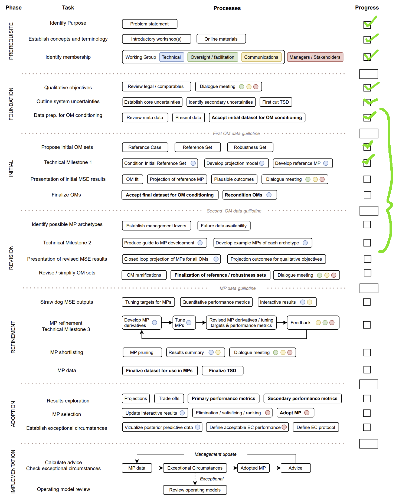

&nbsp;


<style>
  .col2 {
    columns: 2 200px;         /* number of columns and width in pixels*/
    -webkit-columns: 2 200px; /* chrome, safari */
    -moz-columns: 2 200px;    /* firefox */
  }
  .col3 {
    columns: 3 100px;
    -webkit-columns: 3 100px;
    -moz-columns: 3 100px;
  }
  .col4 {
    columns: 4 100px;
    -webkit-columns: 4 100px;
    -moz-columns: 4 100px;
  }
</style>

<style type="text/css">

body{ /* Normal  */
   font-size: 12px;
}
td {  /* Table  */
   font-size: 8px;
}
h1 { /* Header 1 */
 font-size: 18px;
 color: DarkBlue;
}
h2 { /* Header 2 */
 font-size: 15px;
 color: DarkBlue;
}
h3 { /* Header 3 */
 font-size: 14px;
 color: DarkBlue;
}
code.r{ /* Code block */
  font-size: 10px;
}
pre { /* Code block */
  font-size: 10px
}
</style>


***


***

&nbsp;


***

```{r setup, include=FALSE}
library(openMSE)
library(dplyr)
library(kableExtra)
library(readxl)
library(mahiMSE)

knitr::opts_chunk$set(echo = FALSE)

maketab <- function(dir,Alab="Statistical Area"){
  filenam = list.files(dir)
  nf = length(filenam)
  DF = data.frame(filenam)
  names(DF) = c("Area")
  #filepath = list.files(dir, full.names = T, include.dirs = T)
  fit.link = paste0('<a href=', file.path(dir, filenam), '> ', DF$Area , ' </a>')
  DF$Area <- fit.link
  DT::datatable(DF, escape=1,
                colnames=c(Alab),
                filter = 'top',
                options = list(
                  pageLength = 10, 
                  autoWidth = TRUE,
                  sDom  = '<"top">lrt<"bottom">ip'))
}


plotatab <- function(filey,sheet,head=T){
  if(head){
    dat = read_xlsx(paste0(getwd(),"/",filey),sheet)
    kable(dat,"simple") 
  }else{
    dat = read_xlsx(paste0(getwd(),"/",filey),sheet,col_names=F)
    kable(dat,"simple",col.names=rep("",ncol(dat))) 
  }
}


getprojectinfo<-function(page){
  tab=as.data.frame(read_excel("project_Info/Status Assumptions To do.xlsx", sheet = page))
  tab=tab[,2:3]
  tab[is.na(tab)]=""
  kable(tab,"simple")#,col.names=rep("",2)) 
}
  

getprog<-function(page){
  tab=as.data.frame(read_excel("Project_Info/Progress.xlsx", sheet = page))
  tab=tab[,2:3]
  tab[is.na(tab)]=""
  kable(tab,"simple")#,col.names=rep("",2)) 
}
 

```


## Disclaimer

The following work is preliminary and intended only as tool for eliciting feedback on data, modelling and other aspects of this fishery. 

None of these results are final. 

These analyses do not necessarily reflect the point of view of NOAA and in no way anticipate NOAA future policy.

***

## Objective

Develop an MSE framework for the Atlantic Dolphinfish (Mahi Mahi) fishery to test candidate management procedures and inform other management decision making including research prioritization, assessment methodology, specification of fishing regulations and enforcement. 

***

## Project details

Title: 'Lead Analyst for the Dolphin Management Strategy Evaluation Project IAW the Tasks included in the Statement of Work'

```{r ProjDets, eval=T}
dat<-data.frame(c("Term","Funding body","Funding stream","Solicitation No.","Contract No.","Project Partners","Blue Matter Team","NOAA Collaborators"),
                
                 c("June 2024 - May 2025, June 2025 - Feb 2026",
                   "U.S. National Oceanic and Atmospheric Administration",
                   "Sam.gov",
                   "# 1305M324Q0309, NA",
                   "1305M324P0270, NA",
                   "Blue Matter Science Ltd.",
                   "Tom Carruthers, Adrian Hordyk, Quang Huynh",
                   "Cassidy Peterson (Matt Damiano)"))

kable(dat,"simple",col.names=rep("",2)) 

```

***

## Progress

The Prerequisite and Foundation phases have been completed (Figure 1). The initial phase will be completed with an update to the historical catch data ('final dataset for OM conditioning'). Work has begun on designing an mahiMP management procedure that can mimic current management and can be modified to implement regulations such as trip limits and size limits in addition to TAC control linked to relative abundance indices.



Figure 1. Progress in the MSE roadmap. For more information about the roadmap and the various steps see the [supporting document](supporting/MSE_roadmap_Carruthers.pdf)

***

## Products

* DolphinMSE - a private github repository containing data and methods for operating model development. 

* mahiMSE - a public github repository containing operating models, management procedures (harvest strategies) and performance metrics.

* TSD - The trial specifications document, a comprehensive guide to MSE framework development to ensure reproducibility. 


***

## Current Priorities

Table 3. MSE framework development priorities

```{r ToDo, eval=T,echo=F}
plotatab('tables/Various.xlsx','ToDo')

```

***

## Trial Specifications Document

The [TSD](supporting/TSD.html) provides a comprehensive guide to MSE design including a description of the specification of the various operating models, input data, operating model conditioning, operating model spatial/seasonal structure, fleet definitions and performance metrics. 


***

## Reference Grid of Operating Models

Currently, the reference grid of operating models spans high and low values for aspects of population dynamics that are typically most consequential in determining management procedure performance: 

* natural mortality rate (M, longevity, the number of cohorts in the population),

* steepness of the stock recruitment relationship (h, resilience, how well recruitment strength is maintained at low stock sizes phrased as the fraction of unfished recruitment at 1/5 unfished stock size),

* future recruitment strength (phrased as a fraction of the historical unfished recruitment level).

Since operating models are spatial, in addition to these three axes of uncertainty also included is 

* stock viscosity (V, phrased as the probability that individuals stay in the same area among seasons). When the spatial dynamics are imposed on the spatially aggregated model, this is the prior assigned to each area and can be overridden in cases where there are large changes in biomass in an area among seasons. For example, in a case where 30% of the stock is found in an area (according to the VAST spatial index) and only 5% is found in the following season, the probability of staying will be much lower than the prescibed prior. 

These four axes of uncertainty produce a grid of 16 reference set operating models (Table 1). Since there is considerable uncertainty over unreported and international catches, a fifth axis may be added to a revised set in which the level of those catches is varied which ultimately impacts the scale of estimated stock and the relative impact of management procedures for U.S. fisheries.


Table 1. The reference grid of operating models spanning high and low values of natural mortality rate (M), steepness of the stock recruitment curve (Steep), projected recruitment strength as a multiplier of mean historical recruitment strength and viscosity (the mean probability of staying in a given area between seasons). 

```{r RefGrid, eval=T}
OM_no = 1:nrow(ref_grid)
OMtab = cbind(OM_no, ref_grid)
kable(OMtab,"simple") 

```
***

## Operating model conditioning

The 16 operating models of the reference set include two axes that are applied after operating model fitting to data (future recruitment level, viscosity) and hence there are only 4 fitted operating models that span the four scenarios for natural mortality rate (M, high/low) and steepness (h, high/low) (Table 2). 

Spatially aggregated, seasonal operating models were fitted to annual catch data and length composition data by fleet, and the relative abundance indices dervied from a spatial analysis of U.S. commercial catch rate data. 


Table 2. Operating models fits given various assumptions about instantaneous natural mortality rate (M) and stock resilience (steepness of the Beverton-Hold stock recruitment relationship).

```{r}
maketab("./OMs","Operating Model Conditioning")
```

&nbsp;

***

## Resources

The Ocean Foundation provides excellent introductory materials on MSE and management procedures (harvest strategies) at their [harvest strategies website](https://harveststrategies.org/))

The [openMSE website](https://openmse.com/) contains extensive documentation about openMSE and approaches such as RCM. 

***

## Glossary

Table 3. Glossary of MSE terminology and acronyms

```{r Glossary, eval=T,echo=F}
plotatab('tables/Various.xlsx','Glossary')

```

## More on Operating Models 

An operating model is a theoretical description of fishery and population dynamics used for the testing of management strategies that could include, for example,  data collection protocols, stock assessment methods, harvest control rules, enforcement policies and reference points. In fisheries, operating models are used in closed-loop simulation to test management procedures (aka. harvest strategy) accounting for feedbacks between the system, data, management procedure and implementation. A management procedure is any codifable rule that calculates management advice from data. Management Strategy Evaluation uses closed-loop simulation of management procedures as a core technical component but is a wider process of stakeholder and manager engagement that identifies system uncertainties, performance metrics, viable management procedures, ultimately aiming to adopt an MP for the provision of management advice for an established time period. 

&nbsp;

### Reference Case Operating Model

The reference case operating model is used as the single 'base' operating model from which reference set and robustness set operating models are specified. Reference and robustness tests are typically 1-factor departures from the reference case OM, however sometimes reference set OMs are organized in a factorial grid across primary axes of uncertainty. 

&nbsp;

### Reference Set Operating Models

Reference set operating models span a plausible range of the core uncertainties for states of nature. These are often the types of alternative parameterizations or assumptions that would be included in a stock assessment sensitivity analysis. 

The role of the reference set operating models is to provide the central basis for evaluating the performance of candidate management procedures, for example rejecting badly performing harvest strategies. 

&nbsp;

### Robustness Set Operating Models

Robustness set operating models are intended to include additional sources of uncertainty for providing further discrimination among management procedures that perform comparably among reference set operating models. 

Robustness operating models often represent system states of nature that are not empirically informed or are hypotheses of a subset of stakeholders.

&nbsp;

***


## Software and Code

[Rapid Conditioning Model (RCM) (Huynh 2024)](https://samtool.openmse.com/reference/RCM.html)

[OpenMSE (Hordyk et al. 2024)](https://openMSE.com)

[mahiMSE (public, the MSE R package)](https://github.com/Blue-Matter/mahiMSE)

[DolphinMSE (private, data and code for operating models)](https://github.com/Blue-Matter/DolphinMSE)

***


## Recent Presentations

Coming soon. 


***

## References

[Damiano, M., Karnauskas, M., Merten, W., Cao, J. 2024. Spatiotemporal dynamics of dolphinfish (Coryphaena hippurus) in the western Atlantic Ocean. Fish Bull. 2024](https://spo.nmfs.noaa.gov/sites/default/files/pdf-content/fish-bull/12212_03_Damiano_508.pdf)

Hadley, J., Mehta, K.N. 2021. Amendment 10 to the Fishery Management Plan for the Dolphin and Wahoo Fishery of the Atlantic. Available from https://repository.library.noaa.gov/view/noaa/32989

Hordyk, A. 2025. Slick decision analysis. Available from: [https://harveststrategies.org/slick-user-guide.html](https://harveststrategies.org/slick-user-guide.html) 

Hordyk, A., Huynh, Q., Carruthers, T. 2025. OpenMSE: An open-source R package for Management strategy evaluation, available from: https://openmse.com

Huynh, Q., 2025. Rapid Conditioning model. Available from [https://openmse.com/tutorial-rcm/](https://openmse.com/tutorial-rcm/) 

Peterson, C., Karnauskas, M., McPherson, M., Hadley, J., Blake, S., Byrd, J. 2024. Report of the South Atlantic dolphinfish management strategy evaluation stakeholder workshops. NOAA Tech. Memo. NMFS-SEFSC-781, 35 p. Available from [https://repository.library.noaa.gov/view/noaa/61285](https://repository.library.noaa.gov/view/noaa/61285)

Punt, A.E., Butterworth, D.S., de Moor, C.L., De Oliveira, J.A.A., and Haddon, M. 2016. Management strategy evaluation: Best practices. Fish Fish. 17(2): 303–334. doi:10.1111/faf.12104. 

Thorson, J.T., 2019. Guidance for decisions using the Vector Autoregressive Spatio-Temporal (VAST) package in stock, ecosystem, habitat and climate assessments. Fish. Res. 210, 143–161. https://doi.org/10.1016/j.fishres.2018.10.013


***

## Acknowledgements

Many thanks to the hard work of our project collaborators. 

Stakeholder Science Team: Matt Damiano, Mandy Karnauskas, Matt McPherson, Suzana Blake, Julia Byrd, John Hadley, Nikhil Mehta, Wess Merten, Lela Schlenker. 

MSE Modelling Technical Team: Matt Damiano, Kyle Shertzer, John Walter, Cassidy Peterson

Blue Matter: Tom Carruthers, Adrian Hordyk, Quang Huynh

OpenMSE was developed with support from the Natural Resources Defense Council (NRDC), the Gordon and Betty Moore Foundation, the Packard Foundation, the Marine Stewardship Council, Fisheries and Oceans Canada (DFO), the U.S. National Oceanic and Atmospheric Administration, the International Commission for the Conservation of Atlantic Tunas (ICCAT) and The Ocean Foundation.


***

&nbsp;&nbsp;&nbsp;&nbsp;&nbsp;&nbsp;&nbsp;&nbsp;&nbsp;&nbsp;&nbsp;&nbsp;

