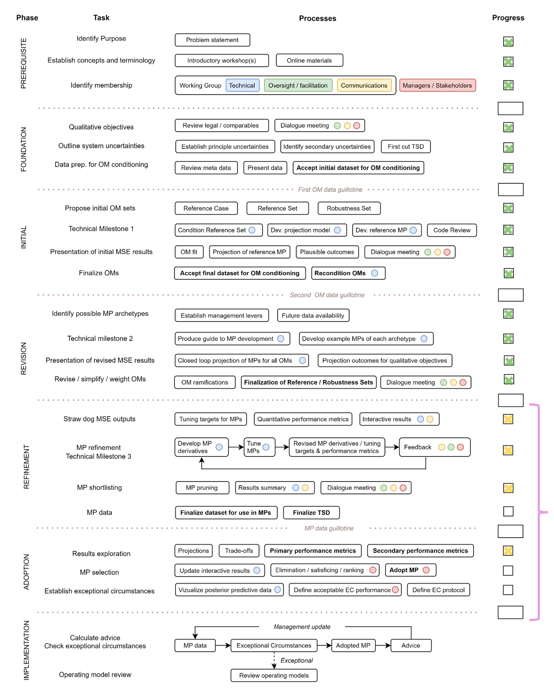

&nbsp;


<style>
  .col2 {
    columns: 2 200px;         /* number of columns and width in pixels*/
    -webkit-columns: 2 200px; /* chrome, safari */
    -moz-columns: 2 200px;    /* firefox */
  }
  .col3 {
    columns: 3 100px;
    -webkit-columns: 3 100px;
    -moz-columns: 3 100px;
  }
  .col4 {
    columns: 4 100px;
    -webkit-columns: 4 100px;
    -moz-columns: 4 100px;
  }
</style>

<style type="text/css">

body{ /* Normal  */
   font-size: 13px;
}
td {  /* Table  */
   font-size: 12px;
}
h1 { /* Header 1 */
 font-size: 18px;
 color: DarkBlue;
}
h2 { /* Header 2 */
 font-size: 15px;
 color: DarkBlue;
}
h3 { /* Header 3 */
 font-size: 14px;
 color: DarkBlue;
}
code.r{ /* Code block */
  font-size: 10px;
}
pre { /* Code block */
  font-size: 10px
}
</style>


***


***

&nbsp;


***

```{r setup, include=FALSE}
library(openMSE)
library(dplyr)
library(kableExtra)
library(readxl)
library(mahiMSE)

knitr::opts_chunk$set(echo = FALSE)

maketab <- function(dir,Alab="Statistical Area"){
  filenam = list.files(dir)
  nf = length(filenam)
  DF = data.frame(filenam)
  names(DF) = c("Area")
  #filepath = list.files(dir, full.names = T, include.dirs = T)
  fit.link = paste0('<a href=', file.path(dir, filenam), '> ', DF$Area , ' </a>')
  DF$Area <- fit.link
  DT::datatable(DF, escape=1,
                colnames=c(Alab),
                filter = 'top',
                options = list(
                  pageLength = 10, 
                  autoWidth = TRUE,
                  sDom  = '<"top">lrt<"bottom">ip'))
}


plotatab <- function(filey,sheet,head=T){
  if(head){
    dat = read_xlsx(paste0(getwd(),"/",filey),sheet)
    kable(dat,"simple") 
  }else{
    dat = read_xlsx(paste0(getwd(),"/",filey),sheet,col_names=F)
    kable(dat,"simple",col.names=rep("",ncol(dat))) 
  }
}


getprojectinfo<-function(page){
  tab=as.data.frame(read_excel("project_Info/Status Assumptions To do.xlsx", sheet = page))
  tab=tab[,2:3]
  tab[is.na(tab)]=""
  kable(tab,"simple")#,col.names=rep("",2)) 
}
  

getprog<-function(page){
  tab=as.data.frame(read_excel("Project_Info/Progress.xlsx", sheet = page))
  tab=tab[,2:3]
  tab[is.na(tab)]=""
  kable(tab,"simple")#,col.names=rep("",2)) 
}
 

```


# Disclaimer

The following work is preliminary and intended only as tool for eliciting feedback on data, modelling and other aspects of this fishery. 

None of these results are final. 

These analyses do not necessarily reflect the point of view of NOAA and in no way anticipate NOAA future policy.

***

# Objective

Develop an MSE framework for the Atlantic Dolphinfish (Mahi Mahi) fishery to test candidate management procedures and inform other management decision making including research prioritization, assessment methodology, specification of fishing regulations and enforcement. 

***

# Project details

Title: 'Lead Analyst for the Dolphin Management Strategy Evaluation Project IAW the Tasks included in the Statement of Work'

```{r ProjDets, eval=T}
dat<-data.frame(c("Term","Funding body","Funding stream","Solicitation No.","Contract No.","Project Partners","Blue Matter Team","NOAA Collaborators"),
                
                 c("June 2024 - May 2025, June 2025 - Feb 2026",
                   "U.S. National Oceanic and Atmospheric Administration",
                   "Sam.gov",
                   "# 1305M324Q0309, NA",
                   "1305M324P0270, NA",
                   "Blue Matter Science Ltd.",
                   "Tom Carruthers, Adrian Hordyk, Quang Huynh",
                   "Cassidy Peterson, (Matt Damiano)"))

kable(dat,"simple",col.names=rep("",2)) 

```

***

# Progress

The Prerequisite, Foundation, Initial and Revision phases have been completed (Figure 1). These form the basis for the completed MSE framework which is now subject to CIE peer-review (July 2026). 

Important methodological components of the Refinement and Adoption phases have been completed such as proposed tuning targets and tuning methods, description of all quantitative performance metrics and the production of an interactive Slick object for viewing MSE results. 




Figure 1. Progress in the MSE roadmap. For more information about the roadmap and the various steps see the [supporting document](supporting/MSE_roadmap_Carruthers.pdf)

***

# For the Peer - Review Team

## Trial Specification Document

The principle document that describes the technical aspects of the MSE framework is the [Trial Specifications Document (TSD)](tsd/TSD.html) - a comprehensive guide to MSE framework development. This is probably the most important source material for your review as it describes and links all of the code, supporting documentation and equations. 


## Presentations for Review Meeting

The presentations of the review meeting roughly follow the steps of the Trial Specifications Document but they include direct reference to the Terms of Reference. These may or may not be of interest.


[1. Context](https://docs.google.com/presentation/d/13v-REaOqLDarxShDSbY975rlFSvnX59m6rkdQKlQvh0/edit?usp=sharing)

[2. Introduction](https://docs.google.com/presentation/d/1XEg_V5-I4PhHKjMlCvQ0u8_VcjX1l4s2yoIgpyRd5-k/edit?usp=sharing)

[3. Model Inputs](https://docs.google.com/presentation/d/1ZuEglj6aFzIOnYHeo9AkESeoEvbkzR8-hPVZ9ykNVAo/edit?usp=sharing)

[4. OM Conditioning Approach](https://docs.google.com/presentation/d/1T-tT8sCCAhwDzdet52Q0jcEB3nIbhwjVH-WxxBg3_CY/edit?usp=sharing)

[5. Operating Models](https://docs.google.com/presentation/d/1UyP6Dj_ZbrhULbTQVRHSIXp_mA3pkVi7VGwoCEqR3go/edit?usp=sharing)

[6. Data Simulation](https://docs.google.com/presentation/d/1gn_Zw1jITXZhc1hSQYAYFjoo2qOg7hXdSN0J8_WWcz8/edit?usp=sharing)

[7. Management Procedures](https://docs.google.com/presentation/d/1Oe9xhvPDrQUfrlZW_BCFpf12aAA-Z6WZiWNaDdlxSQA/edit?usp=sharing)

[8. MP Performance Summary](https://docs.google.com/presentation/d/15DNfT8rJBvFSBvFbkEjkoTIPZeGnnIhxE9tICgqBx1w/edit?usp=sharing)


## Performance Work Statement (inc Terms of Reference)

The [Performance Work Statement](supporting/PWS_SEDAR_104.docx) for SEDAR 104 contains relevant review information such as background, scope, tasks, reporting requirements, terms of reference and a preliminary agenda.


## Demonstration MSE results

1. Download the [Slick object](tsd/data/Slick/mahiSlick_1.slick) with demonstration MSE results
2. Go to the [Slick App Online](https://shiny.bluematterscience.com/app/slick)
3. Load up the slick object from your computer and explore results. 


***

# Code and Software

## Dolphinfish MSE Code

DolphinMSE Github Repository (Private)

* [https://github.com/Blue-Matter/DolphinMSE](https://github.com/Blue-Matter/DolphinMSE)
* Private ‘workhorse’ repo with live data and analyses. 
* Data, reports, notes
* Code for processing data, spatial modelling (VAST), conditioning operating models
* Supporting analyses (e.g., exploratory tests of trip limits, VAST specifications etc)
* Makes all the inputs to mahiMSE R package (OMs, MPs, etc)

mahiMSE GitHub Repository and R Package (Public)

* [https://github.com/Blue-Matter/mahiMSE](https://github.com/Blue-Matter/mahiMSE)
* [mahiMSE Manual](tsd/docs/mahiMSE.html)
* Public-facing R package with manuals, documentation
* How to design MPs, use the mahiMP, run MSE simulations and plot results.
* Includes some small demonstration OM objects and example data sets
* Custom code for organizing results and plotting results. 

mahiRefSet GitHub Repository and R Package (Public)

* [https://github.com/Blue-Matter/mahiRefSet](https://github.com/Blue-Matter/mahiRefSet)
* Reference Grid OMs (#32)

mahiRobSet GitHub Repository and R Package (Public)

* [https://github.com/Blue-Matter/mahiRobSet](https://github.com/Blue-Matter/mahiRobSet)
* Robustness Set OMs (#16)

## MSE Computation and Results Presentation

OpenMSE (Hordyk et la. 2026, v1.01)

* [www.openMSE.com](www.openMSE.com)
* [technical manual including equations](https://docs.openmse.com)
* This is the umbrella package for the component MSEtool, SAMtool, DLMtool R libraries

MSEtool (Hordyk et al. 2026, v4.0.0)

* [MSEtool GitHub](https://github.com/Blue-Matter/MSEtool)
* OM specification
* Closed loop simulation
* Empirical MPs
 
SAMtool (Huynh et al. 2026, v1.9.1)

* [SAMtool GitHub](https://github.com/Blue-Matter/SAMtool)
* Data-rich stock assessment methods
* OM conditioning using Rapid Conditioning Model (RCM)
* Model-based MPs

RCM (Huynh 2026)

* [RCM manual](https://openmse.com/tutorial-rcm)
* [RCM equations](https://openmse.com/tutorial-rcm-eq/)

Slick (Hordyk et al. 2026, v1.0.2)

* [Slick MSE results object](tsd/data/Slick/mahiSlick.rda)
* [Slick Project Page](https://slick.bluematterscience.com/)
* [Slick Online App](https://shiny.bluematterscience.com/app/slick)
* Presentation of MSE results

ECP (Carruthers 2024, v1.0.5)

* [ECP GitHub](https://github.com/Blue-Matter/ECP)
* [ECP App (bluefin tuna)](https://shiny.bluematterscience.com/app/ecp)
* Design and presentation of Exceptional Circumstances Protocols

***

# Current Priorities

Table 3. MSE framework development priorities

```{r ToDo, eval=T,echo=F}
plotatab('tables/Various.xlsx','ToDo')

```

***


# MSE Resources

The Ocean Foundation provides excellent introductory materials on MSE and management procedures (harvest strategies) at their [harvest strategies website](https://harveststrategies.org/).

The [openMSE website](https://openmse.com/) contains extensive documentation about openMSE and approaches such as RCM. 

***


# Dolphin Links

[NOAA Dolphinfish MSE page](https://www.fisheries.noaa.gov/southeast/science-data/dolphinfish-management-strategy-evaluation-us-atlantic). Includes various links. 

[Data analysis quarto book (Karnauskas 2024)](https://sefsc.github.io/SEFSC-dolphin-analyses/)

***


# Reports 

[Stakeholder workshop report](https://repository.library.noaa.gov/view/noaa/61285). Stakeholder workshop meeting materials are appended. 

[Dolphin / wahoo participatory modeling workshop report](https://repository.library.noaa.gov/view/noaa/39878). Note that this was pre-MSE stakeholder workshops, but includes relevant background info.


***

# Recent Presentations

[April SSC Meeting](https://safmc.net/documents/9_dolphinfish_mse_april2025_ssc-pdf/). Dolphin management strategy evaluation: SSC review 1.

[April Dolphin Wahoo AP Meeting](https://safmc.net/documents/dwap_a2_dolphinmse_update_202504-pdf/). Update on the dolphin management strategy evaluation.

[December Council Meeting](https://safmc.net/documents/dw_a1_dolphinmse_dec2024update_202412-pdf/). Update on the dolphin management strategy evaluation.

[June Council Meeting](https://safmc.net/documents/fc1_a5_dolphinmseupdate_202406-pdf/). Update on the dolphin management strategy evaluation.

[December Council Meeting](https://safmc.net/documents/dw_a2_dolphin_mse_update_202312-pdf/). Update on the dolphin management strategy evaluation. 

[November Dolphin Wahoo AP Meeting](https://safmc.net/documents/dwap_a6a_dolphinmse_presentation_202311-pdf/). Dolphin management strategy evaluation: plans and progress.

[June Council Meeting](https://safmc.net/documents/dw_a1_dolphinmseupdate_202306-pdf/). Update on the dolphinfish management strategy evaluation. 

[December Council Meeting](https://safmc.net/documents/fc3_a5a_dolphinmse_update_dec2022/). Update on the dolphinfish management strategy evaluation stakeholder workshops.


***


# References

[Damiano, M., Karnauskas, M., Merten, W., Cao, J. 2024. Spatiotemporal dynamics of dolphinfish (Coryphaena hippurus) in the western Atlantic Ocean. Fish Bull. 2024](https://spo.nmfs.noaa.gov/sites/default/files/pdf-content/fish-bull/12212_03_Damiano_508.pdf)

Hadley, J., Mehta, K.N. 2021. Amendment 10 to the Fishery Management Plan for the Dolphin and Wahoo Fishery of the Atlantic. Available from https://repository.library.noaa.gov/view/noaa/32989

Hordyk, A. 2025. Slick decision analysis. Available from: [https://harveststrategies.org/slick-user-guide.html](https://harveststrategies.org/slick-user-guide.html) 

Hordyk, A., Huynh, Q., Carruthers, T. 2025. OpenMSE: An open-source R package for Management strategy evaluation, available from: https://openmse.com

Huynh, Q., 2025. Rapid Conditioning model. Available from [https://openmse.com/tutorial-rcm/](https://openmse.com/tutorial-rcm/) 

Peterson, C., Karnauskas, M., McPherson, M., Hadley, J., Blake, S., Byrd, J. 2024. Report of the South Atlantic dolphinfish management strategy evaluation stakeholder workshops. NOAA Tech. Memo. NMFS-SEFSC-781, 35 p. Available from [https://repository.library.noaa.gov/view/noaa/61285](https://repository.library.noaa.gov/view/noaa/61285)

Punt, A.E., Butterworth, D.S., de Moor, C.L., De Oliveira, J.A.A., and Haddon, M. 2016. Management strategy evaluation: Best practices. Fish Fish. 17(2): 303–334. doi:10.1111/faf.12104. 

***

# Acknowledgements

Many thanks to the hard work of our project collaborators. 

Stakeholder Science Team: Matt Damiano, Mandy Karnauskas, Matt McPherson, Suzana Blake, Julia Byrd, John Hadley, Nikhil Mehta, Wess Merten, Lela Schlenker. 

MSE Modelling Technical Team: Matt Damiano, Kyle Shertzer, John Walter, Cassidy Peterson

Blue Matter: Tom Carruthers, Adrian Hordyk, Quang Huynh

OpenMSE was developed with support from the Natural Resources Defense Council (NRDC), the Gordon and Betty Moore Foundation, the Packard Foundation, the Marine Stewardship Council, Fisheries and Oceans Canada (DFO), the U.S. National Oceanic and Atmospheric Administration, the International Commission for the Conservation of Atlantic Tunas (ICCAT) and The Ocean Foundation.

OpenMSE continues to be developed with the support of the The Ocean Foundation. 


*** 

# Glossary

Table 3. Glossary of MSE terminology and acronyms

```{r Glossary, eval=T,echo=F}
plotatab('tables/Various.xlsx','Glossary')

```

## More on Operating Models 

An operating model is a theoretical description of fishery and population dynamics used for the testing of management strategies that could include, for example,  data collection protocols, stock assessment methods, harvest control rules, enforcement policies and reference points. In fisheries, operating models are used in closed-loop simulation to test management procedures (aka. harvest strategy) accounting for feedbacks between the system, data, management procedure and implementation. A management procedure is any codifable rule that calculates management advice from data. Management Strategy Evaluation uses closed-loop simulation of management procedures as a core technical component but is a wider process of stakeholder and manager engagement that identifies system uncertainties, performance metrics, viable management procedures, ultimately aiming to adopt an MP for the provision of management advice for an established time period. 

&nbsp;

### Reference Case Operating Model

The reference case operating model is used as the single 'base' operating model from which reference set and robustness set operating models are specified. Reference and robustness tests are typically 1-factor departures from the reference case OM, however sometimes reference set OMs are organized in a factorial grid across primary axes of uncertainty. 

&nbsp;

### Reference Set Operating Models

Reference set operating models span a plausible range of the core uncertainties for states of nature. These are often the types of alternative parameterizations or assumptions that would be included in a stock assessment sensitivity analysis. 

The role of the reference set operating models is to provide the central basis for evaluating the performance of candidate management procedures, for example rejecting badly performing harvest strategies. 

&nbsp;

### Robustness Set Operating Models

Robustness set operating models are intended to include additional sources of uncertainty for providing further discrimination among management procedures that perform comparably among reference set operating models. 

Robustness operating models often represent system states of nature that are not empirically informed or are hypotheses of a subset of stakeholders.

&nbsp;


***

&nbsp;&nbsp;&nbsp;&nbsp;&nbsp;&nbsp;&nbsp;&nbsp;&nbsp;&nbsp;&nbsp;&nbsp;

