<style type="text/css">

body{ /* Normal  */
   font-size: 13px;
}
td {  /* Table  */
   font-size: 12px;
}
h1 { /* Header 1 */
 font-size: 18px;
 color: DarkBlue;
}
h2 { /* Header 2 */
 font-size: 15px;
 color: DarkBlue;
}
h3 { /* Header 3 */
 font-size: 14px;
 color: DarkBlue;
}
code.r{ /* Code block */
  font-size: 10px;
}
pre { /* Code block */
  font-size: 10px
}

</style>

<br>


<br>


```{r set options, echo = FALSE}
knitr::opts_chunk$set(collapse = TRUE, comment = "#>")
knitr::opts_chunk$set(dpi=85)
options(width = 650)
X = Y = 0
plus=function(){X=X+1;assign("X",X, envir = globalenv())}
getF = function(rel=1){X+rel}
Tplus = function(){Y=Y+1;assign("Y",Y, envir = globalenv())}
getT = function(rel=1){Y+rel}
```


```{r setup, include=FALSE}
###--- Update the knitr working directory (R works from the project folder, knitr works in the rmd folder)
dd <- getwd()
knitr::opts_knit$set(root.dir= paste(dd,'/../../')) 

###--- Set some knitr defaults for all of the code blocks below. 
knitr::opts_chunk$set(warning=FALSE
                      ,error=FALSE
                      ,message=FALSE
                      ,cache=F
                      ,eval=TRUE
                      ,results='asis'
                      ,echo=TRUE
                      ,fig.ext="png"
                      ,cache.path = paste0(dd,'/cache/')
                      ,fig.path = paste0(dd,'/figures/')
                      ) 


library(readxl)
library(kableExtra)
library(mahiMSE)

# namdir = 'C:/GitHub/docs/data/Fits'; filedir = "data/Fits"; Alab="Fitting_Report"
makelinktab <- function(namdir, filedir, Alab="Fitting_Report"){
  filenam = list.files(namdir)
  mydatframe = as.data.frame(filenam)
  names(mydatframe) = "Fitting_Report"
  fit.link = paste0('<a href=', file.path(filedir, filenam), '> ', mydatframe$Fitting_Report , ' </a>')
  mydatframe$Fitting_Report <- fit.link
  DT::datatable(mydatframe, escape=1,
                colnames=c(Alab),
                filter = 'top',
                options = list(
                  pageLength = 10, 
                  autoWidth = TRUE,
                  sDom  = '<"top">lrt<"bottom">ip'))
}
makelinktabtest <- function(dir, Alab="Fitting_Report"){
  filenam = list.files(dir)
  print(filenam)
  print(getwd())
  print(paste0(getwd(),dir))
}

plotatab <- function(filey,sheet,head=T){
  if(head){
    dat = read_xlsx(paste0(getwd(),"/",filey),sheet)
    kable(dat,"simple") 
  }else{
    dat = read_xlsx(paste0(getwd(),"/",filey),sheet,col_names=F)
    kable(dat,"simple",col.names=rep("",ncol(dat))) 
  }
}


#setwd("C:/GitHub/DolphinMSE")
#source("C:/GitHub/DolphinMSE/code/OM_new_spatial/dol.input.data.R")
#source("../code/OM_new_spatial/dol.input.data.R")


```

<br>
<hr>

# About This Document

A trial specifications document (TSD) is intended to provide a  description of an MSE framework that is sufficiently detailed to ensure reproducibility. This description includes data sources, management performance metrics, operating models, operating model dynamics, operating model conditioning, management procedures, management procedure tunings and exceptional circumstances protocols. 


<br>
<hr>

# Context

## Problem Statement

Managers of the Atlantic Dolphinfish fishery wish to identify a responsive and robust management strategy that can achieve management objectives for a wide range of plausible scenarios for Dolphinfish population and fishing dynamics (Table `r (getT())`). 


Table `r (Tplus())`. Challenges and opportunities identified by [Peterson et al. (2024)](https://repository.library.noaa.gov/view/noaa/61285). 

```{r Challenges, eval=T,echo=F}
plotatab('docs/tables/Various.xlsx','Challenges')

```

```{r Solutions, eval=T,echo=F}
plotatab('docs/tables/Various.xlsx','Solutions')

```

<br>

## Aims

[Peterson et al. (2024)](https://repository.library.noaa.gov/view/noaa/61285) Describe at least two broad aims of the Dolphinfish MSE: 

1. Predict the amount of dolphin the SAFMC will have each year

2. Maximize the usage of those fish across sectors and region

<br>

## Conceptual Management Objectives

[Peterson et al. (2024)](https://repository.library.noaa.gov/view/noaa/61285) identified at least 6 conceptual management objectives for the fishery operating in northern Florida and southern North Carolina (Table `r (getT())`). 


Table `r (Tplus())`. Conceptual management objectives identified by [Peterson et al. (2024)](https://repository.library.noaa.gov/view/noaa/61285) 

```{r CMO, eval=T,echo=F}
plotatab('docs/tables/Various.xlsx','CMO',head=F)

```

<br>
<hr>

# Basic Concepts and Stock Structure

## Spatial Definitions

 [Damiano et al. 2024](https://spo.nmfs.noaa.gov/sites/default/files/pdf-content/fish-bull/12212_03_Damiano_508.pdf) identify seven discrete areas for characterizing the spatial dynamics of the dolphinfish population and fishery.  


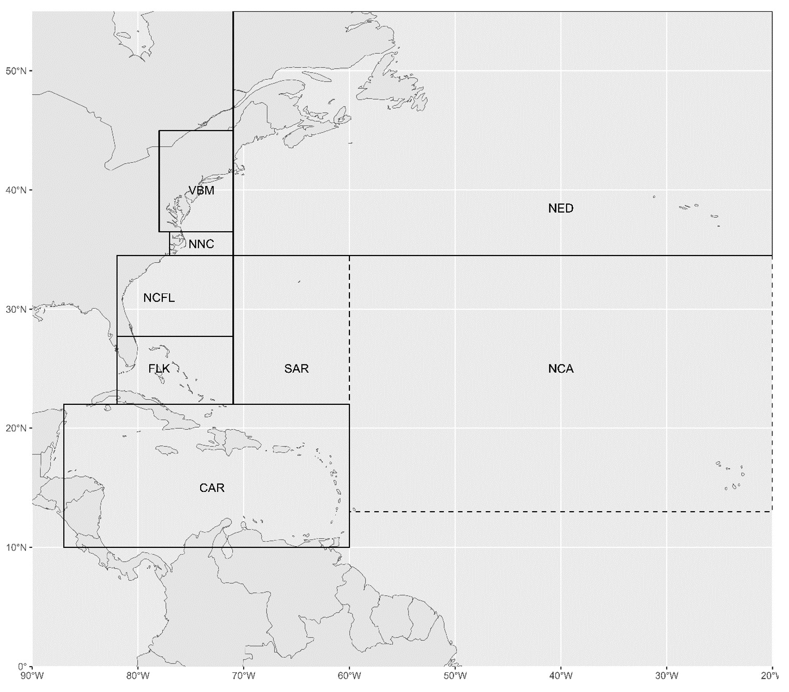

Figure `r (plus())`. Spatial strata defined in [Damiano et al. 2024](https://spo.nmfs.noaa.gov/sites/default/files/pdf-content/fish-bull/12212_03_Damiano_508.pdf)


The dolphinfish population spans all three of the East Coast regional management councils (New England, Mid-Atlantic and South Atlantic). 

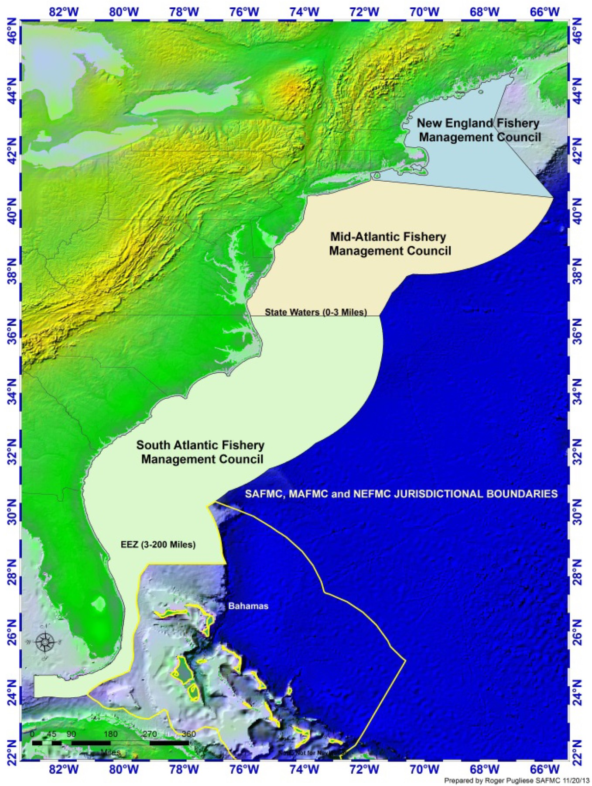


Figure `r (plus())`. Management jurisdictions as described by Ammendment 10 to the FMP for the Dolphin and Wahoo Fishery of the Atlantic [Hadley and Mehta, 2021](https://repository.library.noaa.gov/view/noaa/32989) 


## Updated Spatial Definitions for the Estimation of Biomass Indices

[Damiano et al. 2024](https://spo.nmfs.noaa.gov/sites/default/files/pdf-content/fish-bull/12212_03_Damiano_508.pdf) Used spatial catch rate data from the US longline observer program to develop spatial indices of abundance using the VAST modeling framework (Thorson 2023). Similarly to Dolphinfish in other oceans (Marín-Enríquez et al. 2018), Damiano et al. found consistent seasonal patterns in spatial distribution and density. 

When confronted with spatial catch data it was apparent that, for areas of smaller geographic size, there was a large mismatch between catch magnitude and the spatial biomass index inferred by the VAST model. This is due to the highly migratory behavior of Dolphinfish: high fishing effort and large catches of fish in their transition through a small area over time scales much shorter than the seasonal time step. In this case, the biomass available to fishing in that season is very large even though the catch rates (the ratio VAST uses to quantify biomass) can remain relatively low.

It was necessary to broaden these areas and to better quantify spatiao-temporal distribution of Dolphinfish given their rapid movement. Five areas were defined that are similar to those of Damiano et al. (2024) but follow the U.S. EEZ (Table `r (getT())`, Figure `r (getF())`).


Table `r (Tplus())`. The discrete spatial strata. 

```{r AreasTab, eval=T,echo=F}
plotatab('docs/tables/Various.xlsx','Areas')

```


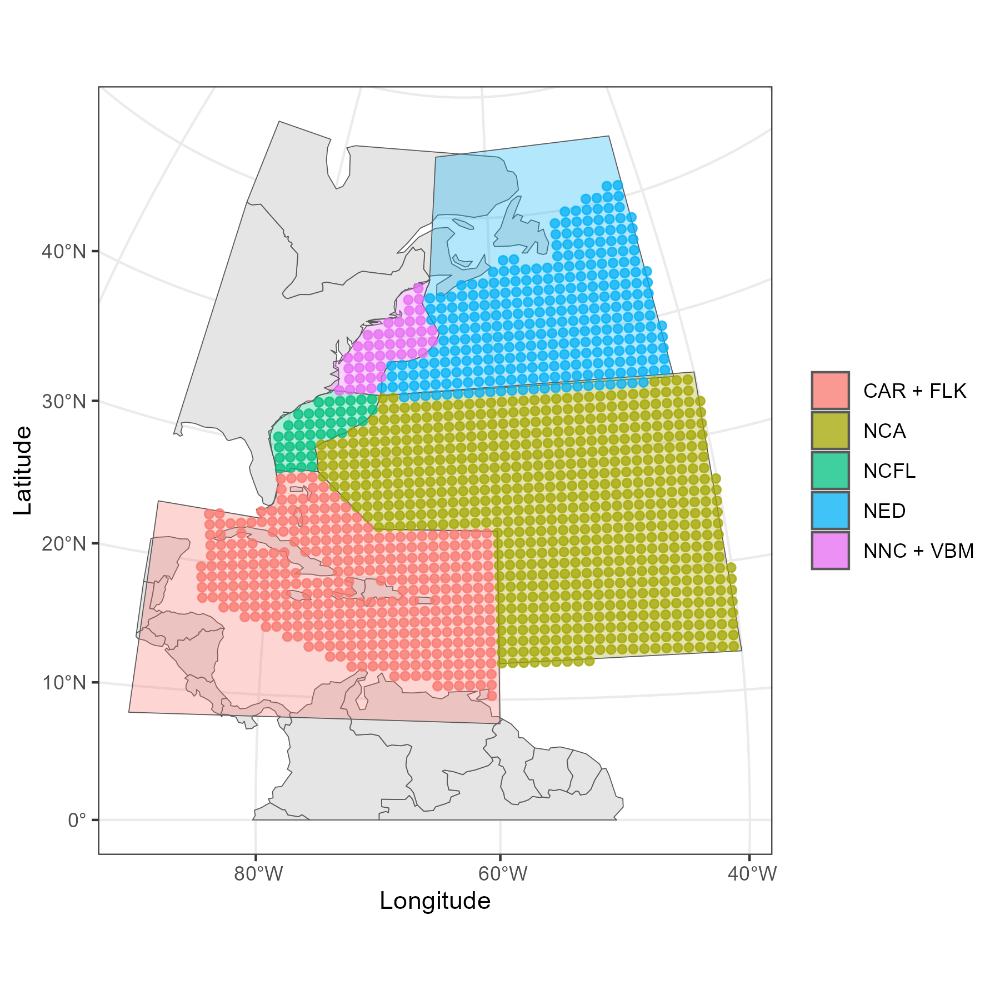

Figure `r (plus())`. The spatial regions and knots used to define the seasonal - spatial density of dolphinfish. 


A 'total' VAST index (all areas combined) was used to condition spatially aggregated population dynamics models (Section 7.2 below), the seasonal spatial indices were used to impose seasonal-spatial structure for spatial-seasonal operating models (Section 7.3 below). 


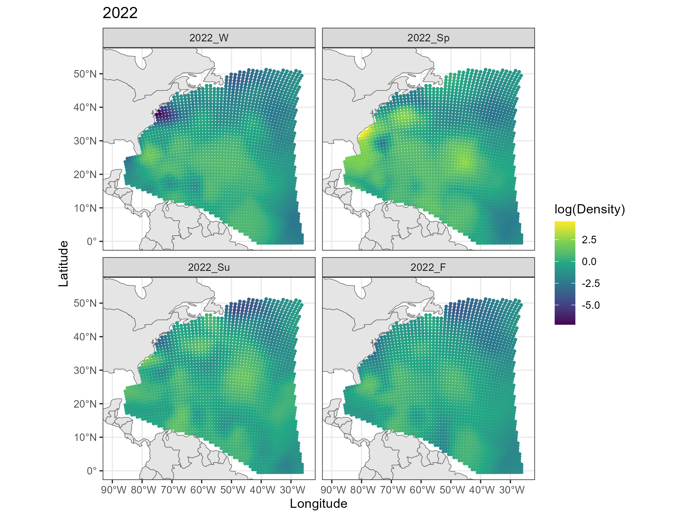

Figure `r (plus())`. Seasonal spatial distribution predicted by the VAST model in 2022. 


<br>


## Fleet Definitions

Exploitation was characterized by eight fleets that were selected as the most concise basis for capturing varying fishery selectivty and also providing detail required to reflect regional, multi-sector fishing interests (Table `r (getF())`). 


Table `r (Tplus())`. Individual fleets used to partition data for operating model conditioning and projection of fishing dynamics.  

```{r FleetTab, eval=T,echo=F}
plotatab('docs/tables/Various.xlsx','Fleets')

```


<br>
<hr>

# Past Data Available

The principal sources of data were seasonal catches by fleet, a spatial VAST index (fitted to fine scale spatial catch and effort data) and catch-length composition data (Table `r (getT())`). 

Table `r (Tplus())`. Summary of data available for operating model conditioning. 

```{r PastData, eval=T,echo=F}
plotatab('docs/tables/Various.xlsx','PastData')

```

<br>

## Catches

Arguably the largest historical shift in catches has been a reduction in recreational fishing in the Caribbean and South Florida region (RecS in CAR+FLK) from highs of near 10kt in the 90's to around 3kt in 2022. During that time international catches have more than tripled from 1.5kt to 5.5kt. In 2022 63% of all Dolphin catches were from International, discard and unreported fishing activities (Figure `r (getF())`). 

Of the remaining 37%, the large majority of catches were by the southern recreational fleet (RecS) (26% of the total catches, 70% of the catch of US fleet). The U.S. commercial fleet catches were less than 1% of the total removals in 2022. The large majority of mahi catches were taken in the Caribbean and Southern Florida region (CAR+FLK) (75%).

Operating models are conditioned on season- and fleet-specific catch data from `r floor(min(Time_steps))` to `r ceiling(max(Time_steps))`. To account for uncertainty in discards and unreported fishing, operating models were conditioned on 50% and 100% of NOAA estimates for these fleets (See section 'Reference Grid Operating Models', below) 


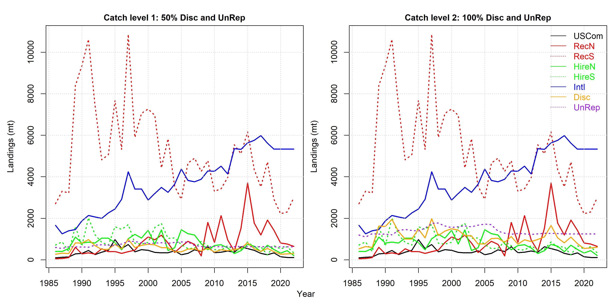

Figure `r (plus())`. Annual landings by fleet that are assumed in operating model conditioning. Two levels of catches were specified for the discard (Disc) and unreported (UnRep) fleets: 50% and 100% of the NOAA estimates.  

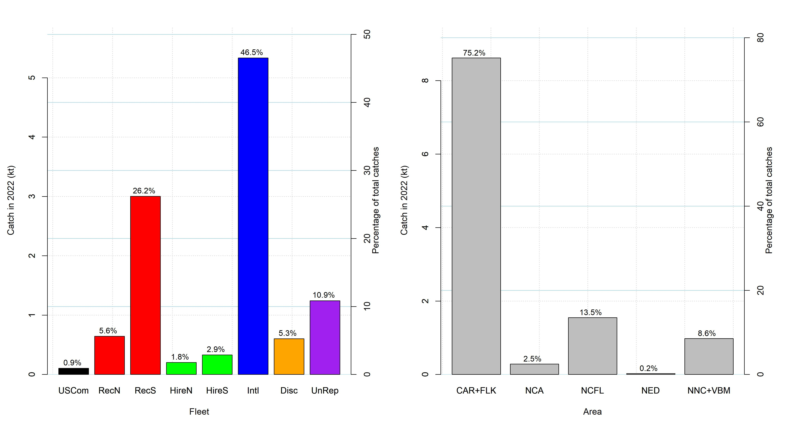

Figure `r (plus())`. Landings by fleet and area in 2022 (the final year of the operating model conditioning) for the base assumption of 100% catches of Discard and Unreported fleets. 

<br>

Table `r (Tplus())`. Percentage of catches by fishing fleet for all historical years (base assumption of 100% catches of Discard and Unreported fleets).  


```{r SeasonalCatch, eval=T,echo=F}

C_yfr2 = C_yfr
C_yfr[,7:8,] = C_yfr[,7:8,] * 0.5                      # level 1 is half catch
C_yfr_list = list(C_yfr, C_yfr2); names(C_yfr_list) = c("Cat_0.5", "Cat_1")

C_tf = apply(C_yfr_list[[2]],1:2,sum)/1000
qf = apply(array(C_tf,c(4,148/4,8)),c(1,3),sum)
seas.matp = round(qf/sum(qf)*100,1)

fleets = dimnames(C_tf)[[2]]
colnames(seas.matp) = fleets
rownames(seas.matp) = c("Winter","Spring","Summer","Autumn")
kable(seas.matp )
```

Table `r (Tplus())`. Percentage of catches by fishing fleet for the last historical 3 years (2020 - 2022) (base assumption of 100% catches of Discard and Unreported fleets).  

```{r SeasonalCatch10, eval=T,echo=F}

C_tf = apply(C_yfr_list[[2]],1:2,sum)/1000
qf = apply(array(C_tf,c(4,148/4,8))[,35:37,],c(1,3),sum)
seas.matp = round(qf/sum(qf)*100,1)
#seas.matp = as.matrix(round(seas.mat*100,0))
colnames(seas.matp) = fleets
rownames(seas.matp) = c("Winter","Spring","Summer","Autumn")
kable(seas.matp )
```

<br>

## Abundance Indices

Spatially aggregated operating models were conditioned on the total abundance index derived from the VAST spatial distribution model of [Damiano et al. (2024)](https://spo.nmfs.noaa.gov/sites/default/files/pdf-content/fish-bull/12212_03_Damiano_508.pdf) but with results summarized by a more concise 5-area definition described above. The VAST index shows considerable variability in abundance among seasons with spring and summer abundance often twice that of the Autumn and Winter (Figure `r (getF())`). This suggests high overall mortality within year. 

At the regional level, the degree of seasonal fluctuation varies. For example, for the NCFL region the VAST index infers very large discrepancies among winter and Summer abundances where as these are much less pronounced in the Caribbean and South Florida region (CAR+FLK). In general, the VAST index suggests that the majority of Dolphinfish abundance is found in the NCA and CAR+FLK regions (Figure `r (getF(2))`).  

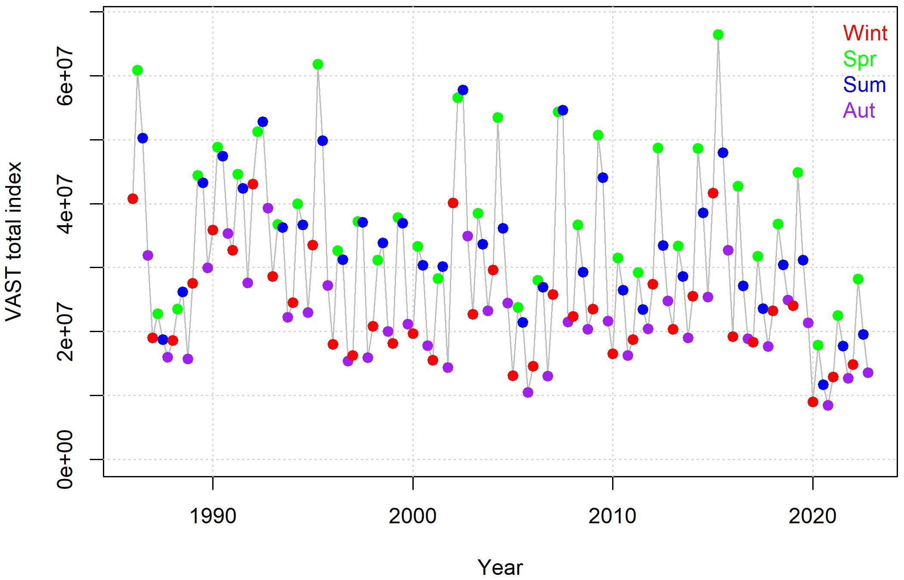

Figure `r (plus())`. The spatially aggregated (total), seasonal VAST index (5-area revision of Damiano et al. 2024). 


The fitted VAST models provide seasonal estimation of regional biomass for determining seasonal movement matrices.


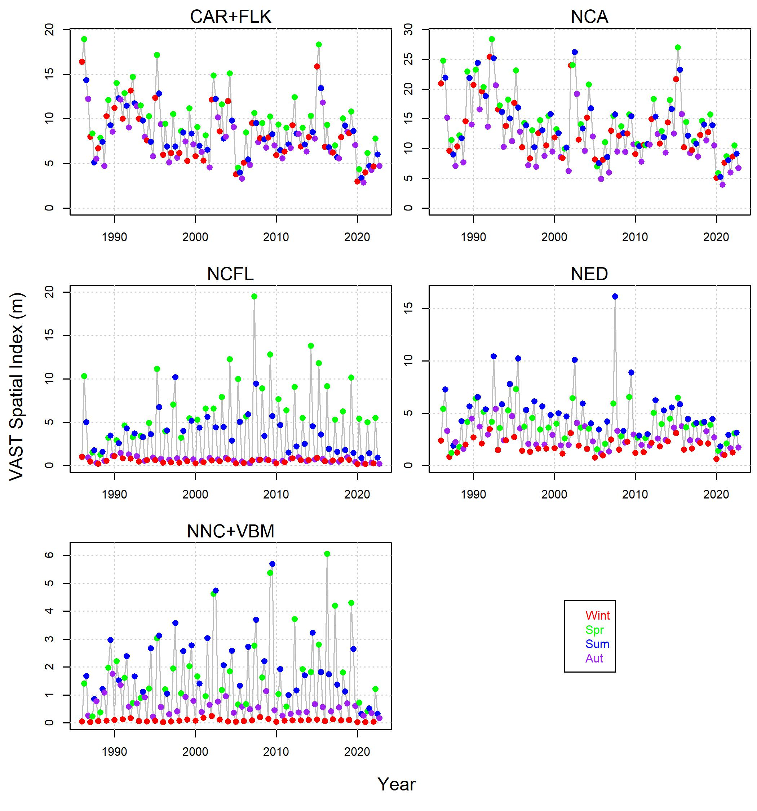

Figure `r (plus())`. The spatial, seasonal VAST index (5 area summary of the VAST model outputs of Damiano et al. 2024). 


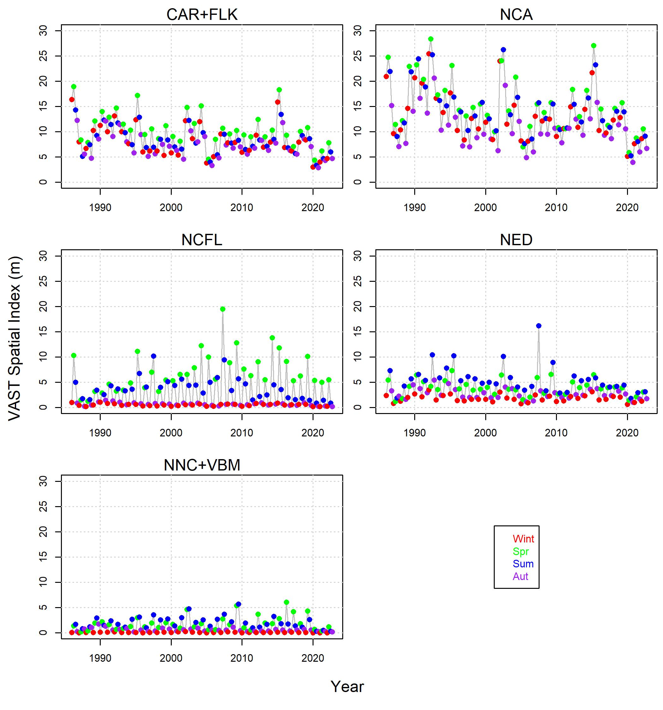

Figure `r (plus())`. The spatial, seasonal VAST index with consistent y-axis range to demonstrate scale differences (5 area summary of the VAST model outputs of Damiano et al. 2024). 


## Length Composition of Catches

Fishing fleets retain fish of varying sizes. RecS, HireN and HireS fleets have comparable catch-length distributions with the majority of fish in the range of 400 - 1000mm with a mode around 550mm (Figure `r (getF())`) (note that the HireN and RecN fleets have relatively few length observations). The USCom fleet catches larger fish from 700 - 1200mm with a mode around 950mm. The RecN fleet catches a wider range of lengths. 

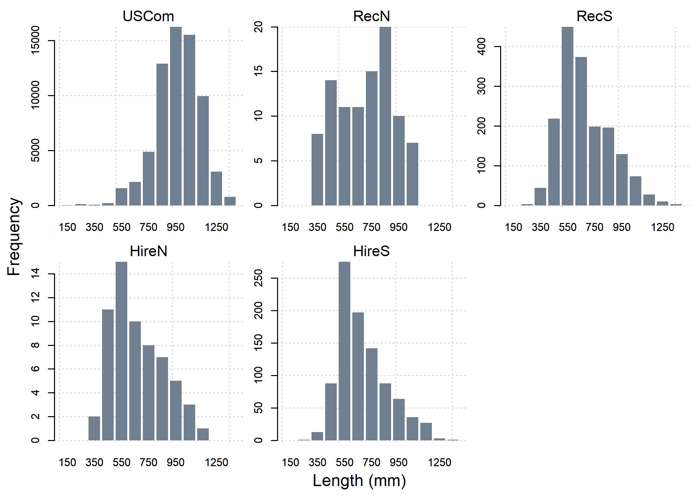

Figure `r (plus())`. Aggregate (across years) length composition data for the catches of those fleets for which these data are available. 


## Data Assumptions

The key assumptions regarding the data are detailed in Table `r (getT())`.


Table `r (Tplus())`. Assumptions made in the processing, presentation and interpretation of data inputs. 

```{r Data_Assump, eval=T,echo=F}
plotatab('docs/tables/Various.xlsx','Data_Assump')
```


<br>
<hr>

# Biological Information

## Input Parameter Summary

Uncertainty in a number of key biological parameters is characterized and later accounted for in operating models. These include maximum growth rate *K*, asymptotic length, instantaneous natural mortality rate *M*, and Beverton-Holt steepness (Table `r (getT())`). 

This approach is a departure from MSE frameworks elsewhere that typically assume point values for such inputs and account for uncertainty in these across a discrete 'grid' of values. The principal reason to avoid this practice is to avoid an unrealistic and indefensible compression of uncertainty when viewing results for a single operating model or across a subset of operating models that hold a particular parameter constant at a point value. This is dicussed in more detail in Section 7 below.  

Table `r (Tplus())`. Biological parameter inputs. Uncertainty is propagated in critical inputs relating to longevity, growth and resilience.  

```{r Params, eval = T, echo=F}
plotatab('docs/tables/Various.xlsx','Params',T)
```


## Somatic Growth

Growth of individual is assumed to follow a von Bertalannfy growth equation with asymptotic length of 1289mm, a maximum growth rate (*K*) of 0.3175 (per quarter, 1.27 *L-infinity* per year) and age-at-zero length (*t0*) of -0.026, established by [Schwenke and Buckel (2008)](https://spo.nmfs.noaa.gov/sites/default/files/pdf-content/2008/1061/schwenke.pdf)(Figure `r (getF())`)

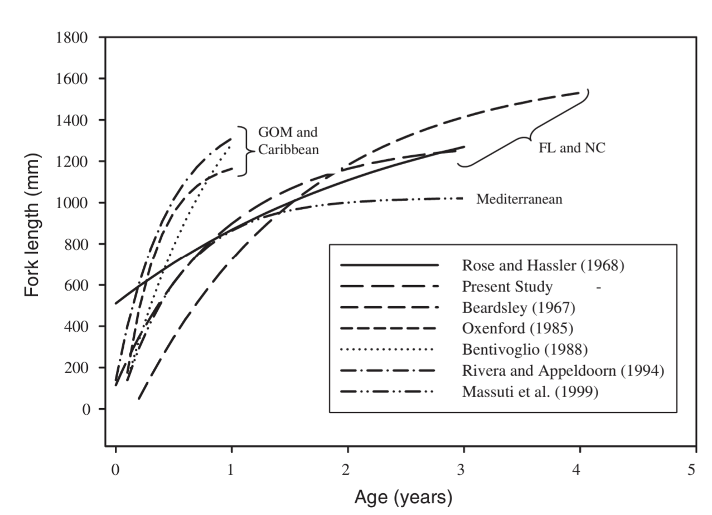

Figure `r (plus())`. The various regional somatic growth curves for Dolphinfish synthesized by Schwenke and Buckel (2008) (Figure 3 of that paper). The solid dashed line ('Present Study', Florida and North Carolina) was used to specify the reference operating models.  

Operating models included stochasticity in the growth model parameters based on estimates of Schwenke and Buckel (2008): a CV of 2% for asymptotic length (St.Dev. of 25.95mm), CV of 6.3% for maximum growth rate (St.Dev. of 0.08). These parameters were sampled with a negative correlation of -0.6 (a value derived by meta-analysis for *Perciformes* (Thorson 2019). 


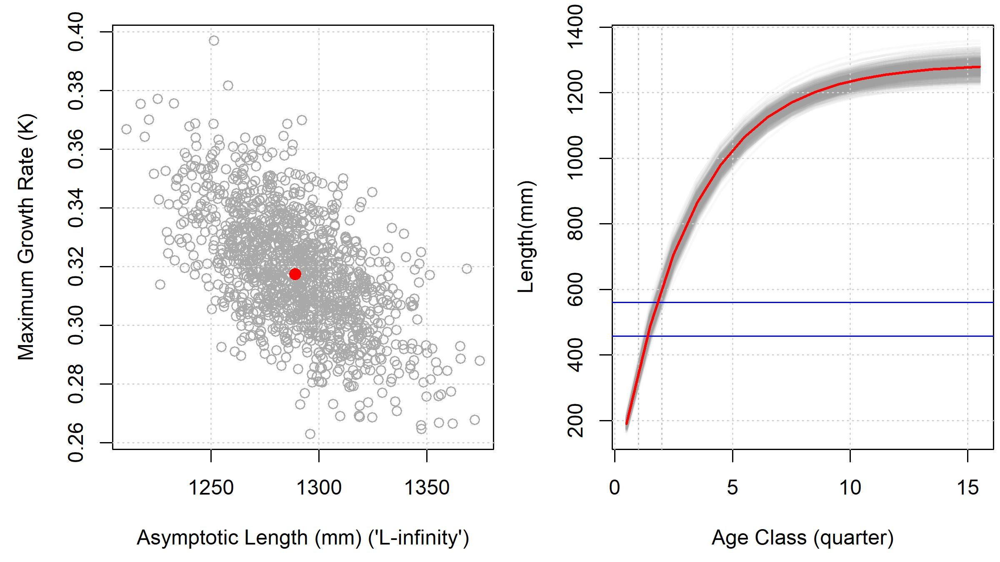

Figure `r (plus())`. The sampled (grey) and mean growth curves assumed for Dolphinfish. The blue horizontal lines on the righthand plot are the length at 50% maturity (spawning fraction) (458mm) and 100% maturity (560mm) estimated by [Schwenke and Buckel (2008)](https://spo.nmfs.noaa.gov/sites/default/files/pdf-content/2008/1061/schwenke.pdf)


## Weight-at-Length

MRIP data provides paired observations of weight and length. Fitted exponential curves slightly updated (upward, greater weight at length) the *b* value estimated by of Schwenke and Buckel (2008) (Figure `r (getF())`).

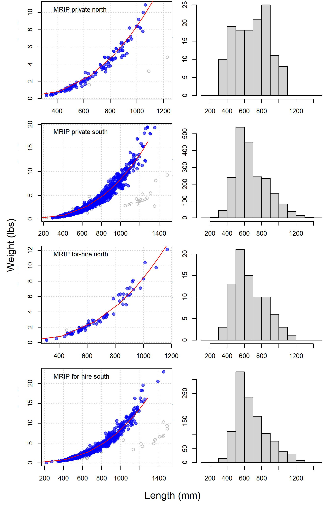

Figure `r (plus())`. MRIP weight-at-length (*b* = 0.267, *a* = 8.2e-8). Schwenke and Buckel (2008) estimated the *b* value of 0.264 but this did not fit the observed data above. Grey data points were considered outliers (reporting unit error) and not used in fitting of length-weight curves. 


## Maturity-at-Age and Maturity-at-Length

From Schwenke and Buckel (2008): "Males reached 50% maturity at 476 mm FL and 100% maturity was reached at 645 mm FL (Table 3). Females reached 50% maturity at a slightly smaller size than males, although confidence limits for this parameter overlapped with those of males. At 458 mm FL, 50% of female dolphinfish were mature, and 100% were mature at about 560 mm FL"

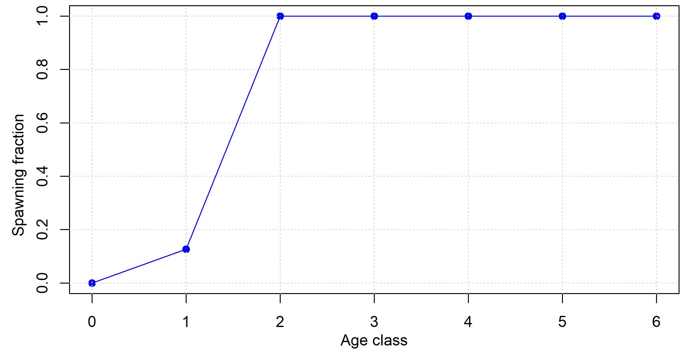

Figure `r (plus())`. Maturity (spawning fraction)-at-age and -length for the reference operating model, estimated by Schwenke and Buckel (2008) 


## Stock-Recruitment and Resilience

The conventional approach for characterizing steepness fits a stock assessment model and either estimates the value within the assessment or derives it post-hoc by evaluating paired estimates of spawning stock biomass and recruitment. Unfortunately, the RCM fits of this study estimate highly variable recruitments and estimated stock biomass (inferred by total VAST index) rarely drops to low enough levels to inform steepness (Figure `r (getF())`). 

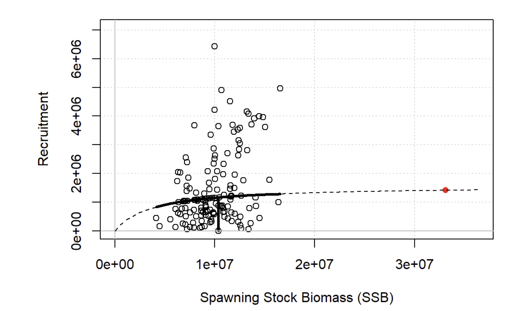

Figure `r (plus())`. Example maximum likelihood estimates of spawning stock biomass (SSB) and recruitment for OM #1 given the mean values for input parameters.

Given a lack of stock assessment (or informative RCM fit) another approach is to derive age-structured indices and relate those of age-1 recruits to those indicative of mature age classes. In a comparable approach, Mahon and Oxenford (1999) develop a catch-rate based sketch of stock-recruitment for Caribbean Dolphinfish suggesting high steepness but with high uncertainty due to few 'observations' at low stock levels (Figure `r (getF())`).

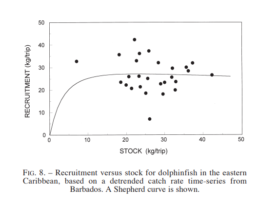

Figure `r (plus())`. Molto et al. 2020. Detrended catch rate indices of SSB and recruitment imply high resilience in Caribbean dolphinfish when a Shepherd model is fitted to data.

Stock resilience is determined by both ecology and life-history and is therefore not necessarily informed from similar species elsewhere. However, the approach taken here is to recognize that there is limited stock-specific information and evaluate MP performance over a range of resilience documented for Dolphinfish elsewhere. 

In the eastern Atlantic, Aires da Silva et al. (2021) (cited by Roa-Ureta et al. 2021) assume a Beverton-Holt relationship and assumed the highest possible stock resilience with a steepness value of 1 (no impact of spawning biomass on recruitment). Note that MSY reference points may not be defined at this extreme level. In the north-western Pacific, Wang et al. (2026) present MSE results for a low-steepness scenario assuming a Beverton-Holt relationship with a steepness value of 0.7.


## Natural Mortality Rate

Natural mortality rate (*M*) is highly uncertain for US South Atlantic Dolphinfish. Globally, the species has wide-ranging life-history characteristics relating to growth and survival. Fish of the Gulf of Mexico, Caribbean and Mediterranean have much higher growth rate (e.g., *K* values above 3.0 per year, Molto et al. 2020) and commensurately higher estimated natural mortality rates (e.g., *M* values higher that 4.0 per year). In contrast, the regional study of Schwenke and Buckel estimates much lower growth rates of around 1.27 per year (see section 'Somatic growth' above) (Figure `r (getF())`). 


Figure `r (plus())`. Somatic growth summarized by Schwenke and Buckel (2008) versus *M* estimates presented in Molto et al. (2020). 


In the only empirical study directly relevant to the stock of this MSE, the age data collected by Schwenke and Buckel (2008) were from dockside landings in the order of thousands of fish (Buckel personal communication). This would imply relative low natural mortality rates given the relatively large fraction of age 2 and 3 fish that were observed (Figure `r (getF())`).


Figure `r (plus())`. The number of fish available dockside to obtain the age 2 and 3+ samples observed by Schwenke and Buckel (2008) for various combinations of fishing mortality (row) and natural mortality (column) per quarter. Note that Buckel indicates (personal communication) that a matter of thousands of fish were available (the blue shaded region). Also shaded in yellow if the region where fishing rates correspond with between 60% and 90% annual harvest rates. 

Meta analysis of taxonomically comparable species in the Then et al. (2015) database do not strongly distinguish between varying hypothetical *M* values but generally support annual values below 2.0 (Figure `r (getF())`). 


Figure `r (plus())`. Meta analysis of growth rate *K* and natural mortality rate *M* from the Then et al (2015). dataset for *Perciformes* and the more closely related *Pleuronectiformes*. 

A preliminary Bayesian analysis of conventional tagging data from a study by Martin et al. (currently not available for circulation), provided total annual Z (combined natural and fishing mortality rate) estimates of between 1.0 and 2.5 (90% interval) (the range for *M* is hence lower than these values depending on the assumed fishing mortality rate).

Based on these data sets this analysis assumes that *M* is likely in the range of 0.25 and 0.5 per quarter (1.0 - 2.0 per year). Note that higher *M* values are likely to be less consequential for MSE testing as they imply a more productive stock subject to lower current fishing mortality rate (challenges for meeting objectives are generally associated with lower *M* values).

Other MSE frameworks have sought to characterize parameter uncertainty only among operating models of a grid (i.e., two point values of steepness or natural mortality rate. E.g., Atlantic Bluefin Tuna, Southern Bluefin Tuna, North Atlantic Swordfish). There are several potential problems with this approach: Firstly, it dramatically compresses uncertainty among simulations within the same operating model preventing the interpretation of uncertainty for any single operating model or among operating models with the same *M* assumption; Secondly, it precludes post-hoc analysis of the role of natural mortality rate in determining performance for any given operating model; and lastly it is a scientifically indefensible assumption within a framework expressly designed to characterize uncertainty. 

For these reasons, operating models included multiple simulations for which *M* varied around mean values of 0.25 or 0.5 (depending on the *M* factor level) but with a CV of 10%. This 10% CV matches the most precise assumption that has been previously put forward by meta studies of Then et al. (2015) 

## Post Release Mortality Rate (PRM)

The mortality rate of discarded fish was determined by Rudershausen et al. (2019) with a median PRM value of 0.248 (0.053 to 0.389, 95% CI) for the US rod and reel fishery. 

This was a weighted estimate based on the fraction of fish released in poor condition (PRM median 0.450, -0.066 to 0.757, 95% CI) and good condition (PRM median 0.138, 0.060 to 0.255, 95% CI).

In these analyses we assume a rate of 0.25 for PRM. Since it may be altered by management intervention PRM is considered a management lever and can be modified within candidate MPs. 


<br>
<hr>

# Uncertainties

In the workshops of Peterson et al. (2021) stakeholders reported on uncertainties within the Dolphinfish fishery management system that should be incorporated into the MSE exercise. 

The following uncertainties were identified by the meeting participants.


## Removals

Participants highlighted the uncertainty in total removals and exploitation rate, in both the magnitude and quality of private recreational catch data and the overall magnitude of international exploitation of the stock.


## Alternate Movement Patterns

Dolphinfish movement is generally expected to follow the Gulf Stream from the Caribbean up the US east coast and around the Atlantic Ocean basin back to the Caribbean. Over the past several years, the Dolphinfish population has experienced changes in movement and
seasonal residency patterns. Participants suggested that Dolphinfish may be following alternate movement patterns, wherein (1) Caribbean fish are bypassing south Florida as they follow the Gulf Stream, (2) Dolphinfish are moving south from southern New England rather than following the clockwise Atlantic Ocean gyre, and (3) there are populations of resident Dolphinfish in southern New England and off the coast of South Carolina. Participants provided supporting evidence for movement pattern (1), noting that the fish available to North Carolina and surrounding waters match that of Dolphinfish that are caught in Caribbean waters, the clear reduction of Dolphinfish available in south Florida, and the clear increases in water temperature observed off south Florida in recent years.


## Changing Availability and Catchability

Several mechanisms for past and future changes in availability and catchability were postulated by stakeholders. Some participants suggested that climate-driven changes in temperature, shifts in the location of the Gulf Stream, and declines in the health of Sargassum weed and changes in abundance and clustering of Sargassum weed may lead to changes in availability and catchability across regions. For example, an offshore shift in the Gulf Stream would reduce availability of Dolphinfish to fishermen off the coast of South Carolina, increasing distance of Dolphinfish from shore and forcing fishermen to rely on eddies rather than the main Gulf Stream where the fish may be more abundant, but inaccessible to many fishermen. 

Further, anthropogenic changes are expected to impact the availability and catchability of Dolphinfish in the future. In the northern region, fishermen often rely on lobster pot buoys to catch Dolphinfish, which, like fish aggregating devices (FADs), congregate Dolphinfish. However, there is a push to move towards lobster pots with ropeless technology to prevent whale entanglements. This shift would likely impact catchability of Dolphinfish in these affected regions. Contrarily, offshore wind farms are being developed or are planned in several regions along the US east coast. These wind farms will result in increased structure out on the water which will undoubtedly congregate Dolphinfish and their forage. The development of these large offshore wind farms will likely increase the catchability of Dolphinfish in the northern region.


## Economic Fishery Drivers

The cost of fishing is increasing in all regions, primarily driven by increasing fuel prices. This increasing cost is also exacerbated by Dolphinfish moving further offshore as reported in Wilmington, NC. This strain has certainly been felt across all sectors of the fishery.

Further, the demand for locally caught Dolphinfish varies regionally (is particularly low in the northeast region of the U.S. region) and is highly impacted by imported Dolphinfish. Imported Dolphinfish are primarily Pacific-caught, and imported Dolphinfish account for the vast majority of U.S. Dolphinfish consumption (McPherson et al. 2022). However, stakeholder participants suggested that importing has resulted in a reduction in demand and price for locally caught Dolphinfish across regions. While we can measure and analyze these economic trends from the past, it is much more challenging to predict trends in the cost of fishing and demand for charter trips and locally caught Dolphinfish in the future. Unknown future economic drivers will correspondingly impact future fishing effort.

Post-release mortality and depredation - The at-vessel and post-release mortality reportedly varies substantially by region and is particularly related to areas of high shark abundance. Shark depredation has been increasing over time, particularly in south Florida and northern North Carolina, and this has strong implications for at-vessel and post-release mortality of Dolphinfish in these regions.

Enforcement challenges - Participants highlighted challenges with enforcement, particularly related to: unlicensed fishermen selling their product to local restaurants, challenges enforcing stricter state regulations in Florida as compared to federal regulations, and for the implementation of size limits in regions where no size restrictions are currently applied. In particular, in the northern North Carolina region, some feedback included the challenges associated with measuring live Dolphinfish and some indicated that any minimum size limit would be disregarded in practice.


<br>
<hr>

# Operating Model Dynamics

## Overview

Operating models (OMs) for Dolphinfish were structured by age, fleet, season and area following the definitions outlined above. This structuring aims to capture important population and fishing dynamics including cohort strength, spatial seasonality in abundance and spatial seasonal fishing opportunities which vary among fishing fleets. 

The available approaches for characterizing spatial population dynamics of fisheries (e.g., a Stock Synthesis assessment) require relatively complete data to inform movement and distribution such as conventional or electronic tagging data. Such data are not available at the spatio-temporal resolution required by Dolphinfish operating models. To overcome this limitation, a multi-step approach to OM conditioning was applied (Figure `r (getF())`): 

(Step 1) Estimate scale, seasonal reproduction and fishery selectivity in a spatially aggregated model (RCM); 

(Step 2) Characterize movement implied by spatial indices (VAST); 

(Step 3) Impose spatial structure and  solve for spatial-seasonal exploitation rate by fleet;

(Step 4) Characterize and Project Seasonal Recruitment. 


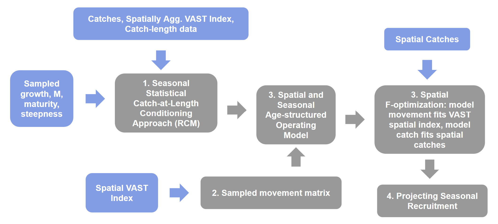

Figure `r (plus())`. Sequential approach to conditioning the spatial, seasonal, multi-fleet operating model. 


## Step 1. Estimate Scale, Seasonal Reproduction and Fishery Selectivity in a Spatially Aggregated Model

### RCM

All operating models were conditioned in the R statistical environment (R Core Team 2024) using the [Rapid Conditioning Model](https://openmse.com/tutorial-rcm/) (RCM, Huynh et al. 2025) of the SAMtool package (Huynh et al. 2026), one of the component libraries of the openMSE R package [Hordyk et al. 2026](https://openmse.com/). The RCM is a statistical catch-at-age (or catch-at-length) model similar to stock assessment frameworks such as the Woods Hole Assessment Model (WHAM; Stock and Miller 2021) in that it is implemented in R using the Template Model Builder (TMB) library for non-linear estimation (Kristensen et al. 2016). The RCM designed specifically for the conditioning of operating models in the full range of data-poor to data-rich. A key feature of RCM is the ability to conduct replicate maximum likelihood estimate (MLE) fits across sampled parameters and data sets creating stochasticity in historical dynamics.

The RCM has previously been applied as an operating model conditioning approach in various peer-reviewed applications such as evaluation of rebuilding strategies for B.C. Inside Yelloweye Rockfish (Haggarty et al. 2022), development of management procedures for B.C. Inside Quillback Rockfish (DFO 2023), four species of B.C. invertebrates (Geoduck, Manila Clam, Green Sea Urchin, Giant Red Sea Cucumber)[Carruthers et al. 2025](https://mis-assess.github.io/csrf_hh_io/3369975a9851e6fd41a0ae6865456662040af596/index.html) for the Bay of Fundy Herring MSE (Carruthers et al., 2023a) and in support of the MERA approach to data-moderate fisheries management (Carruthers et al., 2023b). The RCM has also been used to demonstrate OM conditioning in preliminary MSE analyses for a range of pelagic species such as South Atlantic Swordfish (Taylor et al. 2022), North Atlantic Blue Shark (Carruthers 2024) and Pacific Neon Flying Squid (Dai 2025).

Using RCM, a multi-fleet spatially aggregated seasonal model was conditioned on annual catches, the total VAST abundance index (all areas summed) and the fleet length composition data to estimate stock-wide productivity and scale (seasonal recruitment, fishing mortality rate at age and numbers at age). The product of this RCM fit was a spatially aggregated OpenMSE operating model.


Table `r (Tplus())`. Summary of RCM configuration and assumptions.  

```{r RCM_config, eval = T, echo=F}
plotatab('docs/tables/Various.xlsx','RCM_config',T)
```

### Population and Exploitation Dynamics

The operating models assume the standard equations for age-structured population dynamics that include a zero age (season zero in fact) class and a plus group. These equations along with those for fishery selectivity and exploitation rate are fully documented in the [openMSE Technical Manual](https://docs.openmse.com/). For RCM, see the [RCM manual](https://openmse.com/tutorial-rcm) and [RCM model equations](https://openmse.com/tutorial-rcm-eq)

The operating model was structured by season so parameters that reflect rates are 1/4 their annual value and recruitment was estimated to occur in every season. In order to allow for estimation of seasonally varying recruitment, a large value of the lognormal standard deviation on recruitment deviations was specified ('sigma-R' of 2.0). Post-hoc, these freely estimated recruitments were characterized to such that seasonal patterns of recruitment strength were preserved in projection years (see Section 7.5). 

### Model Initialization

The models were fitted to seasonal catches, the spatially aggregated VAST index and catch-length composition data available from 1986 - 2022. Since we know that exploitation occured prior to 1986 it was necessary to initalize the model assuming some long-term exploitation rate. This was achieved by characterizing an equilibrium catch for each fleet, calculated as the mean of the first two years (Figure `r (getF())`). 


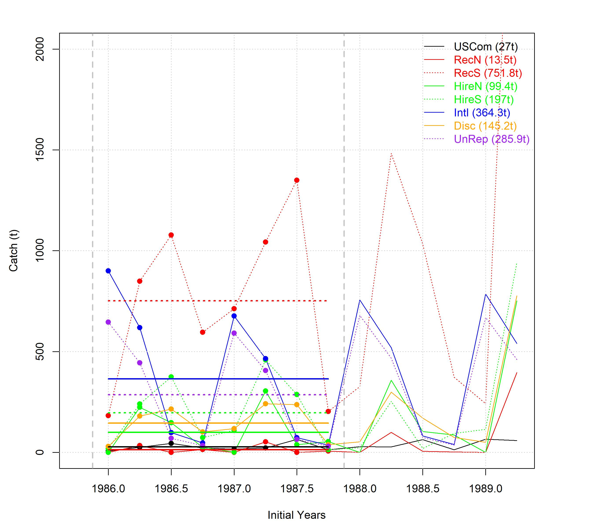

Figure `r (plus())`. Equilibrium catches prior to 1986 calculated as the mean value over the first 2 years of available data (1986 and 1987). 


### Parameter Uncertainty

For each draw of model life-history parameters (growth, maturity, steepness, M) RCM conducts a maximum likelihood estimation of seasonal recruitment, unfished recruitment, selectivity parameters and annual fishing mortality rate. In this way, uncertainty in life history (which cannot be reliably co-estimated with exploitation rate, selectivity and recruitment) is captured in the multiple simulations of each operating model. 


### Objective Function

The equations of the objective functions for priors, data and penalties (e.g., seasonal Fs greater than some specified maximum) are available online from the [openMSE website](https://openmse.com/tutorial-rcm-eq/7-objective-function/). Operating models were conditioned assuming lognormal likelihoods for catches, the total VAST Index and the length composition data. No ad-hoc reweighting was applied. A maximum seasonal fishing mortality rate (F) of 2.3 (harvest rate of 90%) was specified above which a penalty was applied. 

Table `r (Tplus())`. Data inputs and related likelihood functions assumed by RCM for purposes of maximum likelihood estimation.  

```{r RCM_LHF, eval = T, echo=F}
plotatab('docs/tables/Various.xlsx','RCM_LHF',T)
```


Table `r (Tplus())`. Estimated model parameters.  

```{r RCM_params, eval = T, echo=F}
plotatab('docs/tables/Various.xlsx','RCM_params',T)
```

### RCM Model Fitting Reports

The RCM model includes standardized reporting that describes inputs, model estimates, likelihood components and visualizes fit to data. 

RCM model fitting reports are available for all reference case operating models. Note that reference operating model factors relating to future recruitment and movement are added post-hoc to the fitted spatial aggregated operating models of conditioning step 1. Hence there are eight conditioned operating models spanning two levels for natural mortality, steepness and historical catch levels. The RCM fitting reports for the eight conditioned OMs are available in the following table: 

```{r Fit_reps, eval=T,echo=F}
makelinktab('C:/GitHub/mahiMSE/docs/tsd/data/Fits',"data/Fits",'RCM Conditioning Report')
```


## Step 2. Characterize Movement Implied by Spatial Indices (VAST)

Seasonal movement dynamics that match the distribution of the spatial VAST index (5 areas) were superimposed to create a spatial operating model (adding a spatial dimension to the RCM - estimated OM). 


The seasonal spatial predictions of the VAST model can be used to calculate a Markov movement matrix $\Delta$ for every historical transition (Figure `r (getF())`). To estimate all movement transitions from each area to each area would require information on each of these transitions (e.g., from a very extensive tagging study). In this case we only have the starting distribution (the fraction in each area going into the movement matrix) $D_{t-1,from}$, from the previous time step $t-1$ and the resulting fraction in each area $D_{t, to}$ in the subsequent timestep $t$ as a result of the movement. 

In this application we use the gravity model formulation of Carruthers et al. (2011) and Taylor et al. (2011) which is suitably constrained. This approach aims for a given level of mean viscosity (probability of staying in each area - the positive diagonal) by adjusting a gravity parameter $g$ and a viscosity parameter $v$ by area.  


Figure `r (plus())`. The estimation of a constrained Markov movement matrix for a single year and season, with $n_{areas}-1$ gravity parameters $g$, and $n_{areas}$ viscosity parameters (viscosities $v$, have an informative prior). 

The movement transitions are first calculated in the logit space: 

$$ m_{t, from, to} = g_{t, to}+v_{t, to}, \quad \text{if } from = to $$
$$ m_{t, from, to} = g_{t, to} \quad \text{if } from \neq to $$
The $g$ terms are freely estimated. Since each row of the Markov matrix is constrained to sum to 1, there are $n_{areas} - 1$ degress of freedom, the final gravity term for the last area has a fixed value of zero. 

$$ g_{t, n_{areas}} = 0 $$
These logit-space movement terms are then transformed such that each row of the movement matrix sums to 1:

$$ \Delta_{t, from, to} = e^{m_{t, from, to}} / \sum_{to=1}^{n_{areas}}e^{m_{t, from, to}} $$

The predicted distribution $\hat{D_{t}}$ is given by: 

$$ \hat{D_{t}} = D_{t-1}\Delta_{t}$$

Estimation of the $g$ and $v$ terms was conducted in R using the 'nlminb' function for non-linear estimation. There were three components to the negative log likelihood function: fit to the observed VAST distribution $D_{to}$, fit to a user-specified level of stock viscosity $V$ and a weak prior for the $g$ and $v$ terms. 

Component 1: Fit to the observed distribution $D_{t}$ was evaluated with a relatively precise normal likelihood function:

$$log(D_{t}) \sim N(log(\hat{D_{t}}), 0.025)$$

Component 2: A user-specified target viscosity (probability of staying) $V$ was used to estimate movement matrices with varying levels of viscosity: 

$$log(\Delta_{t,from,to}) \sim N(log(V), 0.35), \quad \text{where } from = to$$

Component 3: To improve numerical stability of the estimation, all terms were assigned a very weak normal prior (impact on estimated values was negligible):

$$ g \sim N(0, 5) $$
$$ v \sim N(0, 5) $$

This approach was able to characterize the historical predictions of the VAST model relatively well (Figure `r (getF())`) given varying specification of target viscosity $V$ (Figures `r (getF())` and `r (getF(2))`). 

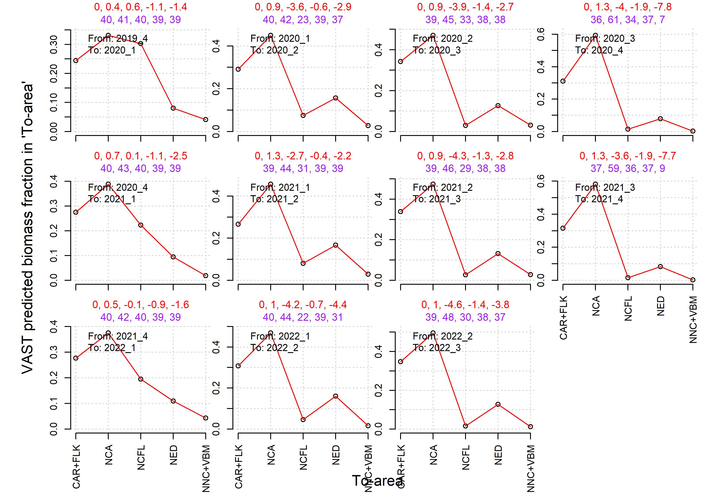

Figure `r (plus())`. Fit of the markov movement matrix to a series of example transitions with a user-specified target viscosity of 40 per cent. The red numbers at the top of each panel are the estimated gravity terms *g*. The purple numbers are the estimated probability of staying. Note that these may or may not match the target (a prior) specified due to the fraction that remains in the area between time steps. 


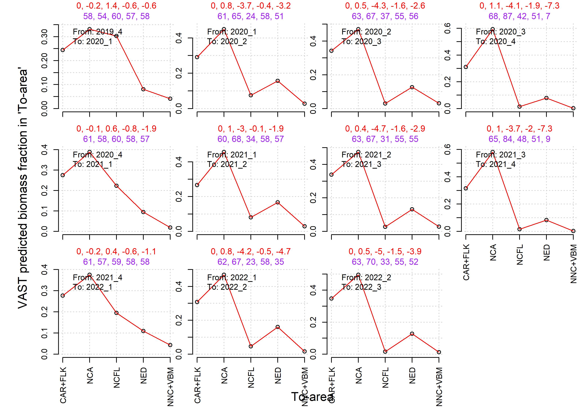

Figure `r (plus())`. Fit of the markov movement matrix to a series of example transitions with a user-specified target viscosity of 60 per cent.


In order to account for historical uncertainty in movement, $g$ and $v$ parameters were drawn from a multivariate normal distribution with the variance-covariance matrix calculated from the nlminb model fit (inverse Hessian matrix). 

For projection years, in order to preserve historical patterns of seasonality, individual years (sets of 4 seasonal movements) were sampled at random with replacement to construct the projected movements (Figure `r (getF())`). 

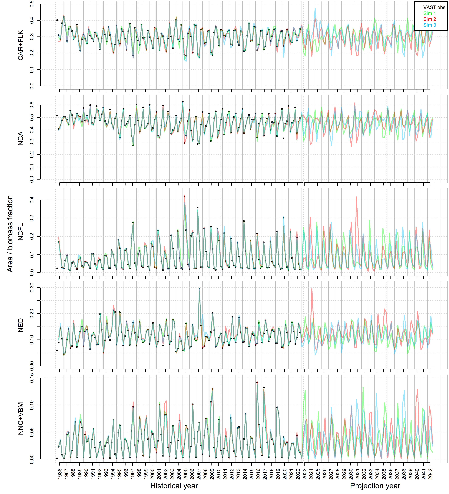

Figure `r (plus())`. The historical and projected simulation of seasonal-spatial distribution with a user-specified target viscosity of 40 per cent.  


## Step 3. Impose Spatial Structure and Solve for Spatial-Seasonal Exploitation Rate by Fleet

The spatially-aggregated RCM operating model was extended to a spatial model by superimposing the movement matrices calculated in step 2 above. These movement matrices provide a distribution of stock biomass that closely matches the spatial VAST index. A key requirement of the operating models is that they match the historical pattern of spatial exploitation rate. 

To achieve this, we employed an iterative numerical approach known as as Walrasian Tatonnement which has been used to solve for very complex fishery exploitation dynamics across many hundreds of stocks (Carruthers et al. 2019) and for density dependence within stock assessments (Carruthers and Wang 2026, in review). 

An initial distribution of historical exploitation rate (apical F, the exploitation rate of the most selected age class) by time step $t$, simulation $s$, fleet $f$ and area $r$, was proposed. This initial guess is calculated by dividing observed spatial catches $C_{obs}$ by the VAST spatial distribution $D$ multiplied by the spatially aggregated OM estimate of stock biomass $B_{agg}$: 


$$ F_{1,s, t,r,f} = C_{obs,t,r,f}/({B_{agg,s,t} D_{t,r}})$$
For reasons of numerical stability a maximum value of 0.8 was assumed for the $F$ terms in this initial step. 

The spatial operating model can now be initialized providing a prediction of spatial catches $C_{pred}$. Over 15 iterations, the spatial exploitation rates were updated such that the operating model prediction of spatial catches closely matched those observed. In each iteration $i$ the ratios of observed to predicted catches were calculated:

$$ \delta_{i,s,t,r,f} = C_{obs,t,r,f} / C_{pred,i-1,s,t,r,f} $$
For the next iteration exploitation rate are updated according to this ratio and an adjustment factor. The adjustment factor is needed to slowly move the numerical approach to a stable equilibrium. Immediately updating the historical F distribution according to $\delta$ would lead to instability and 'flip-flopping' as previous values of F would impact those in subsequent time steps. Here a relatively large (there are few cohorts and reduced impact of F on subsequent biomass compared with longer lived species) adjustment factor of 0.7 was assumed: 

$$ F_{i,t, s, t,r,f} = exp(0.7 \cdot log( \delta_{i,s,t,r,f})) \cdot F_{i-1,t, s, t,r,f}  $$
A maximum F in any time step of 2.3 (harvest rate of 90%) was imposed.

In this application running the algorithm for 15 iterations was to ensure convergence. For most operating models, catches were very close to those observed after just 8 iterations (Figures `r (getF())` - `r (getF(3))`).

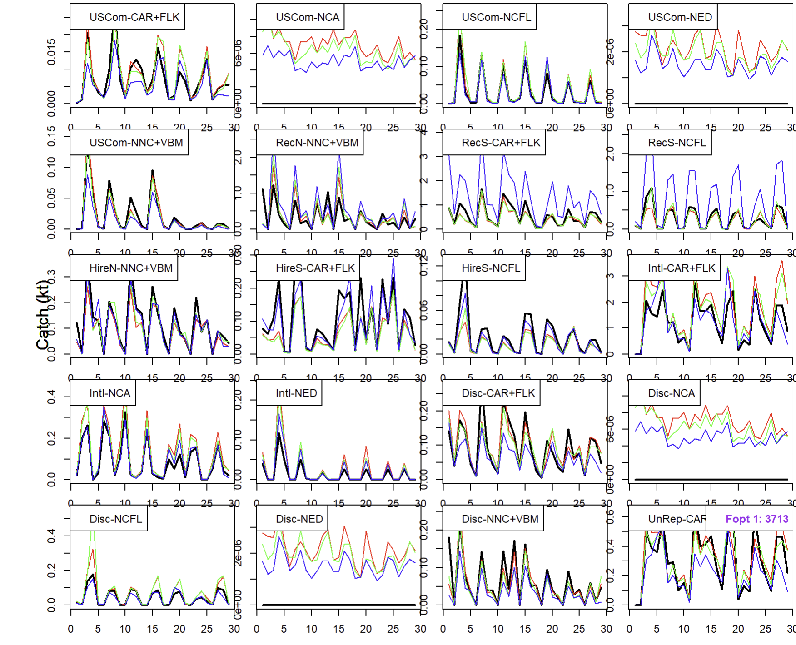

Figure `r (plus())`. Observed versus predicted catches (x axis is time-step index) for the first iteration of the algorithm based on the initial guess of spatial exploitation rate.

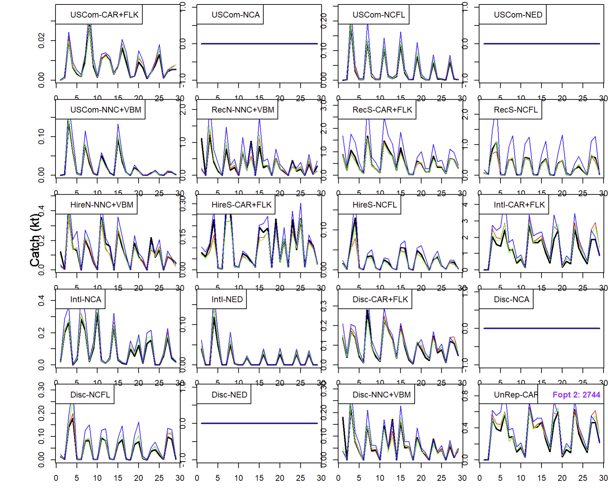

Figure `r (plus())`. Observed versus predicted catches (x axis is time-step index) for the second iteration of the algorithm in which the initial guess of spatial exploitation rate has been updated once.

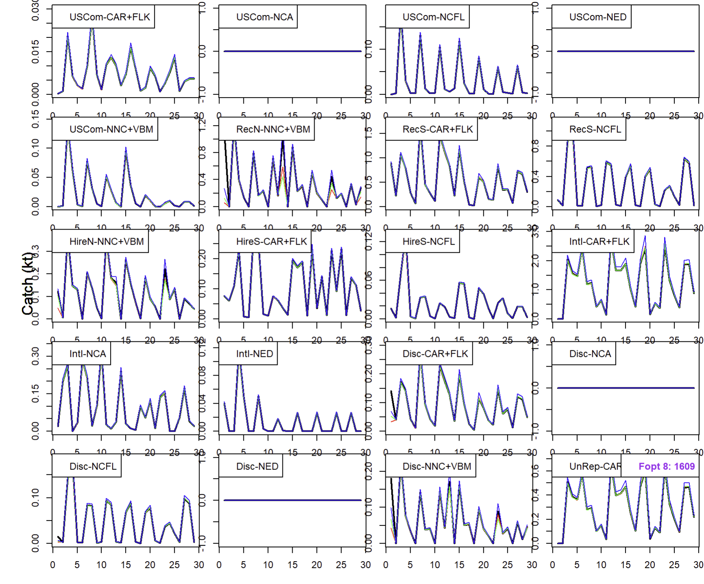

Figure `r (plus())`. Observed versus predicted catches (x axis is the historical time-step) after 8 iterations of the algorithm in which the initial guess of spatial exploitation rate has been updated seven times.


## Step 4. Characterize and Project Seasonal Recruitment. 

Historical recruitment deviations were sampled assuming a multivariate normal distribution specified by the variance-covariance matrix of parameters from the RCM model fitting. 

In order to characterize the seasonal pattern in recruitment for use in projections, historical mean and variance were characterized for each season. Future seasonal recruitment deviations were then sampled according to truncated log-normal distributions (deviations greater than 6 were resampled) using those mean and variance estimates. Lag-1 autocorrelation among historical estimates was low for each season and therefore future deviates were sampled independently (Figure `r (getF())`). 

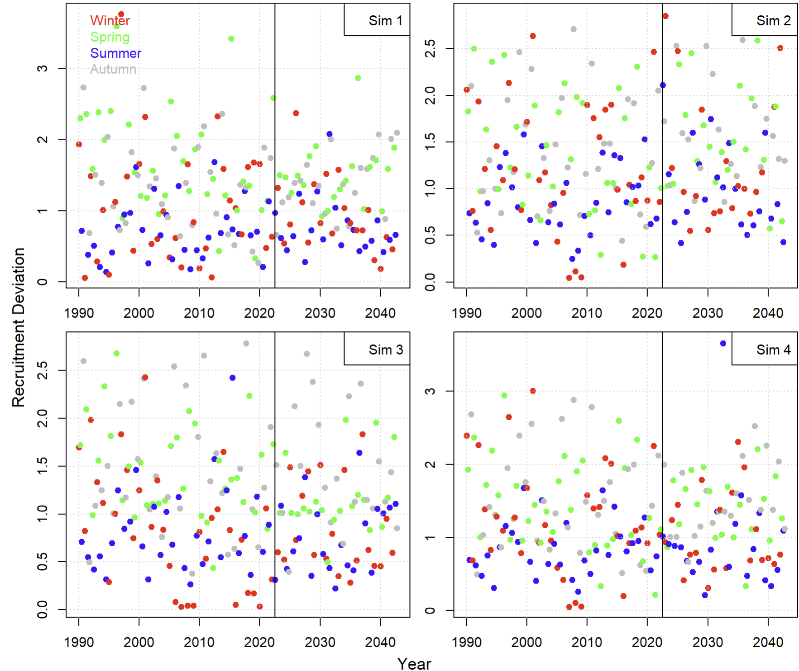

Figure `r (plus())`. Historical estimated recruitment for four simulations, including simulated projected recruitment.


## Conclusions: The Sequential Operating Model Conditioning Approach. 

This sequential approach to conditioning operating models for Dolphinfish captures the important properties of dolphinfish dynamics;

* Plausible scale and recruitment variability (Step 1: Estimate scale, seasonal reproduction and fishery selectivity in a spatially aggregated model)
* Captures uncertainty in stock and fishery dynamics (stochastic inputs for *M*, *K* and stochastic estimates of selectivity, Estimate scale, seasonal reproduction and fishery selectivity in a spatially aggregated model)
* Absolute abundance differences among areas (Step 2: Characterize movement implied by spatial indices (VAST))
* Seasonality in abundance (Step 2: Characterize movement implied by spatial indices (VAST))
* Varying seasonality among areas (Step 2: Characterize movement implied by spatial indices (VAST))
* Matches spatial catches by fleet and season. (Step 3: Imposing Spatial Structure and Solving for Spatial Exploitation Rate)
* Captures and projects seasonality in recruitment (Step 4: Characterize and Project Seasonal Recruitment)


<br>
<hr>

# Trial Specifications

## Reference Grid Operating Models

### Overview of Reference Grid

Reference operating models are intended to capture the primary uncertainties relating to stock, fishery, observation and implementation dynamics. In most MSE settings, typical reference OM uncertainties are similar to common sensitivity analyses for stock assessment models including:  

* stock status (e.g., spawning biomass relative to unfished levels)
* productivity (e.g., mean recruitment level, natural mortality rate, somatic growth)
* resilience (i.e., steepness or compensation ratio)
* magnitude of historical observed catches
* weighting of conflicting stock trend information

Reference set operating models serve as the core basis for comparatively evaluating the performance of candidate management procedures (CMPs). These reference set operating models may be weighted to reflect varying plausibility of the simulated scenarios. In general, reference operating models may be empirically derived and are not specified from only expert judgement or other subjective approaches. 

For Dolphinfish, spatial considerations of stock distribution, stock mixing and fishing opportunity are additional key uncertainties. Preliminary reference operating models were designed as an orthogonal grid of 5 factors with two levels of each factor. Those factors included natural survival (*M*), magnitude in mean recruitment (based on time periods of historical estimated recruitment), stock resilience (steepness), spatial distribution and stock viscosity. With two levels for each factor this leads to a total of 32 operating models (Table `r (getT())`). Uncertainty in stock status is included within operating models of the reference grid and characterized by stochasticity among the RCM conditioned simulations in each operating model. 

The reference set is a fully orthogonal grid with two levels for each of five factors.


Table `r (Tplus())`. The factors and levels of the orthogonal grid of reference operating models.  

```{r RefOMs, eval=T,echo=F}
plotatab('docs/tables/Various.xlsx','RefGrid')

```
<br>


These 32 operating models are organized in the general order of most (OM_1) to least (OM_32) challenging test of an MP:

```{r reference, eval=T,echo=F}
plotatab('docs/tables/Various.xlsx','Reference')
```


### Factor 1: Natural Mortality Rate

The two mean levels of natural mortality rate selected as suitable bounds (0.25 and 0.5 per season, see section 'Natural Mortality Rate' above) were imposed on operating models assuming a 10% coefficient of variation to propagate uncertainty across simulations (Figure `r (getF())`). Adding within-OM uncertainty means that no subset of operating models have a point-value for parameters that are unknown and also provides a range of parameter values for evaluating performance gradients (e.g., "How does yield of a given MP vary across values of natural mortality rate versus steepness"?). 

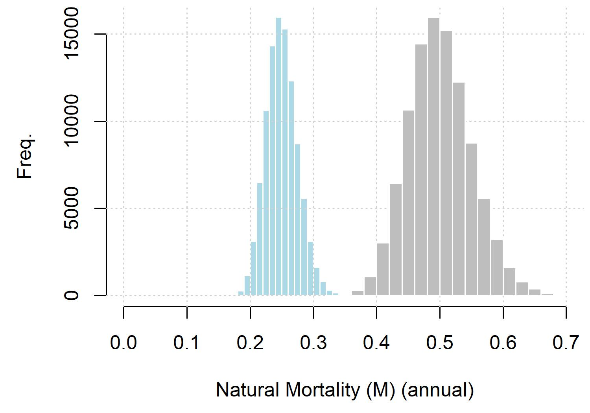

Figure `r (plus())`. Distribution of seasonal natural mortality rate sampled for operating models of the reference grid (low: mean = 0.25, high: mean = 0.5).


### Factor 2: Steepness of the Beverton-Holt Stock-Recruitment Relationship

In this MSE we bracket mean steepness with disparate values of 0.7 and 0.95 (a value of 1 may lead to indeterminate MSY reference points) (See section 'Stock-Recruitment and Resilience' above). As with *M*, steepness was sampled from a distribution of values (sd = 0.025) to impose within-OM uncertainty (Figure `r (getF())`). 

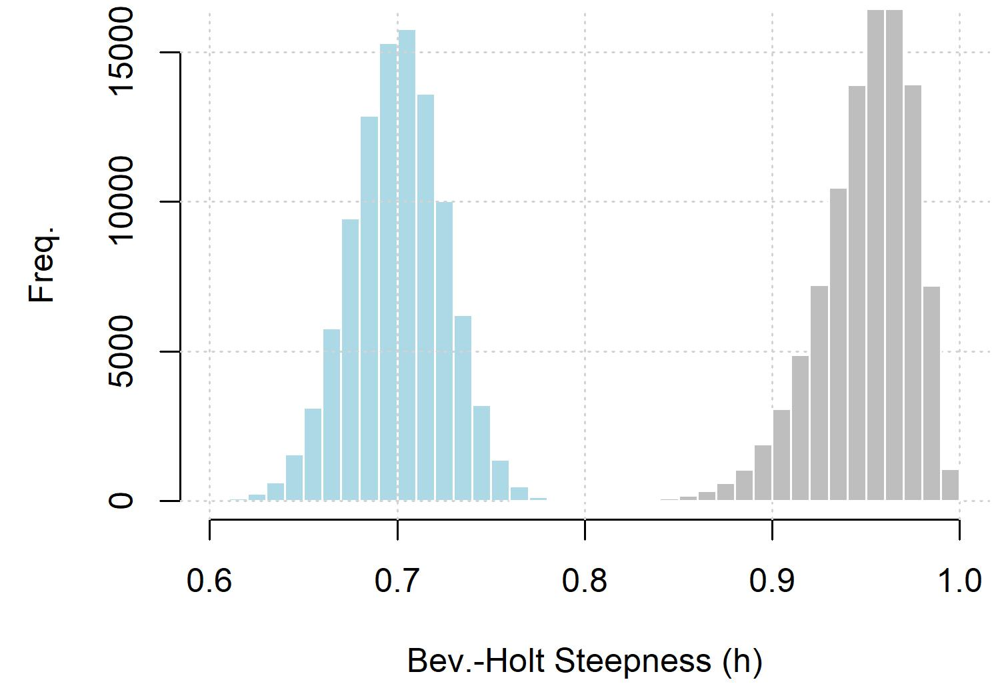

Figure `r (plus())`. Distribution of steepness (Beverton-Holt stock-recruitment relationship) sampled for operating models of the reference grid (low: mean = 0.7, high: mean = 0.95).


### Factor 3: Catch Magnitude of Discard and Unreported Fleets

In order to capture uncertainty in the magnitude of discard and unreported fleets, 50% and 100% of the base catch for these fleets were selected as appropriate levels. Note that lower catches are the relevant direction of uncertainty since these infer a smaller overall stock subject to a higher fraction of exploitation by the US fleets for which MPs are to be tested. 

### Factor 4: Future Recruitment Strength

RCM model fits followed the reduction in the VAST index over the most recent four years, during which estimated recruitment has declined more than can be predicted by spawning biomass changes. Recruitment deviations (the additional process error not explained by spawning biomass) over the most recent 4 years are approximately 75% of the preceding historical years (Figure `r (getF())`). 

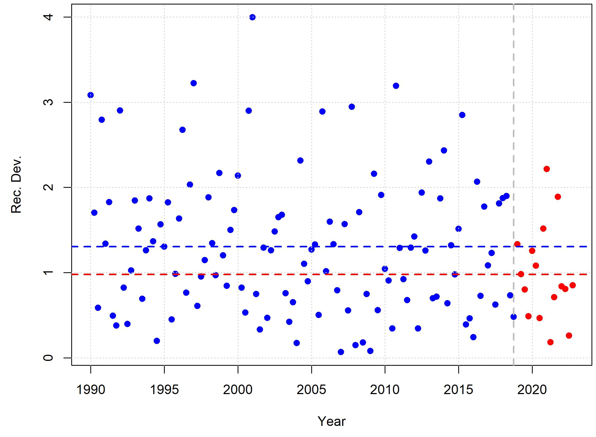

Figure `r (plus())`. Example of maximum likelihood estimates of recruitment deviations (first simulation of OM #1). 

It is not clear whether the stock will revert to the long-term mean recruitment deviations or remain at a lower than expected level. To recognized this uncertainty and characterize it, projections of recruitment assume that these are sampled stochastically with autocorrelation around a mean level that is 75% and 100% of historical levels.  


### Factor 5: Spatial Mixing and Movement

Using a gravity model, movement matrices were calculated that matched the biomass changes inferred by the VAST spatial index while aiming for a specified probability of the stock staying in the same area among seasons. 

Below are two examples where a movement matrix is calculated that corectly moves the distribution of fish inferred by the VAST index in Summer 2022, redistributing this in Autumn 2022 (Figure `r (getF())`). 


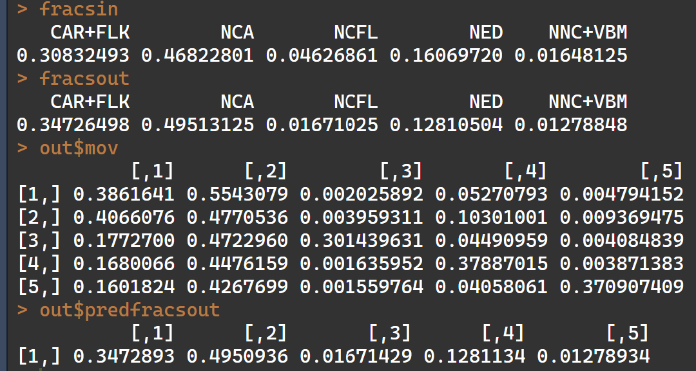

Figure `r (plus())`. Example of a movement matrix derived from the gravity modelling approach that aims for 40% probability of staying (positive diagonal) while correctly moving the distribution of fish in Summer 2022 (fracsin) to match the distribution of fish in Autumn 2022 (fracsout).   

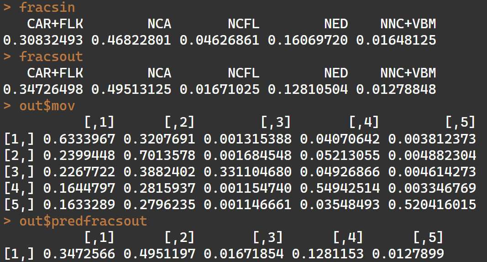

Figure `r (plus())`. Example of a movement matrix derived from the gravity modelling approach that aims for 60% probability of staying (positive diagonal) while correctly moving the distribution of fish in Summer 2022 (fracsin) to match the distribution of fish in Autumn 2022 (fracsout).

Movement matrices were calculated for target probabilities of staying of 20%, 40%, 60% and 80%. Levels of 40% and 60% were used in the reference set for the factor 'spatial mixing and movement'. Levels of 20% and 80% probability of staying were used to specify robustness operating models.  


<br>

## Reference Case Operating Model

The reference case operating model is a single well-characterized and well-understood hypothesis that serves as a familiar and concise basis for quickly investigating sensitivities, alternative MPs etc. It is a tool for efficiently obtaining quantitative  answers to working group questions (e.g., "does it make a difference to MP selection if historical catches are under reported"?).

The current Reference Case operating model is OM_29 that has low M, low steepness, full historical catches, continuation of historical mean recruitment and high stock mixing. 


## Plausibility Weighting

Given the high uncertainty regarding Dolphinfish life history dynamics, fishery exploitation and stock mixing, reference set operating models are currently considered as equally plausible. Future phases of MSE development may include processes to add weighting of operating models which may affect both MP tuning and the presentation of CMP performance outcomes. 

## Robustness Set Operating Models

Robustness set operating models represent secondary uncertainties that may not be well informed by data, involve alternative future scenarios that are derived from subjective judgement or represent the viewpoints or experience of particular stakeholders or scientists. The purpose of the robustness operating models is to provide a means of further discrimation among management procedures that perform similarly for the reference set of operating models. Robustness operating models also provide performance outcomes for hypotheses specific to certain stakeholder groups (e.g., "how will northward shifts in biomass affect catch outcomes for Florida fisheries"?). 

Table `r (Tplus())`. Robustness operating models. Single factor variants of the reference case operating model. 

```{r RobOMs, eval=T,echo=F}
plotatab('docs/tables/Various.xlsx','Robustness')

```


<br>
<hr>


# Simulating Data

## Historical Data 

All historical observations (indices, catches, catch compositions) are considered known and these values do not vary among operating models or simulations. Only future data vary that are the product of population, fishery and observation processes that are part of the closed-loop simulation.   


## Generation of Future Data for Input to Management Procedures

When an RCM model is fitted to catches, indices and length composition data, the properties of the observation error model (that generates future data of comparable quality to those observed historically) is calculated from the fit of each simulation to the observed data. For example, if a simulation fits the data well (has low residual error and few runs in residuals) then future observations of those data will be generated with commensurately high precision and low lag-1 autocorrelation (that determines whether data are consistently over or under the true simulated value). Conversely, if a simulation (a fit of the model to the data) does not fit the data well, then those data are simulated with higher precision and, if there are runs in residuals, higher lag-1 autocorrelation. For composition data, the effective sample size of historical data is assumed for future simulations.

In this application only index data are used by the candidate management procedures. Future revisions to this MSE framework may introduce model-based MPs that can make use of both catch and catch composition data. 

## Simulating Indices

A number of indices have been proposed for use in an empirical management procedure ('empirical' because it calculates advice directly from data without a estimation step, such as a stock assessment model).The primary index for CMP development has been the U.S. pelagic longline index in season 1 (Winter), area 1 (CAR + FLK)

The approach to simulating indices is the same as in MSE frameworks elsewhere. On a simulation by simulation basis, the statistical properties of the index are characterized (Figure `r (getF())`):

* Constant of proportionality (catchability or 'q')
* Lognormal standard deviation (expressed as a coefficient of variation (CV))
* Lag-1 autocorrelation. 


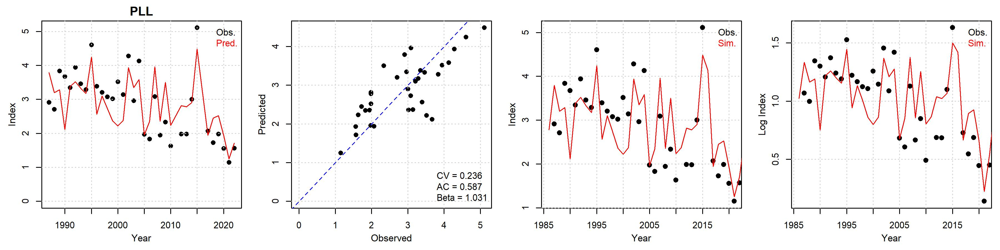

Figure `r (plus())`. Calculation of statistical properties for a single simulation of the reference case operating model (OM_29). The black dots are the U.S. pelagic longline index, the red line is the true vulnerable biomass from the historical period of the simulation. 

The mahiMP management procedure retains the ability to specify statistical properties of indices for exploratory purposes ('value of information' analyses). 

## Other Potential Indices

A number of other data inputs to MP have been identified but not yet formalized. These include:

* A Puerto Rico Tournament Index (PLL vulnerable biomass, season 1, area 1).
* The 'Blue Blob' environmental index - above/below average classifier of stock availability (total biomass, over all areas and seasons)
* The ENSO environmental index - above/below average classifier of stock availability (total biomass over all areas and seasons). 
* MRIP Recreational Catch Rate Index (US recreational fleets vulnerable biomass, season 2 & 3, US EEZ areas)

<br>
<hr>

# Performance Measures / Statistics

## Conceptual Management Objectives

A series of stakeholder workshops were conducted to elicit feedback on suitable management performance metrics [(Peterson et al. 2024)](https://doi.org/10.25923/f628-n174). The following broad objectives were identified: 

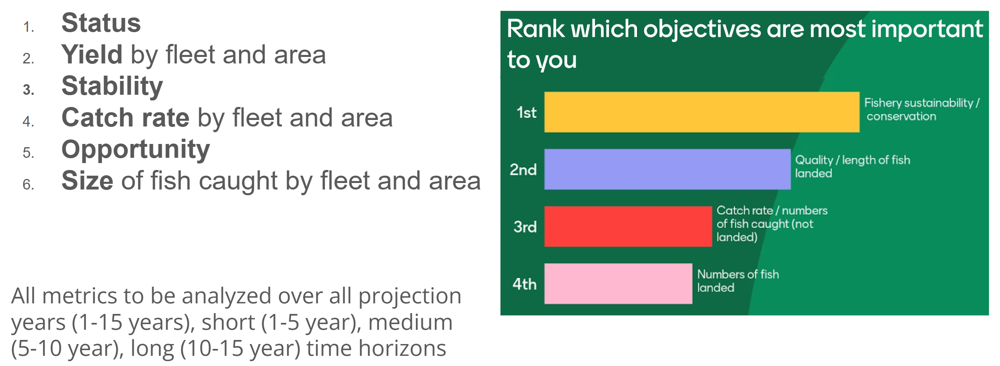

Figure `r (plus())`. Conceptual management objectives identified during stakeholder workshops.  

## Time Horizons for Performance Evaluation

Due to its relatively short life span, management procedures tend to reach equilibrium biomass and yield outcomes before 10 years (40 seasons) of the MSE projection. For this reason the following time horizons were selected for evaluating near, medium and long term performance: 

* Full projection period (15 years, 60 quarters)
* Near-term (projection years 1-5, 20 quarters)
* Medium-term (projection years 6-10, 20 quarters)
* Long-term (projection years 11-15, 20 quarters)


## Metrics Currently Available in the mahiMSE R Package

### Status

As is typical in other MSE and stock assessment settings, spawning stock biomass (SSB) status is reported relative to MSY levels (SSBMSY). In this seasonal model the numerator is the mean SSB over the year (Figure `r (getF())`). 

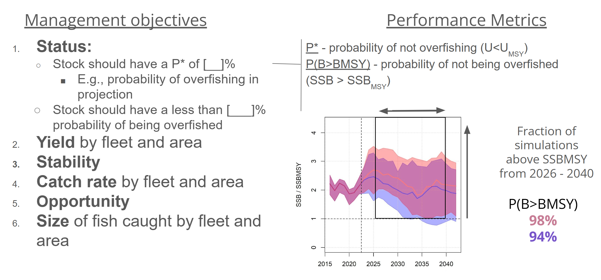

Figure `r (plus())`. Evaluation of stock status according to spawning biomass relative to MSY levels   

### Yield

Yield is represented by annual landings (Figure `r (getF())`) but could also be reported in catches which may be more relevant to recreational stakeholders. 

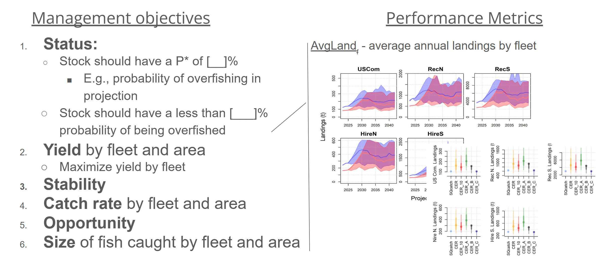

Figure `r (plus())`. Evaluation of fleet-specific yield 


### Stability

Yield stability is calculated as the absolute percentage change in annual landings in each management update (it would not be calculated over time steps where management was not updated)(Figure `r (getF())`). 

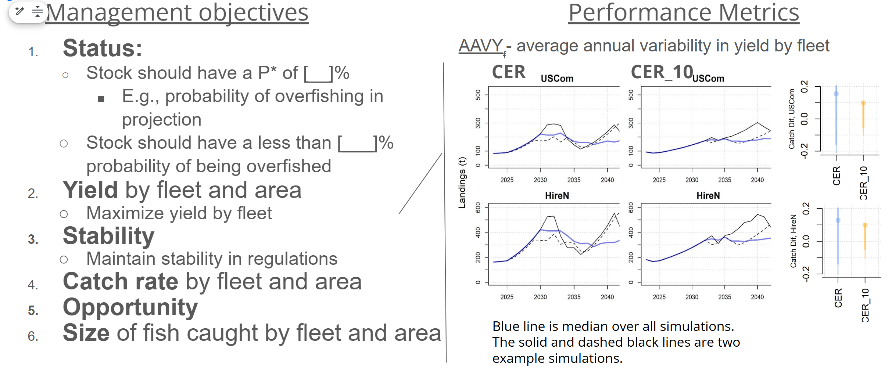

Figure `r (plus())`. Stability in yield evaluated as the average annual variation (absolute deviation as a fraction)


### Catch Rate

The various operators in each fleet have varying catchabilities (catch rates vary relative to vulnerable biomass) based on local scale availability, fishing gear, behaviors, species targeting etc. To provide a metric of catch rate that is meaningful to all operators but independent of their individual catchabilities, catch rate is phrased relative to today (2022). This is simply the mean vulnerable biomass in a given year relative to that in 2022 (Figure `r (getF())`).

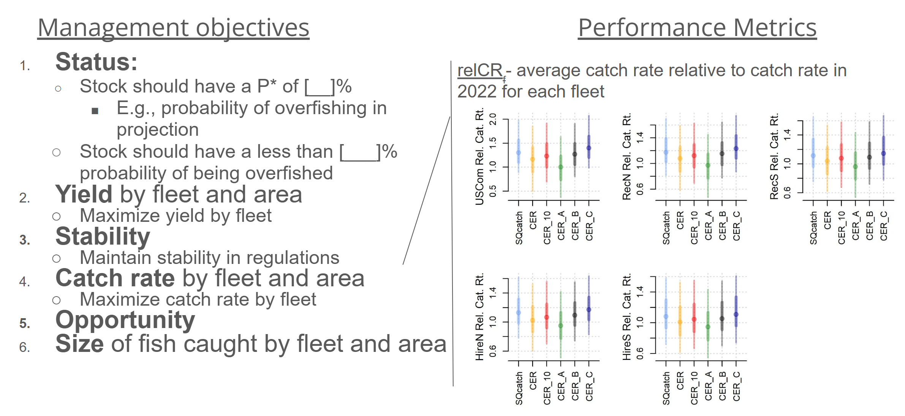

Figure `r (plus())`. Predicted catch rate relative to 2022 levels (controlling for operator catchability)


### Opportunity

In order to model events where a catch limit is met early or never met, it is necessary to include a fleet dynamics model. This is being investigated but not currently available. Until such a model can be implemented it is not possible to calculate fishing opportunity metrics. 

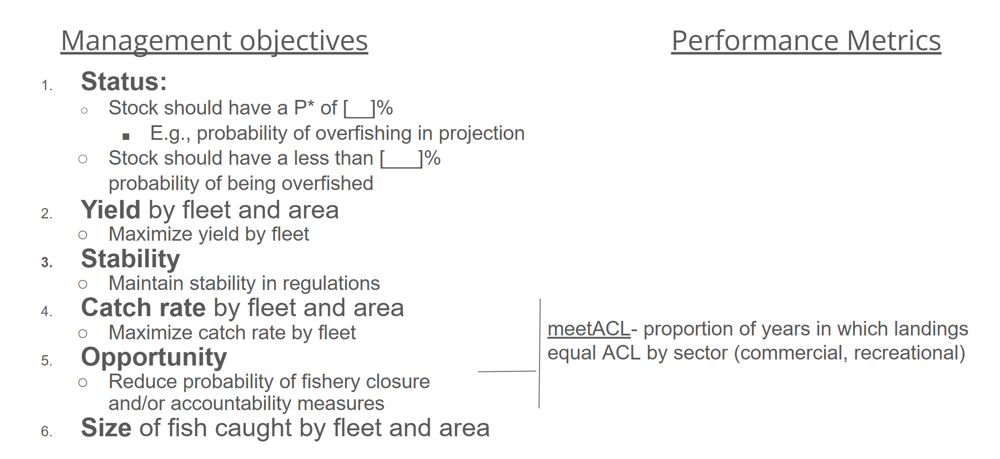

Figure `r (plus())`. Opportunity in fishing phrased as the fraction of potential catches not realized due to the catch limit. 


### Size of Catch

For the same reasons as catch rate, size of catch is phrased in terms of mean size relative to 2022 which is independent of the selectivity of individual operators (Figure `r (getF())`).  

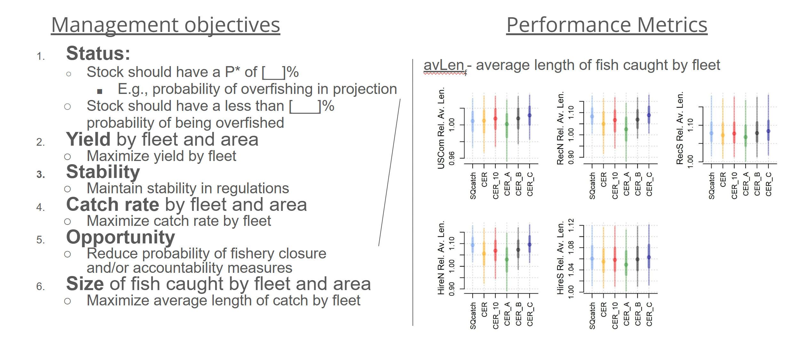

Figure `r (plus())`. Size of caught fish expressed relative to 2022 levels (controlling for operator-specific selectivity / availablity). 


## Calculation of MSY Quantities

MSY quantities were calculated using the standard approach of Botsford (1981) and Walters and Martell (2004) (Box 3.2 of that book) which efficiently calculates equilibrium yields for an age-structured population dynamics model using growth, maturity, the stock recruitment relationship and a fishery selectivity at age vector [more on OpenMSE MSY reference point calculation](https://docs.openmse.com/concept-ref-points.html). 

Future changes in selectivity may be imposed by MPs that test alternative size limits. For this reason static MSY reference points were calculated based on operating model conditions in the final year of the historical simulation (2022). 

Since the operating model has multiple fleets, aggregate selectivity was calculated as the mean selectivity across fleets weighted by their catch. Overfishing reference points were calculated on the basis of catch weight divided by total biomass (harvest rate *U*, UMSY). There are two advantages to this exploitation rate metric: (1) MP-driven future selectivity changes affect the interpretation of apical *F* (*F* for the most selected age class); (2) *U* calculation does not require the calculation of asymptotic age-selectivity that is challenging for spatial, seasonal, multistock models where temporal variability in recruitment creates transient effects. 


## Results Presentation

The default basis for the presentation of results is the Slick App [Hordyk et al. 2025](https://harveststrategies.org/slick-user-guide.html) that provides an interactive summary of MSE results across OMs, MPs and performance metrics. Results are presented in worm plots, spider plots, box plots and Kobe plots in addition to colored performance tables (sometimes referred to as 'quilt plots'). 


<br>
<hr>

# Management Procedures

## Management control options

The following management control options have been identified for the purposes of management procedure testing. 

* catch limits
* minimum size limits 
* slot limits 
* bag/trip limits 

More information on current management options is included in [Amendment 10 to the Fishery Management Plan for the Dolphin and Wahoo Fishery of the Atlantic](https://repository.library.noaa.gov/view/noaa/32989/noaa_32989_DS1.pdf)


## Implementation of Management Advice

As in other MSE settings, management advice is considered to be followed exactly for all measures including size limits, effort controls and catch limits. Mismatches between recommendations and the implemented exploitation can still occur if the simulated stock reaches low levels and catches are not obtainable, for example. 

The operating models all have the option of simulating implementation error (e.g., mismatches between recommended and implemented TAC) and implementation biases (e.g., consistent overages).  


## Management Procedure Archetypes 

MP archetypes are broad classifications of management procedures that interpret data types in a particular way for the provision of management advice. For example an index rate output MP is one that aims for a constant exploitation rate. 

Table `r (Tplus())`. Examples of candidate management procedure archetypes. 

```{r MParch, eval=T,echo=F}
plotatab('docs/tables/Various.xlsx','MParch')

```

## Management Procedure Derivatives

A management procedure archetype can be modified into a derivative by imposing one or more constraints, filters or harvest control rules (Table `r (getT())`). 

Table `r (Tplus())`. Examples of candidate management procedure derivatives 

```{r MPderiv, eval=T,echo=F}
plotatab('docs/tables/Various.xlsx','MPderiv')

```

## The MahiMP

The mahiMP is a flexible, empirical management procedure available in the [mahiMSE R package](https://blue-matter.github.io/mahiMSE/supporting/mahiMSE.html). The primary functionality of the mahiMP is to investigate options for setting TAC advice (on aggregate, by fleet or by fleet and area) based on available indices of abundance. The MP also has the ability to prescribe only fishing effort and effort and TAC combined. 

The mahiMP is an MP of the archetype 'index rate output' that includes options for all of the various MP derivatives listed above (Figure `r (getF())`). Additional management measures are accounted for such as minimum and maximum size limits by fleet and trip limits by fleet. Alternative post-release mortality rates can also be explored using the MP. 

The mahiMP is configured with status quo management (Table `r (getT())`) from which changes can be made. 


Table `r (Tplus())`. Status quo settings for the mahiMP. 

```{r MPStatQuo, eval=T,echo=F}
plotatab('docs/tables/Various.xlsx','StatQuo')

```


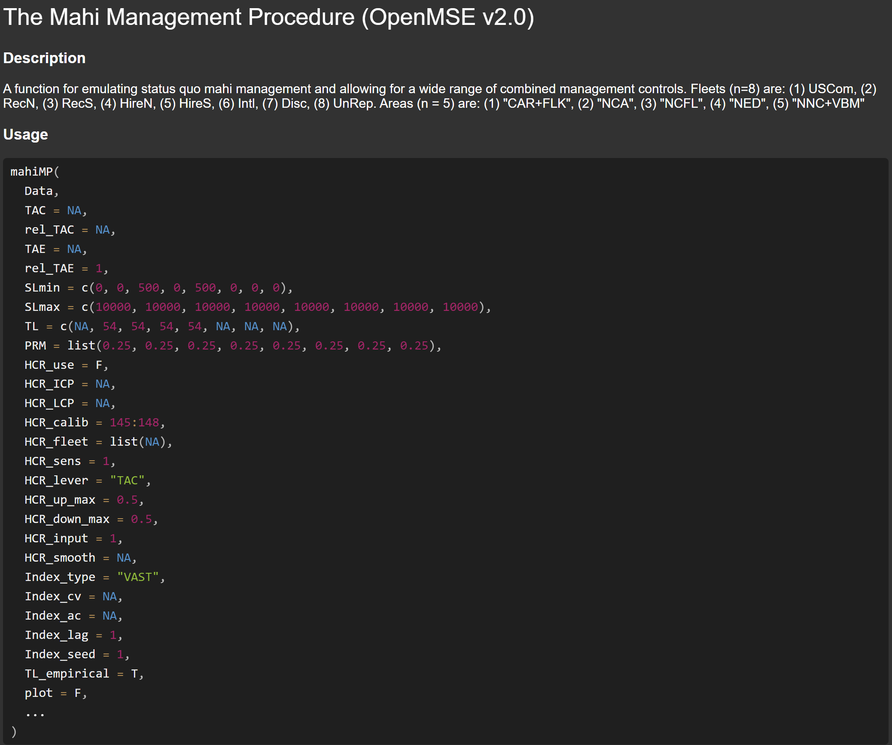

Figure `r (plus())`. Arguments to the mahiMP included in the mahiMSE R package. 


TAC control is implemented via an empirical harvest control rule (HCR). The control points of the HCR can be modified to include both constant exploitation rate and constant catch scenarios (Figure `r (getF())`). 


Figure `r (plus())`. A comparison of two HCR configurations, a constant exploitation rate (CER) calibrated to fish at current catch per index, and a more aggressive derivative (CER_A). 


Limits on TAC changes among management cycles are available in addition to options for smoothing indices or dampening TAC changes (Figure `r (getF())`). 


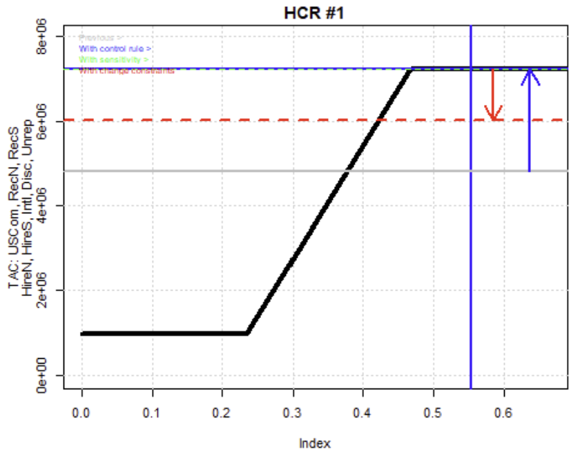

Figure `r (plus())`. The modifiable 'hockey stick' HCR implemented by the mahiMP. 


## Modelling Trip Limits

### Characterizing Observed Catch Rate Data

Recreational trip-level catch rate data were summarized over the last five years (2020 - 2024). These catch rate (fish per trip) distributions were strongly positively skewed. In general, very few trips exceeded the existing 54-fish trip limit (Figure `r (getF())`). 

When characterized by a negative binomial distribution (binomial and lognormal models failed to approximate the variance and skew), the upper tail of the distribution was relatively thin leading to lesser predicted impacts of trip limits on release rates. 

When characterized by an empirical fit (kernel density) the distribution predicted a larger (but still small) impact of the trip limit on release rate (Figure `r (getF())`). 

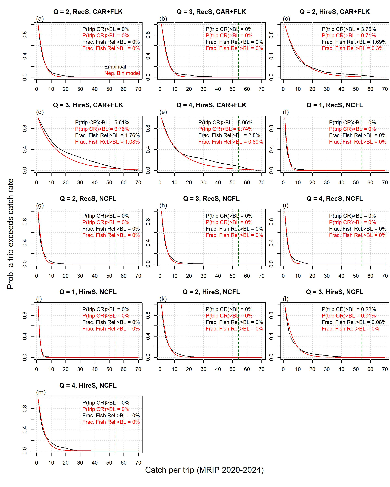

Figure `r (plus())`. Empirical (black, kernel density) and modelled (red, negative binomial) fish per trip for the RecS and HireS fleets from 2020-2024. Note that in most cases very few trips exceed the current 54 fish limit (vertical dashed line). 

### Predicting Release Rate

The constant of proportionality (*q*) was calculated relating the mean of the catch rate distributions to the corresponding vulnerable biomass of the fleet. The expected mean catch rate could then be predicted in any future year of the projection. Given an assumption of constant coefficient of variation (CV), it is possible to predict the fraction of fish released (*r*) as a product of this predicted catch rate distribution (Table `r (getT())`, Figure `r (getF())`). 


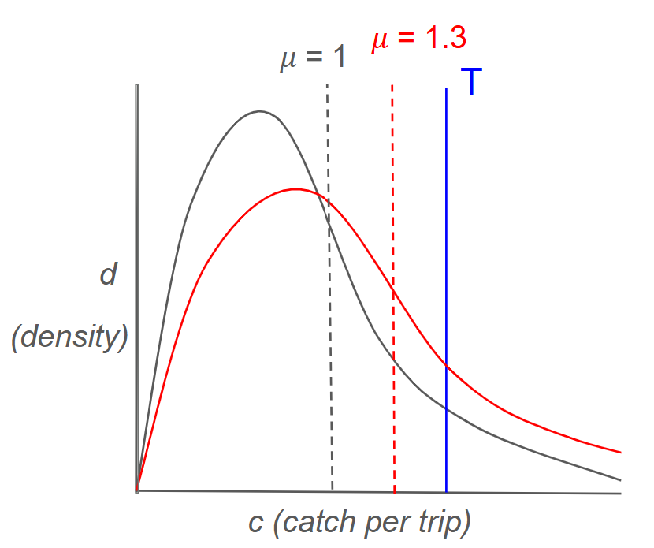

Figure `r (plus())`. For didactic purposes: a fitted density distribution (*d*) for catch rates (*c*) for the historical time period (black) and an expected distribution of catch rates where vulnerable biomass is 30% larger (mean is 1.3) (red). Given the assumption of a constant coefficient of variation, the distribution is stretched such that a larger fraction of catch rates are above the trip limit (*T*). 


Table `r (Tplus())`. Equations of the trip-limit model predicting release rate of fish given a distribution of catch rates (*d*) and a trip limit (*T*).  

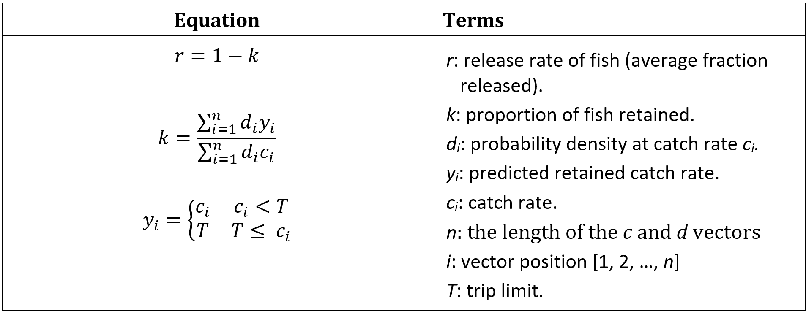

## Example MPs

A set of 6 candidate management procedures were specified to demonstrate a range of performance outcomes spanning the trade-offs of yield, stability and safety (Table `r (getT())`, Figure `r (getF())`). 


Table `r (Tplus())`. Description of the 6 demonstration CMPs.  

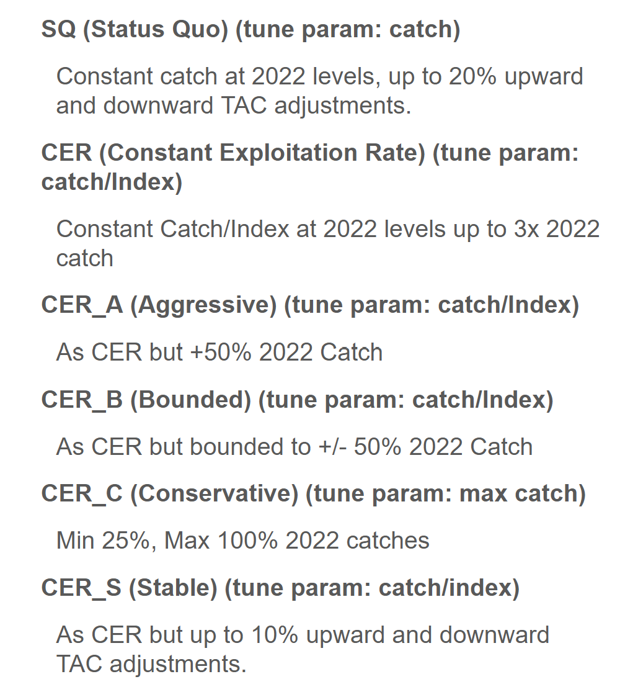


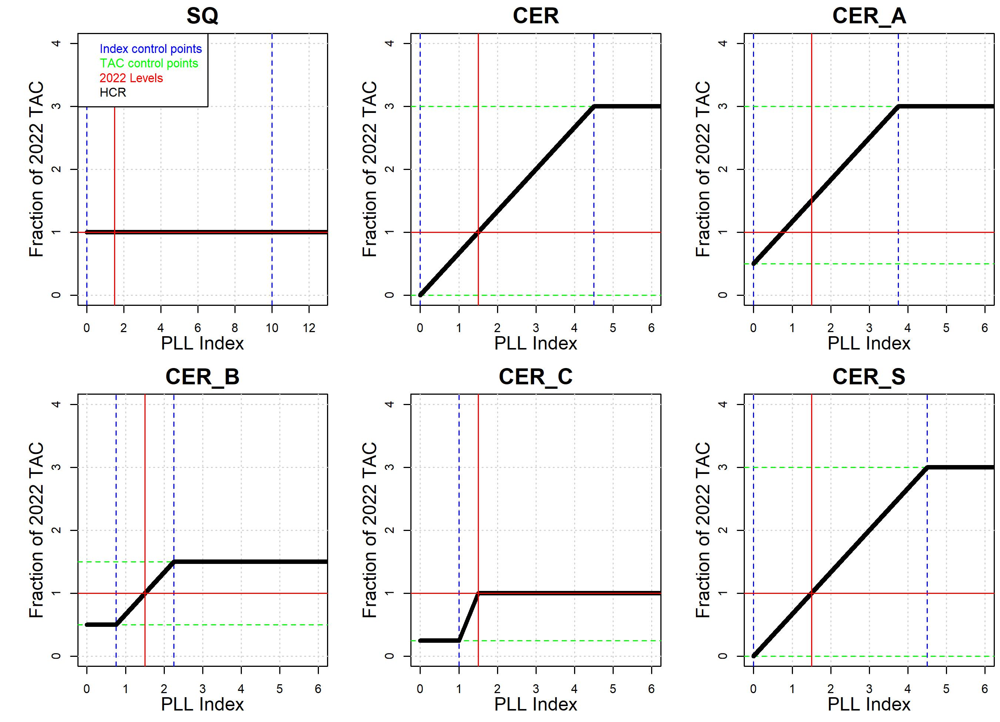

Figure `r (plus())`. Example empirical CMPs using various empirical HCRs (derivatives of the mahiMP). 

## Management procedure tuning

Currently management procedures are not tuned. Candidate options for tuning relate to 'Probability Green Kobe' (PGK) which is probability the stock is both underfished (SSB>SSBMSY) and subject to underfishing (F<FMSY). 

Possible target levels for tuning are PGK = 60% and PGK = 70%. 

Typically MPs are tuned to targets over the medium to long time projection horizons so that they are related to asymptotic MP performance and are not affected by near-term transient effects of initial projection conditions. A possible starting point would be the PGK evaluated across all reference grid OMs (or a suitable subset) for the last 5 years of the projection. 

<br>
<hr>


# Example Results  

## The Slick App

MSE results are presented using the [Slick App (Hordyk et al. 2026)](https://slick.bluematterscience.com). Slick is a decision analysis Shiny App that can either be installed as an R package and run locally from the R command line or can be [accessed online](https://harveststrategies.org/management-strategy-evaluation/shiny-app/). Slick is currently used as the default app for presentation of MSE results for a number of RFMOs (e.g., ICCAT). 

Slick provides a relatively accessible tool for comparing CMP performance across OMs and metrics. 

Demonstration results are available in a Slick object for download from [here](data/Slick/mahiSlick_1.slick).

The easiest approach is to navigate to [Slick online](https://harveststrategies.org/management-strategy-evaluation/shiny-app/) and upload this object. 

Alternatively, for a faster approach that also allows for custom results plotting from the R commandline you can use the R package:


```{r slickR, eval=F,echo=T}
remotes::install_github('blue-matter/Slick')
library(Slick)
slick = readRDS("where_you_saved_the_object/mahiSlick_1.slick")
App(slick = slick)

```

The App includes a front page that summarizes the object and the purpose of the analysis. On the left-hand side are a column of icons that present results in various ways including time series plots, box plots and trade-off plots (Figure `r (getF())`). 

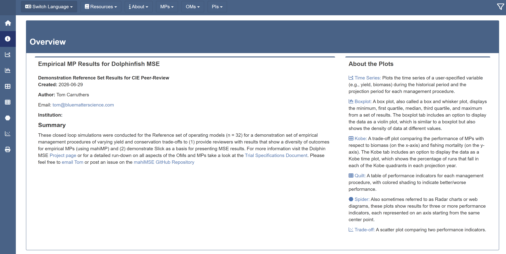

Figure `r (plus())`. The front page of the Slick App. 


## Time Series Plots

Three quantities are currently available in the time-series plots: SSB/SSBMSY, F/FMSY and total Landings (e.g., Figure `r (getF())`). Time series plots provide an intuition into the trajectory stability of MP performance over the projection period. Behaviours of note include over compensation (periods of systematic overfishing then underfishing), severe trade-offs between short and long term yield, catch stability and the degree of uncertainty in outcomes as the closed-loop projection evolves. 

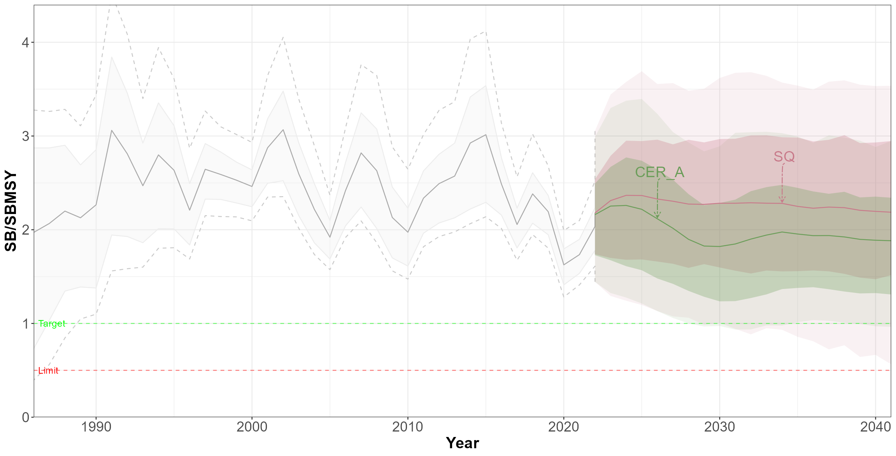

Figure `r (plus())`. A time series plot of spawning biomass relative to MSY levels for a pair of MPs including the mean, interquartile and 80 percent interquantile ranges. 


## Box Plots

In other MSE settings, box plots (sometimes referred to as 'Zeh' plots) provide the primary basis for summarising the expected performance among MPs, their trade-offs and the uncertainty in outcomes (Figure `r (getF())`). 

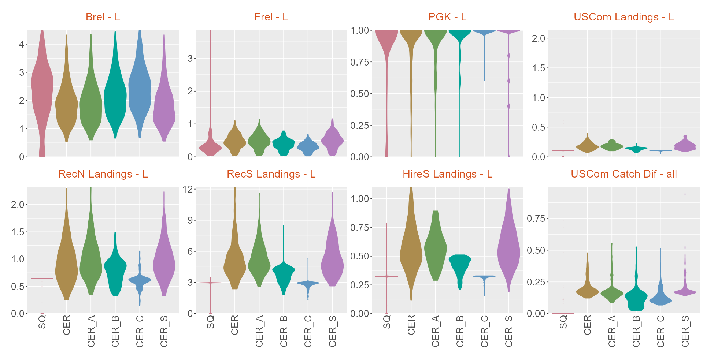

Figure `r (plus())`. Box plots showing the distribution of mean outcomes (average across years, withing simulation) for 8 metrics across 6 CMPs. 'L' denotes long-term (first 5 years of the projection). 'all' denotes all projection years (first 15 years of the projection). 

## Kobe Plots

Kobe plots are commonly presented in performance summaries because they capture two quantities relevant for most RFMOs: the probability of overfishing (F>FMSY) and the probability of overfished status (SSB<SSBMSY) (Figure `r (getF())`). The probability of green kobe (fraction of simulations where the stock is both underfished and subject to underfishing) is often used as a tuning target (e.g., PGK = 60%). 

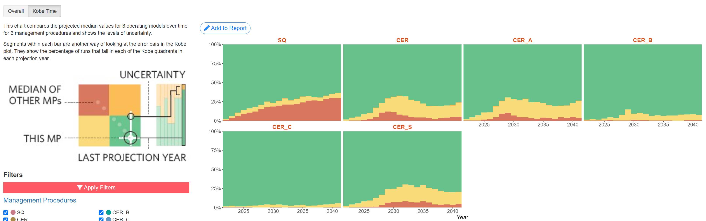

Figure `r (plus())`. Kobe time plot showing the fraction of simulations that are overfished subject to overfishing (red), overfished subject to underfishing (yellow), underfished subject to overfishing (orange) and underfished subject to underfishing (green). These are presented for OMs of low productivity (Rec = 0.75) and low resilience (Steepness = 0.7) to enhance the contrast among CMPs.

## Quilt Plots

These shaded tables provide numerical results in support of the other MSE results figures. The results can be reordered to reveal trade-offs among performance metrics (Figure `r (getF())`). 


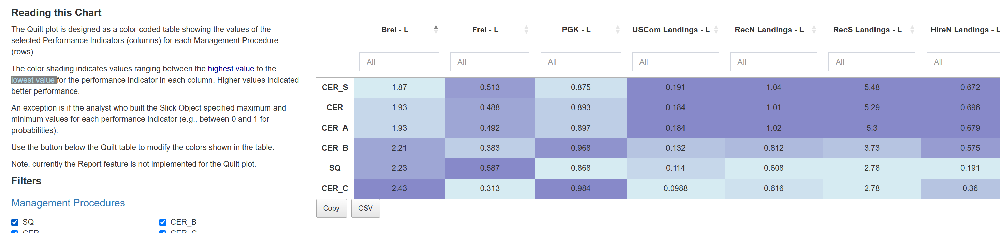

Figure `r (plus())`. A quilt plot of key performance metrics. Shading denotes level. Results are ordered here in ascending long-term biomass outcome Brel (SSB/SSBMSY in years 11 to 15 of the projection). Frel refers to F/FMSY (U/UMSY). 

## Trade-offs

A key objective of MSE is to reveal management performance trade-offs. The principal trade-offs exist between short term yield, long term yield, variability in yield and long-term biomass (e.g., Figure `r (getF())`). 


Figure `r (plus())`. Trade-off plot of long-term (projection years 11-15) SSB/SSBMSY (Brel) and F/FMSY (Frel)

## Conclusions

The Slick App provides a flexible, open and inclusive basis for presenting CMP performance comparisons The App can be run by a wider range of stakeholders and managers than would be possible using R code and functions. By placing results in an interactive App, there is no need for a extensive interaction between managers and an MSE technical team to provide relevant outputs. 


<br>
<hr>

# Exceptional Circumstances Protocols

## The Role of Exceptional Circumstances 

A principal motivation behind management strategy evaluation (MSE) and the management procedure (MP) approach was originally to lessen the need for frequent use of more complex and comprehensive stock assessment processes (and associated ‘tinkering’, Butterworth 2008). It follows that in most settings, MPs are adopted for an agreed period of time after which a formal review of the MP is scheduled. For example, the 5-year interval for review of MP implementation by the International Whaling Commission, IWC 1999 and the 6-year interval for review of the MP adopted by ICCAT for Atlantic bluefin tuna (ICCAT2022). 

It is however considered best practice to establish protocols for detecting situations where the observed system dynamics are not consistent with the range of simulations specified in the operating model, over which the adopted MP was demonstrated to be robust (Butterworth 2008). Exceptional circumstances (EC) protocols typically compare new, updated observations of the data used by the MP with the simulated values from the MSE projections (‘posterior predicted data’). They can also involve a check of the assumptions used to condition the models or characterize the axes of uncertainty. 

## An example: Northern Atlantic Albacore Exceptional Circumstances

ICCAT recently adopted an EC protocol for North Atlantic albacore (ICCAT 2021a; b). The EC protocol identifies several indicators which may trigger exceptional circumstances if new observed values fell outside the 95% interquantile range of the simulated values for a given year. Other indicators such as growth, maturity, and natural mortality were highlighted as possible triggers of ECs but their criterion for being triggered was less exact, simply indicating when these should be considered (e.g., new research/analysis was presented and accepted by the SCRS leading to new values substantially different from those used in the MSE testing). 

The northern albacore EC is not rigidly connected with a specified action: “Triggering an EC does not immediately result in TAC advice from the MP being rescinded; rather, it means that the SCRS needs to examine the indicators and determine if a change in advice is warranted.”

The triggering of an exceptional circumstance first requires a determination of how the EC might impact the results of the management procedure currently being used. Triggering EC could be interpreted in several ways, for example: (1) there is conservation concern as indicators/inputs are lower than those tested; (2) yields are potentially too low as indicators/inputs are higher than those tested, (3) there is no appreciable change in conservation concern or potential yield as the EC has little impact on the MP results. Once the impact of the EC has been established the recommended responses to the EC can be developed for consideration by managers. 

## Other Examples of Exceptional Circumstances

In the case of Greenland halibut in Subarea 2 + Divisions 3KLMNO, the Northwest Atlantic Fisheries Organization (NAFO 2011) compares observed catches and survey indices with operating model predictions of these data. When observations fall out of the 90% probability interval of posterior predicted data, these are considered indicative of exceptional circumstances. Exceptional circumstances provisions were triggered for Greenland halibut (NAFO 2018) in 2014 when one of the survey index observations fell below the 5th percentile of the predicted posterior distribution for that data type. 

Similarly to NAFO, the Canadian Department of Fisheries and Oceans (DFO 2011) identify various data that may be monitored to detect exceptional circumstances in the MSE for Pollock in NAFO area 4Xopqrs5, including survey biomass indices, catches and catch-at-age composition data. DFO (2011) also identified being outside the 90% probability interval of simulated survey data as a possible indicator of ECs and included an absolute level for the posterior predicted indices below which observed data would indicate exceptional circumstances. 

For southern bluefin tuna, the EC protocols of CCSBT make use of fishery indicators (relative abundance data not used by the MP) and a range of data types used by the MP including fishery-dependent catch rate indices, estimates of spawning biomass from close-kin genetics and estimates of age-2 numbers from conventional gene tagging (Preece et al. 2021). Similarly to northern albacore, CCSBT outline exceptional circumstances in order to flag possible problem areas to keep under closer scrutiny for the immediate future, rather than rigidly connecting EC to a course of action such as operating model reconditioning and/or MP revision. For example, a very high Japanese longline CPUE estimate for 2018 triggered the CCSBT EC but action was not taken given that there was a relatively low impact on the TAC recommendation (Preece et al. 2021). Similarly to EC in other MSE frameworks, the focus of the EC is not the ability to detect a specified OM condition (e.g., low spawning biomass) but on whether observed data are comparable to those projected by the OM. 

The Indian Ocean Tropical Tuna Commission (IOTC) also has a broad definition of exceptional circumstances (IOTC 2021) including: “new knowledge about the stock, population dynamics or biology, changes in fisheries or fishing operations, changes to input data to the MP, or missing data, or inconsistent implementation of the MP advice (e.g. total catch is greater than the Total Allowable Catch)”. Similarly to CCSBT, IOTC does not prescribe a rigid management response to the triggering of EC, and this “can include review of additional information or new research, review of the performance of the MP (via reconditioned Operating Models), or management advice to precautionarily revise the TAC”.

## ECP App

ECP are the final component of MSE framework development and are typically explored during the MP adoption phase. ECP design (what indicators, what tails, what Type I and Type II error) and implementation (have ECP been triggered) are to be implemented in the [ECP App](https://shiny.bluematterscience.com/app/ecp) (Carruthers 2025)


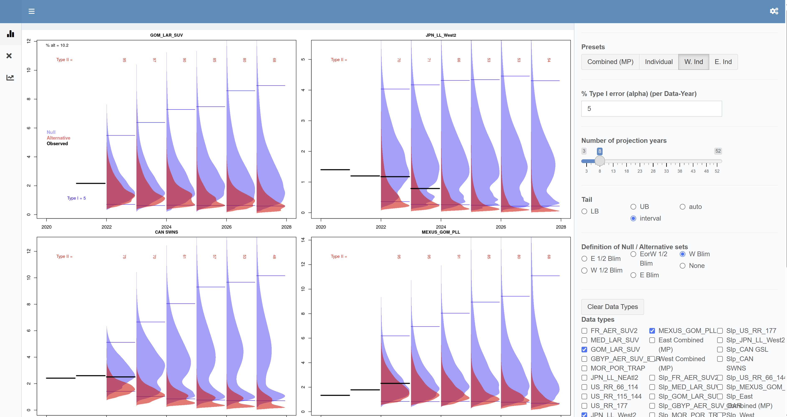

Figure `r (plus())`. Example of the ECP app showing 4 possible indices of abundance considered for ECP for Atlantic Bluefin Tuna. Blue shaded regions are projected simulations where western biomass did not drop below half of SSBMSY. Red shaded regions are projected simulations where western biomass did drop below half of SSBMSY. 


The ECP app follows the principles of [Carruthers and Hordyk (2019)](https://doi.org/10.1139/cjfas-2018-0223) in that it uses power analysis to develop suitable ECP indicators. 


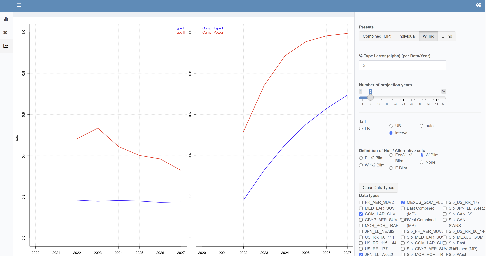

Figure `r (plus())`. Example of the ECP app showing expected rates of Type I error (probability of falsely triggering ECP for non-problematic simulations) and Type II error (failing to trigger ECP for problematic simulations) for a demo ECP for Atlantic Bluefin Tuna. 


<br>
<hr>


# Code 

## Dolphinfish MSE Code

### DolphinMSE Github Repository (Private)

* [https://github.com/Blue-Matter/DolphinMSE](https://github.com/Blue-Matter/DolphinMSE)
* Private ‘workhorse’ repo with live data and analyses. 
* Data, reports, notes
* Code for processing data, spatial modelling (VAST), conditioning operating models
* Supporting analyses (e.g., exploratory tests of trip limits, VAST specifications etc)
* Makes all the inputs to mahiMSE R package (OMs, MPs, etc)

### mahiMSE GitHub Repository and R Package (Public)

* [https://github.com/Blue-Matter/mahiMSE](https://github.com/Blue-Matter/mahiMSE)
* [mahiMSE Manual](docs/mahiMSE.html)
* Public-facing R package with manuals, documentation
* How to design MPs, use the mahiMP, run MSE simulations and plot results.
* Includes some small demonstration OM objects and example data sets
* Custom code for organizing results and plotting results. 

### mahiRefSet GitHub Repository and R Package (Public)

* [https://github.com/Blue-Matter/mahiRefSet](https://github.com/Blue-Matter/mahiRefSet)
* Reference Grid OMs (#32)

### mahiRobSet GitHub Repository and R Package (Public)

* [https://github.com/Blue-Matter/mahiRobSet](https://github.com/Blue-Matter/mahiRobSet)
* Robustness Set OMs (#16)

## MP and MSE Code

### OpenMSE (Hordyk et la. 2026, v1.01)

* [www.openMSE.com](www.openMSE.com)
* [technical manual including equations](https://docs.openmse.com)
* This is the umbrella package for the component MSEtool, SAMtool, DLMtool R libraries

### MSEtool (Hordyk et al. 2026, v4.0.0)

* [MSEtool GitHub](https://github.com/Blue-Matter/MSEtool)
* OM specification
* Closed loop simulation
* Empirical MPs
 
### SAMtool (Huynh et al. 2026, v1.9.1)

* [SAMtool GitHub](https://github.com/Blue-Matter/SAMtool)
* Data-rich stock assessment methods
* OM conditioning using Rapid Conditioning Model (RCM)
* Model-based MPs

### RCM (Huynh 2026)

* [RCM manual](https://openmse.com/tutorial-rcm)
* [RCM equations](https://openmse.com/tutorial-rcm-eq/)

### Slick (Hordyk et al. 2026, v1.0.2)

* [Slick Project Page](https://slick.bluematterscience.com/)
* Presentation of MSE results

### ECP (Carruthers 2024, v1.0.5)

* [ECP GitHub](https://github.com/Blue-Matter/ECP)
* [ECP App (bluefin tuna)](https://shiny.bluematterscience.com/app/ecp)
* Design and presentation of Exceptional Circumstances Protocols


<br>
<hr>

# References

<div style="padding-left: 30px; text-indent: -30px;">

Aires-da-silva, A., J. L. Valero, M. N. Maunder, C. Minte-Vera, C. Lennert-Cody, M. H.Román, J. Martínez-Ortiz, E. J. Torrejón-Magallanes, and M. N. Carranza.Exploratory Stock Assessment of Dorado (Coryphaena hippurus) in theSoutheastern Pacific Ocean. Document SAC-05-11b. Inter-American Tropical TunaCommission, Scientific Advisory Committee, Seventh Meeting. pp. 9–13 (2016).

Aires-da-Silva, A., C. E. Lennert-Cody, M. N. Maunder, M. Roman-Verdesoto, C. Minte-Vera, N. W. Vogel, J. Martínez-Ortiz, J. C. Carvajal, P. X. Guerrero, and F.Sondheimer. Preliminary Results from IATTC Collaborative Research Activities onDorado in the Eastern Pacific Ocean and Future Research Plan. Document SAC-05-11b. Inter-American Tropical Tuna Commission, Scientific Advisory Committee,Fifth Meeting. pp. 1–27 (2014).

Alejo-Plata, C., P. Díaz-Jaimes, and I. H. Salgado-Ugarte. Sex ratios, size at sexual maturity, and spawning seasonality of dolphinfish (Coryphaena hippurus) captured in the Gulf of Tehuantepec, Mexico. Fish. Res., 110(1): 207–216 (2011b).

Alemany, F., and E. Massuti. First record of larval stages of Coryphaena hippurus(Pisces: Coryphaenidae) in the Mediterranean Sea*. Sci. Mar., 62(1–2): 181–184 (1998).

Arocha, F., L. A. Marcano, A. Lárez, D. Altuve, and J. Alió. The fishery, demographic size structure and oocyte development of dolphinfish, Coryphaena hippurus, in Venezuela and adjacent waters*. Sci. Mar., 63(3–4): 401–409 (1999).

Beardsley, G. L. (1967). Age, growth, and reproduction of the dolphin, Coryphaena hippurus, in the Straits of Florida. Copeia 1967, 441–451. doi: 10.2307/1442132

Benjamin, D., and B. Kurup. Stock assessment of Dolphinfish, Coryphaena hippurus (Linnaeus, 1758) off southwest coast of India. J. Mar. Biol. Assoc. India, 54(1): 96 (2012).

Bentivoglio, A. A. Invesigations into the growth, maturity, mortality rates and occurrenceof the dolphin (Coryphaena hippurus, Linnaeus) in the Gulf of Mexico. M.Sc. thesis. University College of North Wales, Bangor, UK, 37 p. (1988).

Bignami S, Sponaugle S, Cowen RK. Effects of ocean acidification on the larvae of a high-value pelagic fisheries species, Mahimahi Coryphaena hippurus. Aquat Biol. 2014;21:249-260. https://doi.org/10.3354/ab00598.

Botsford, L. 1981. Optimal fishery policy for size-specific density-dependent population models.  J. Math. Biol. 12, 265–293

Brewton, R. A., M. J. Ajemian, P. C. Young, and G. W. Stunz. Feeding Ecology of Dolphinfish in the Western Gulf of Mexico. Trans. Am. Fish. Soc., 145(4): 839–853 (2016).

Brill R. Selective advantages conferred by the high performance physiology of tunas, billfishes, and dolphin fish. Comp Biochem Physiol. 1996;113A:3-15.

Carruthers, T.R., Hordyk, A.R. 2019. Using management strategy evaluation to establish indicators of changing fisheries. C.J.F.A.S. [doi: https://doi.org/10.1139/cjfas-2018-0223](https://doi.org/10.1139/cjfas-2018-0223)

Carruthers, T.R., Wang, Y. 2026. Estimating density dependent dynamics within stock assessment models using Walrasian Tatonnment. Under review at Fisheries Research. 

[Carruthers, T.R., et al. 2019. Landscape-scale social and ecological outcomes of dynamic angler and fish behaviours: processes, data, and patterns. Can. J. Fish. Aqua. Sci.](https://klwilson.org/wp-content/uploads/2019/03/landscape-scale-ses-management-in-bc-rainbow-trout-carruthers-et-al.-2019.pdf)

[Carruthers, T.R., McAlllister, M.K., Taylor, N.G. 2011. Spatial surplus production modeling of Atlantic tunas and billfish. Ecological Applications. 21 (7), 2743 - 2755.](https://esajournals.onlinelibrary.wiley.com/doi/10.1890/10-2026.1) 

Carruthers, T.R., Hordyk, A.R., Huynh, Q.C., Singh, R., and Barrett, T.J. 2023a. A Framework for Conditioning Operating Models for the Southwest Nova Scotia/Bay of Fundy Spawning Component of 4VWX Herring. DFO Can. Sci. Advis. Sec. Res. Doc. 2023/022. v + 103 p. [https://www.dfo-mpo.gc.ca/csas-sccs/Publications/ResDocs-DocRech/2023/2023_022-eng.html](https://www.dfo-mpo.gc.ca/csas-sccs/Publications/ResDocs-DocRech/2023/2023_022-eng.html)

Carruthers, T. R., Huynh, Q. C., Hordyk, A. R., Newman, D., Smith, A. D. M., Sainsbury, K. J., Stokes, K., Morison, A., Agnew, D., Parma, A., Sobrino, I., & Longo, C. 2023b. Method evaluation and risk assessment: A framework for evaluating management strategies for data-limited fisheries. Fish and Fisheries, 24, 279–296. [https://doi.org/10.1111/faf.12726](https://doi.org/10.1111/faf.12726)

Carruthers, T.R. 2024a. Developing the Climate Test: Robustness Trials for Climate-Ready Management Procedures. Collect. Vol. Sci. Pap. ICCAT, 81(6), SCRS/2024/104: 1-26 (2024). Available from: [https://www.iccat.int/Documents/CVSP/CV081_2024/n_6/CV08106104.pdf](https://www.iccat.int/Documents/CVSP/CV081_2024/n_6/CV08106104.pdf)

Carruthers, T.R. 2024b. Developing the Climate Test: Performance metrics of climate robustness. Collect. Vol. Sci. Pap. ICCAT, 81(2), SCRS/2024/148: 1-7 (2024). Available from [https://www.iccat.int/Documents/CVSP/CV081_2024/n_2/CV08102148.pdf](https://www.iccat.int/Documents/CVSP/CV081_2024/n_2/CV08102148.pdf)

Carruthers, T.R. 2024c. Technical MSE demonstration for Atlantic Blue Shark. Collect. Vol. Sci. Pap. ICCAT, 81(9), 1-19. [https://www.iccat.int/Documents/CVSP/CV081_2024/n_9/CV08109141.pdf](https://www.iccat.int/Documents/CVSP/CV081_2024/n_9/CV08109141.pdf)

Carruthers, T.R. 2025. Informing Management of B.C. Hand-Harvested Invertebrates: Operating Models, MPs and MSE. Available from: [https://mis-assess.github.io/csrf_hh_io/3369975a9851e6fd41a0ae6865456662040af596/index.html](https://mis-assess.github.io/csrf_hh_io/3369975a9851e6fd41a0ae6865456662040af596/index.html)

Catalán, I. A., D. Auch, P. Kamermans, B. Morales-Nin, N. V. Angelopoulos, P. Reglero, T. Sandersfeld, and M. A. Peck. Critically examining the knowledge base required to mechanistically project climate impacts: A case study of Europe’s fish and shellfish. Fish Fish., 1–17 (2019).

Chang, S.-K., and M. N. Maunder. Aging material matters in the estimation of von Bertalanffy growth parameters for dolphinfish (Coryphaena hippurus). Fish. Res., 119–120: 147–153 (2012).

Chatterji, A., and Z. A. Ansari. Fecundity of dolphin fish, Coryphaena hippurus L. Mahasagar-Bulletin Natl. Inst. Oceanogr., 15(2): 129–133 (1982).

Dai, L. 2025. Management Strategy Evaluation for a short-lived species with only annual data: a case study of the Autumn cohort of Neon Flying Squid in the North Pacific Ocean. NPFC-2025-SSC NFS02-IP06. Available here. 

DFO. 2023. Proceedings of the Pacific regional peer review on the Application of the Management Procedure Framework for Inside Quillback Rockfish in British Columbia in 2021; December 6-7, 2022. DFO Can. Sci. Ad(vis. Sec. Proceed. Ser. 2023/036 [https://www.dfo-mpo.gc.ca/csas-sccs/Publications/Pro-Cr/2023/2023_036-eng.html](https://www.dfo-mpo.gc.ca/csas-sccs/Publications/Pro-Cr/2023/2023_036-eng.html)

Ditty, J. G., R. F. Shaw, C. B. Grimes, and J. S. Cope. Larval development, distribution, and abundance common dolphin, Coryphaena hippurus, and pompano dolphin, C. equiselis (family: Coryphaenidae), in the northern Gulf of Mexico*. Fish. Bull., 92(2): 275–291 (1994).

Dooley, J. K. Fishes associated with the pelagic Sargassum complex, with a discussion of the Sargassum community. Contrib. Mar. Sci., 16: 32 (1972).

FAO, Coryphaena hippurus (Linnaeus, 1758). Global Capture Production for Species. 2018. http://www.fao.org.

Farrell, E. R., A. M. Boustany, P. N. Halpin, and D. L. Hammond. Dolphinfish (Coryphaena hippurus) distribution in relation to biophysical ocean conditions in the northwest Atlantic. Fish. Res., 151: 177–190 (2014).

Guzman, H. M., E. Díaz-Ferguson, Á. J. Vega, and Y. A. Robles. Assessment of the dolphinfish Coryphaena hippurus (Perciformes: Coryphaenidae) fishery in Pacific Panama. Rev. Biol. Trop., 63(3): 705–716 (2015).

Hadley, J., Mehta, K.N. 2021. Amendment 10 to the Fishery Management Plan for the Dolphin and Wahoo Fishery of the Atlantic. Available from https://repository.library.noaa.gov/view/noaa/32989

Haggarty, D.R., Huynh, Q.C., Forrest, R.E., Anderson, S.C., Bresch, M.J., Keppel, E.A. 2022. Evaluation of potential rebuilding strategies for Inside Yelloweye Rockfish (Sebastes ruberrimus) in British Columbia. DFO Can. Sci. Advis. Sec. Res. Doc. 2021/008. vi + 139 p. [https://www.dfo-mpo.gc.ca/csas-sccs/Publications/ResDocs-DocRech/2021/2021_008-eng.html](https://www.dfo-mpo.gc.ca/csas-sccs/Publications/ResDocs-DocRech/2021/2021_008-eng.html)

Heuer, R. M., Stieglitz, J. D., Pasparakis, C., Enochs, I. C., Benetti, D. D., Grosell, M. (2021). The effects of temperature acclimation on swimming performance in the pelagic Mahi-mahi (Coryphaena hippurus). arXivLabs [Preprint]. Available online at: https://arxiv.org/abs/2102.07743 (accessed February 15, 2021)

Hordyk, A. 2025. Slick decision analysis. Available from: [https://harveststrategies.org/slick-user-guide.html](https://harveststrategies.org/slick-user-guide.html) 

Hordyk, A., Huynh, Q., Carruthers, T. 2025. OpenMSE: An open-source R package for Management strategy evaluation, available from: https://openmse.com

Huynn, Q., 2025. Rapid Conditioning model. Available from [https://openmse.com/tutorial-rcm/](https://openmse.com/tutorial-rcm/) 

Kitchens, L. L., and J. R. Rooker. Habitat associations of dolphinfish larvae in the Gulf of Mexico. Fish. Oceanogr., 23(6): 460–471 (2014).

Kristensen, K., Nielsen, A., Berg, C.W., Skaug, H., Bell, B.M. 2016. TMB:  Automatic Differentiation and Laplace Approximation. Journal of Statistical Software, 70(5), 1-21. [https://doi.org/10.18637/jss.v070.i05](https://doi.org/10.18637/jss.v070.i05 )  

Lin, S.-J., Musyl, M. K., Wang, S.-P., Su, N.-J., Chiang, W.-C., Lu, C.-P., et al. (2019). Movement behaviour of released wild and farm-raised dolphinfish Coryphaena hippurus tracked by pop-up satellite archival tags. Fish. Sci. 85, 779–790. doi: 10.1007/s12562-019-01334-y

Mahon, R. Oxenford, H.A. 1999. Precautionary assessment and management of dolphinfish in the Caribbean. Scientia Marina. 63(3-4): 429-438. Available [here](https://www.researchgate.net/publication/285676268_Precautionary_assessment_and_management_of_dolphinfish_in_the_Caribbean/fulltext/59ba8caf458515bb9c4cb61c/Precautionary-assessment-and-management-of-dolphinfish-in-the-Caribbean.pdf)

Marín-Enríquez, E., J. Seoane, and A. Muhlia-Melo. Environmental modeling of occurrence of dolphinfish (Coryphaena spp.) in the Pacific Ocean off Mexico reveals seasonality in abundance, hot spots and migration patterns. Fish. Oceanogr., 27(1): 28–40 (2018).

McGuigan, C. J., Schlenker, L. S., Stieglitz, J. D., Benetti, D. D., and Grosell, M. (2021). Quantifying the effects of pop-up satellite archival tags on the swimming performance and behavior of young-adult mahi-mahi (Coryphaena hippurus).
Can. J. Fish. Aquat. Sci. 78, 32–39. doi: 10.1139/cjfas-2020-0030

Merten, W., R. Appeldoorn, and D. Hammond. Movements of dolphinfish (Coryphaena hippurus) along the U.S. east coast as determined through mark and recapture data.Fish. Res., 151: 114–121 (2014a).

Merten, W., R. Appeldoorn, and D. Hammond. Spatial differentiation of dolphinfish(Coryphaena hippurus) movements relative to the Bahamian archipielago. Bull. Mar. Sci., 90(3): 849–864 (2014b).

Merten, W., Appeldoorn, R., and Hammond, D. (2016). Movement dynamics of dolphinfish (Coryphaena hippurus) in the northeastern Caribbean Sea: evidence of seasonal re-entry into domestic and international fisheries throughout the
western central Atlantic. Fish. Res. 175, 24–34. doi: 10.1016/j.fishres.2015.10.021

Merten, W., Appeldoorn, R., Rivera, R., and Hammond, D. (2014). Diel vertical movements of adult male dolphinfish (Coryphaena hippurus) in the western central Atlantic as determined by use of pop-up satellite archival transmitters.
Mar. Biol. 161, 1823–1834. doi: 10.1007/s00227-014-2464-0

Molto V. et al. 2020. A global review on the biology of the dolphinfish (Coryphaena hippurus) and its fishery in the Mediterranean Sea: advances in the last two decades. Reviews in Fisheries Science and Aquaculture. 28 (3): 376-420. Available from[https://digital.csic.es/bitstream/10261/225596/4/Molto_etal_2020.pdf](https://digital.csic.es/bitstream/10261/225596/4/Molto_etal_2020.pdf) 
Oxenford, H. A. (1999). Biology of the dolphinfish (Coryphaena hippurus) in the western central Atlantic: a review. Sci. Mar. 63, 277–301. doi: 10.3989/scimar. 1999.63n3-4303

Oxenford, H. A., and Hunte, W. (1999). Feeding habits of the dolphinfish (Coryphaena hippurus) in the eastern Caribbean. Sci. Mar. 63, 303–315. doi: 10.3989/scimar.1999.63n3-4317

Palko BJ, Beardsley GL, Richards WJ. Synopsis of the biological data on dolphin-fishes, Coryphaena hippurus Linnaeus and Coryphaena equiselis Linnaeus. FAO Fish Synopsis Rep. 1982;130: 1-34

Perry, A. L., Low, P. J., Ellis, J. R., and Reynolds, J. D. (2005). Climate change and distribution shifts in marine fishes. Science 308, 1912–1915. doi: 10.1126/science.1111322

Peterson, C., Karnauskas, M., McPherson, M., Hadley, J., Blake, S., Byrd, J. 2024. Report of the South Atlantic dolphinfish management strategy evaluation stakeholder workshops. NOAA Tech. Memo. NMFS-SEFSC-781, 35 p. Available from [https://repository.library.noaa.gov/view/noaa/61285](https://repository.library.noaa.gov/view/noaa/61285)

Pimentel M, Pegado M, Repolho T, Rosa R. Impact of ocean acidification in the metabolism and swimming behavior of the dolphinfish (Coryphaena hippurus) early larvae. Mar Biol. 2014;161:725-729. https://doi.org/10.1007/s00227-013-2365-7.

Punt, A.E., Butterworth, D.S., de Moor, C.L., De Oliveira, J.A.A., and Haddon, M. 2016. Management strategy evaluation: Best practices. Fish Fish. 17(2): 303–334. doi:10.1111/faf.12104. 

R Core Team. R: A Language and Environment for Statistical Computing. R Foundation for Statistical Computing, Vienna, Austria. URL https://www.r-projecto.org. (2024).

Roa-Ureta, R.H., et al. 2021. Stock Assessment of the Dolphinfish (Coryphaena hipparus) in the South-East Pacific Ocean. Available from: [https://institutopesca.gob.ec/wp-content/uploads/2022/05/Stock-Assessment-of-the-dolphinfish.pdf](https://institutopesca.gob.ec/wp-content/uploads/2022/05/Stock-Assessment-of-the-dolphinfish.pdf)

Rose, C. D. The biology and catch distribution of the dolphin, Coryphaena hippurus(Linnaeus), in North Carolina waters. PhD Thesis. North Carolina State University(1966).Rose, C. D., and W. W. Hassler. Age and Growth of the Dolphin, Coryphaena hippurus (Linnaeus), in North Carolina Waters. Trans. Am. Fish. Soc., 97(3): 271–276 (1968).

Rose, C. D., and W. W. Hassler. Food Habits and Sex Ratios of Dolphin Coryphaena hippurus Captured in the Western Atlantic Ocean off Hatteras, North Carolina.Trans. Am. Fish. Soc., 103(1): 94–100 (1974).

[Rudershausen, P.J., Poland, S.J., Merten, W., Buckel, J.A., 2019. Estimating Discard Mortality for Dolphinfish in a Recreational Hook and Line Fishery. N. Am. J. Fish. Manage. 39(6): 1143-1154](https://beyondourshores.org/wp-content/uploads/2019/11/Rudershausen-et-al.-2019-Discard-Mortality.pdf)

Salvadeo, C., Auliz-Ortiz, D. M., Petatán-Ramírez, D., Reyes-Bonilla, H., IvanovaBonchera, A., and Juárez-León, E. (2020). Potential poleward distribution shift of dolphinfish (Coryphaena hippurus) along the southern California current
system. Environ. Biol. Fishes. 103, 973–984. doi: 10.1007/s10641-020-00999-0

[Schwenke, K.L., and Buckel, J.A. 2008. Age, growth, and reproduction of dolphinfish (Coryphaena hippurus) caught off the coast of North Carolina. Fish. Bull. 106:82–92 (2008)](https://spo.nmfs.noaa.gov/sites/default/files/pdf-content/2008/1061/schwenke.pdf)

Stieglitz, J. D., Hoenig, R. H., Kloeblen, S., Tudela, C. E., Grosell, M., and Benetti, D. D. (2017). Capture, transport, prophylaxis, acclimation, and continuous spawning of mahi-mahi (Coryphaena hippurus) in captivity. Aquaculture 479, 1–6. doi: 10.1016/j.aquaculture.2017.05.006

Stieglitz JD, Benetti DD, Grosell M. Nutritional physiology of mahi-mahi (Coryphaena hippurus): Postprandial metabolic
response to different diets and metabolic impacts on swim performance. Comp Biochem Physiol A Mol Integr Physiol. 2018;215: 28-34. https://doi.org/10.1016/j.cbpa.2017.10.016.

Stramma, L., Prince, E. D., Schmidtko, S., Luo, J., Hoolihan, J. P., and Visbeck, M. (2012). Expansion of oxygen minimum zones may reduce available habitat for tropical pelagic fishes. Nat. Clim. Chang. 2, 33–37. doi: 10.1038/nclimate1304

Stock, B.C., Miller, T.J. 2021. The Woods Hole Assessment Model (WHAM): A general state-space assessment framework that incorporates time- and age-varying processes via random effects and links to environmental covariates. Fish. [Res. 240. https://doi.org/10.1016/j.fishres.2021.105967](Res. 240. https://doi.org/10.1016/j.fishres.2021.105967)

[Taylor, N.G., et al. 2011. Atlantic Bluefin Tuna: A Novel Multistock Spatial Model for Assessing Population Biomass. PLOS One](https://doi.org/10.1371/journal.pone.0027693)

Taylor, N.G., Mourato, B., Parker, D. 2022. Preliminary closed-loop simulation of management procedure performance for southern Swordfish. Collect. Vol. Sci. Pap. ICCAT, 79(2): 705-714. [https://www.iccat.int/Documents/CVSP/CV081_2024/n_7/CV08107016.pdf](https://www.iccat.int/Documents/CVSP/CV081_2024/n_7/CV08107016.pdf)

Then, A.Y., Hoenig, J.M., Hall, N.G., Hewitt, D.A. 2015. Evaluating the predictive performance of empirical estimators of natural mortality rate using information on over 200 fish species. ICES Journal of Marine Science. 72(1): 82–92, https://doi.org/10.1093/icesjms/fsu136 

Thorson, J.T., 2019. Guidance for decisions using the Vector Autoregressive Spatio-Temporal (VAST) package in stock, ecosystem, habitat and climate assessments. Fish. Res. 210, 143–161. https://doi.org/10.1016/j.fishres.2018.10.013

Tsai HY, Chang M, Liu SC, Abe G, Ota KG. Embryonic development of goldfish (Carassius auratus): A model for the study of
evolutionary change in developmental mechanisms by artificial selection. Dev Dyn. 2013;242:1262-1283. https://doi.org/10.1002/dvdy.24022.

Walters, C.J., and Martell, S.J.D. 2004. Fisheries ecology and management. Princeton University Press.

Wang, S-P, et al. 2026a. Toward sustainable use of dolphinfish (Coryphaena hippurus) in the Northwest Pacific: A framework for stock assessment and management strategy evaluation,
Regional Studies in Marine Science, 94. [https://doi.org/10.1016/j.rsma.2026.104771](https://doi.org/10.1016/j.rsma.2026.104771)

Wang, S-P., et al. 2026b. The framework of the management strategy evaluation for dolphinfish in the northwest Pacific Ocean. [Available here](https://fisheryprogress.org/sites/default/files/documents_actions/FIP_MSE_preliminary%20trials_20230818.pdf)

</div>


<br>
<hr>

# Appendix A. Glossary

Table `r (Tplus())`. Glossary of MSE terminology and acronyms

```{r Glossary, eval=T,echo=F}
plotatab('docs/tables/Various.xlsx','Glossary')

```


<br>
<hr>

# Appendix B. Future Robustness and Ecosystem Considerations

## Introduction

In most fishery management settings there is an impetus to demonstrate that adopted management procedures are responsive and robust to plausible nonstationary impacts. 

A review of papers that describe possible climate impacts on fisheries revealed very few examples where defensible forecasts were available (Carruthers 2024a). In theory, it may be possible to develop an ‘end-to-end’ model that combines sub-models of emissions (e.g., Algieri et al. 2023, Wang et al. 2017), earth systems (Kawamiya et al. 2020), ecosystems (e.g., Beaugrand and Kirby 2018, Lehodey et al. 2010; 2011), behaviour (e.g., Bushnell and Brill 1991, Cayré and Marsac 1993) and physiology (e.g., Gooding et al. 1981, Graham et al. 1989, Checkley et al. 2009). Forecasting fishery impacts would therefore combine a complex series of linked projections that include greenhouse gas emissions (least uncertain), response of climate processes (uncertain), linkages with oceanographic conditions (more uncertain) and the expected impact of those on pelagic communities and individual species (most uncertain). It can be argued that any forecast of climate impacts on fisheries should be seen as firmly hypothetical, and the relative credibility of impact scenarios should be considered highly uncertain. 

This large uncertainty over future nonstationary impact scenarios poses a problem for the provision of ‘future ready’ fishery management advice using the contemporary stock assessment and management strategy evaluation (MSE) frameworks. That is because those frameworks rely on the specification of models that represent oceanographic impacts and the frequency (weighting) of those models could strongly affect the advice provided. For example, it may not be clear whether there will be small or large future changes in natural survival (natural mortality, M). Advice arising from scenarios with large M changes would likely lead to the provision of strongly differing advice from scenarios with small M changes, yet their relative credibility is not easily evaluated. 

## A proposal using MSE simulations

Although quantitative forecasts of oceanographic impacts on fisheries may not be available, qualitatively, the way in which nonstationarity can impact individual populations is clear. Most papers documenting possible impacts predict changes in recruitment strength (carrying capacity, spawning habitat, larval survival), adult survival (natural mortality rate), somatic growth, spatial distribution (range contraction, catchability) age at maturity and condition factor (fecundity). Additionally, it is generally understood what direction of change in those variables poses a challenge for management procedures: lower recruitment strength, decreased survival, lower somatic growth rate, reduced spatial distribution, older age at maturity and poorer condition factor. 

One proposed option (Carruthers 2024b) is to shift the focus from model-based tests of future robustness in favour of performance metrics of future robustness. Such an approach tests how resilient candidate management procedures are to commonly proposed environmental impacts such that their future robustness can be comparatively evaluated. This shifts the emphasis away from forecasting (we think this nonstationary impact will happen) to the inherent robustness of the candidate management procedures (if this impact occurs, this MP is twice as resilient). 

## Calculating nonstationary robustness metrics

It is possible to quantify nonstationary robustness with respect to declines in population survival (natural mortality rate M), recruitment strength (R), somatic growth (K) and condition factor (C). To do this MPs are tuned to acheive stable biomass outcomes and then the level of change required to break a threshold is calculated. This then becomes a performance attribute of that management procedure. 

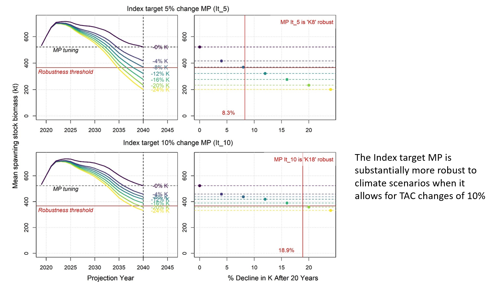

Figure `r (plus())`. Calculation of nonstationary robustness metrics. In this example an MP is tuned such that it provides stable SSB over 20 projected years. Given a defined threshold for ‘robust’ as a decline in biomass of more than 30% after 20 projected years, it is possible to calculate the decrease in somatic growth (K) needed to 'break' the MP such that it drops below the threshold. In this case the index target MP allowing for 10% changes in TAC between years (bottom) was more than twice as robust as the derivative allowing for 5% changes (top) (surviving up to an 18% decline in K vs an 8% decline, respectively). 


These types of metrics can then be tabulated across MPs (rows) and nonstationary tests (column):

Table `r (Tplus())`. Example nonstationary performance metrics. Tabulated numbers are the percentage change in each impact before the robustness threshold is reached. Higher percentages that are shaded green represent higher robustness. Shading is scaled per nonstationary test (by column) according to the maximum robustness (highest %) M = increasing natural mortality rate, R = decreasing recruitment strength, K = decreasing somatic growth, C = decreasing condition factor (weight-at-age).
 
 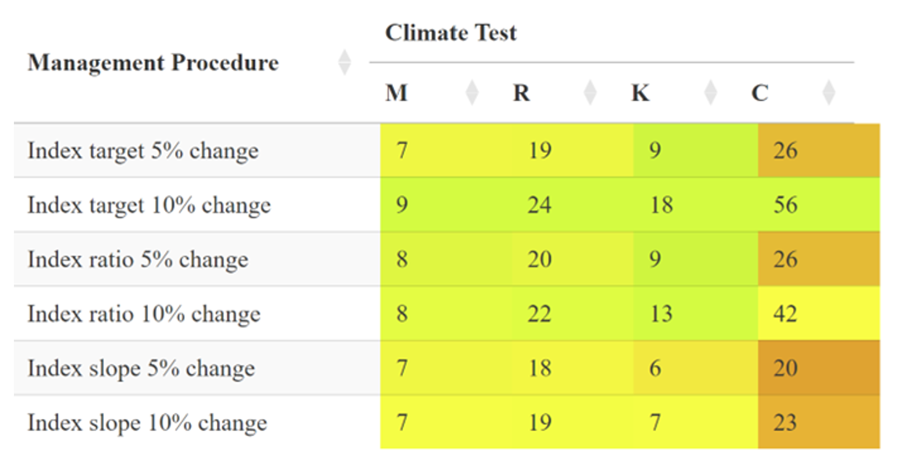


