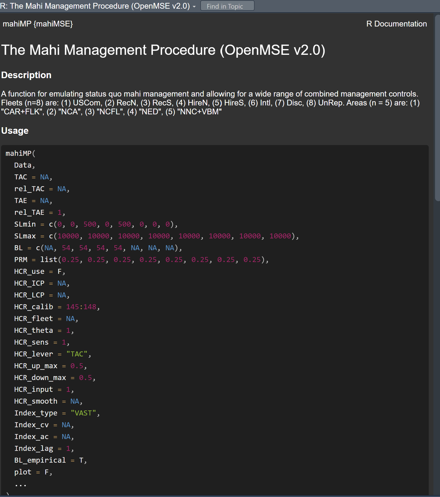
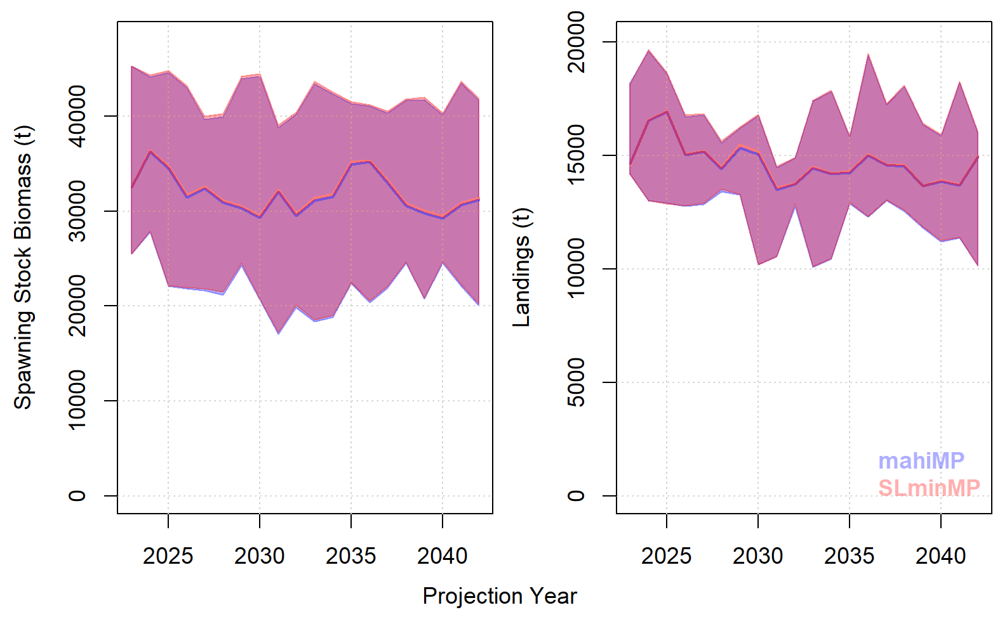

<style type="text/css">

pre code {
  word-wrap: normal;
  white-space: pre;
}
body{ /* Normal  */
   font-size: 12px;
}
td {  /* Table  */
   font-size: 9px;
}
h1 { /* Header 1 */
 font-size: 18px;
 color: DarkBlue;
}
h2 { /* Header 2 */
 font-size: 15px;
 color: DarkBlue;
}
h3 { /* Header 3 */
 font-size: 14px;
 color: DarkBlue;
}
code.r{ /* Code block */
  font-size: 10px;
}
pre { /* Code block */
  font-size: 10px;
  overflow-x: auto;
}
</style>


&nbsp;


```{r, include = FALSE}

library(readxl)
library(kableExtra)
library(mahiMSE)

knitr::opts_chunk$set(
  collapse = TRUE,
  comment = "#>"
)
knitr::opts_chunk$set(dpi=85, fig.width=7.5, fig.height = 5)


knitr::opts_chunk$set(collapse = TRUE, comment = "#>")

options(width = 650)
X = Y = 0
plus=function(){X=X+1;assign("X",X, envir = globalenv())}
getF = function(rel=1){X+rel}
Tplus = function(){Y=Y+1;assign("Y",Y, envir = globalenv())}
getT = function(rel=1){Y+rel}


plotatab2 <- function(filey,sheet,head=T){
  if(head){
    dat = read_xlsx(filey,sheet)
    kable(dat,"simple") 
  }else{
    dat = read_xlsx(filey,sheet,col_names=F)
    kable(dat,"simple",col.names=rep("",ncol(dat))) 
  }
}


```


<br>
<hr>


# Foreword

This research and decision support tools use operating models and MSE (Management Strategy Evaluation) simulation testing to characterize scientific uncertainty to inform robust management decision making. 

<br>
<hr>


# Objective of this document

This document is intended to guide prospective users on how to:

* work with mahi operating models
* design and test management procedures (MPs)
* summarize MP performance 


<br>
<hr>


# Version Notes 

The package is subject to ongoing testing and development. If you find a bug or a problem please send a report to <tom@bluematterscience.com> so that it can be fixed!  

<br>
<hr>


# Background information

Project information, links and results are available from a [project webpage](https://blue-matter.github.io/mahiMSE/)

<br>
<hr>

# Software

The [openMSE R package](https://openmse.com) was used to organize fishery data, define operating models, condition operating models to data, calculate reference points and specify and test existing and alternative management options. 

The [Rapid Conditioning Model](https://openmse.com/tutorial-rcm/) was used to fit operating models to observed data. 


<br>
<hr>

# In Development

A number of additional features for the mahiMSE package are in development:

```{r ToDo, eval=T,echo=F}

plotatab2('C:/GitHub/mahiMSE/docs/tables/Various.xlsx','ToDo')

```


<br>
<hr>

# Installation

1. Install [R for Windows](https://cran.r-project.org/bin/windows/)

2. Install [RStudio](https://www.rstudio.com/products/rstudio/download/)

3. Install latest openMSE packages

Open RStudio and enter the following commands into the console:

```{r install_openMSE,eval=F}
install.packages('openMSE')
install.package('pak')
```

You will need to upgrade to the very latest version of MSEtool. 

MSEtool was radically overhauled to consolidate all the various features required from applications and workshops for more than 200 fisheries worldwide. MSEtool version 4.x.x is faster, smaller, more flexible and much more intuitive to use. Furthermore it includes features for seasonality that are particularly applicable for short-lived species such as mahi. 

As of March 2026 v4.x.x exists on the noaa-mahi branch of the MSEtool R package repository. By the end of 2026 this will be rolled into the regular CRAN release of MSEtool (v4.0.0) and openMSE (v2.0).

To install MSEtool v4.x.x it you use the following code: 

```{r install_MSEtool,eval=F}
library('pak')
pkg_install('blue-matter/MSEtool@noaa-mahi') # you need the prerelease branch
```

4. Install the latest version of the mahiMSE GitHub package:

```{r install_github_packages,eval=F}
pkg_install("blue-matter/mahiMSE")         # mahiMP, plotting etc
```


5. Check that the installation is successful by finding this help file (the mahiMSE vignette):

```{r load_library, eval=F}
library(mahiMSE)
vignette('mahiMSE')                    # Not working with pak (its the document you are reading!)
```


6. Install the Reference Set and Robustness Set OM Packages

```{r install_OM_packages,eval=F}
pkg_install("blue-matter/mahiRefSet")  # 32 OMs
pkg_install("blue-matter/mahiRobSet")  # 13 OMs

```

If you have any difficulties please send an inquiry including some reproducible code to: tom@bluematterscience.com

<br>
<hr>


# Quick start: Run an MSE with a Small OM 

Load libraries: 

```{r QS_load, eval=F}
library(mahiMSE)
```

Build a historical simulation for the small (8 simulation) version of OM_29 (the reference case operating model):

```{r QS_hist, eval=F}
Hist = Simulate(smallOM)
```

Create two management procedures using the mahiMP function:

```{r QS_stat_quo_mse, eval=F, echo=T, out.width="50%", out.height="50%", fig.height = 5}
StatQuo = HalfEff = mahiMP              # copy the  mahiMP
formals(HalfEff)$rel_TAE = 1/2          # all fleets effort is halved
class(HalfEff) = class(StatQuo) = "mp"  # assign class 'mp'

myMSE = Project(Hist, c('StatQuo','HalfEff'))    # Project 
```

Plot projected SSB and Landings:

```{r QS_stat_quo_mse_plot, eval=T, out.width="50%", out.height="50%", fig.height = 5}
mahiplot(mahiResults(myMSE))                        # plot annual results
mahiplot_fleet(mahiResults(myMSE))            
mahiplot_MSY(mahiResults(myMSE))
```

<br>
<hr>

# Getting Help

## Splash Page & Trial Specifications Document (TSD)

The [project splash page](https://blue-matter.github.io/mahiMSE/) provides a centralized place for project status, links to supporting documentation and other help on MSE concepts. If you had to have one mahi MSE link on your desktop, this is it!

The [TSD](https://blue-matter.github.io/mahiMSE/tsd/TSD.html) is intended to provide sufficient detail on the technical aspects of the MSE to ensure reproducibility. 

## Inline R Package Help

User-facing mahiMSE functions have inline R help. Along with user-facing functions of the OpenMSE package, these can be accessed with the ? operator:

```{r inlinehelp, eval=F,echo=T}

?mahiMP
?mahiplot

?Simulate
?Project

```


All of the code for the mahiMSE R package is open source. Internal functions such as those for computing things like the impact of trip-limits on retention rate, are all available to the user. 

Use the double colon operators to locate and view code:

```{r opensource, eval=F,echo=T}

mahiMSE::do_HCR        # Internal function for calculates advice using a harvest control rule
mahiMSE::gen_ind       # Internal function for generating indices of abundance for fleets
mahiMSE::do_TL         # Internal function for predicting catch rate distribution and retention rate for a trip limit   

```


## Useful Package Objects

It can be challenging to keep track of the nomenclature of things like the various fleets and areas. The mahiMSE package includes a number of objects that are automatically loaded into the session to help the user. 

```{r helper_obhjects, eval=F,echo=T}
Areas          # Named vector of area names
Areas2         # Alternative area names
Fleets         # Fleet names
Example_Data   # An example data file recorded after one projected time step, MSEtool object of class 'data'
Example_Data2  # An example data file recorded after many projected time steps given over-exploitation, MSEtool object of class 'data' 
Example_Data3  # An example data file recorded after many projected time steps given under-exploitation, MSEtool object of class 'data' 
rTAC           # regional, seasonal catch from last historical year for reference a 3D array [nseason, nfleet, narea]
sVAST          # The spatial VAST index (areas sum to 1) by time step (quarterly), a matrix [ntimestep, narea]
oVAST          # The original VAST output (data table with CVs, strata etc)
TL_info        # Trip limit information. The distribution of catch rates at 2018 - 2022 stock levels. This is used 
               # to predict the catch rate and hence release rates within the mahiMP
ref_grid       # The reference grid of operating models
cond_grid      # The grid of conditioned (fitted to data) reference grid operating models
C_yfr          # Catches (kg) in a 3D array [historical time period, fleet, area]
Length_classes # The length classes of the operating model (helps to specify length vectors for MP inputs)
Time_steps     # All of the time steps of the historical and projection period
hTime_steps    # The time steps of the historical period
pTime_steps    # The time steps of the projection period

```


<br>
<hr>

# Mahi MSE Dimensions: Areas, Fleets, Time Steps and Length Classes

When exploring management procedures you may wish to specify advice for specific fleets and/or areas, and also control how management changes occur over time. In this section we review the dimensions of the MSE and show you how you can access these. 

## Areas

The operating model has five explicit areas which can be used to specify management advice: 


Figure `r (plus())`. The five spatial regions of the operating model. 

Table `r (Tplus())`. The discrete spatial strata. 

```{r AreasTab, eval=T,echo=F}

plotatab2('C:/GitHub/mahiMSE/docs/tables/Various.xlsx','Areas')

```

## Fleets

Table `r (Tplus())`. Individual fleets used to partition data for operating model conditioning and projection of fishing dynamics.  

```{r FleetTab, eval=T,echo=F}
plotatab2('C:/GitHub/mahiMSE/docs/tables/Various.xlsx','Fleets')

```

Here is the breakdown of catches (t) in 2022 for Mahi:

```{r FleetCatch, eval=T,echo=T}
nts = dim(C_yfr)[1]
last4seasons = nts-(3:0)
Cagg = round(apply(C_yfr[last4seasons,,],2:3,sum)/1E3,1) # sum over fleet and area
kable(Cagg)

```

## Time Steps

The mahi operating models run on a seasonal time step (1: Winter, 2: Spring, 3: Summer, 4:Autumn). You can view historical, projected and all timesteps using the data objects loaded with mahiMSE

```{r Timesteps, eval=T,echo=T}
Time_steps    # all
hTime_steps   # historical 
pTime_steps   # projected

```

If for example, you wanted to view these four quarters of catches for both 2021 and 2022 that would be eight timesteps. 

Lets sum those up across areas and tabulate them: 

```{r FleetYearCatch, eval=T,echo=T}
library(kableExtra) 
dim(C_yfr)                                 # catches in kg in a 3D array [timestep, fleet, area]
nts = dim(C_yfr)[1]                        # number of time steps in total 37 years, 4 seasons is 148 seasons total
Csub = C_yfr[nts-(7:0),,]                  # catches for last 8 time steps (2 years)
Csum = apply(Csub,1:2,sum)                 # sum over the first two dimensions (timestep and fleet)
kable(round(Csum/1000,0))                  # tabulate to the nearest ton

```

## Length Classes

Management options such as post-release mortality rate are available by length class to model the impact of alternative gears or regulations. Length class information is available in the operating model objects (more on those below) but since it is the same among OMs, by default a vector is loaded with the mahiMSE to make these easy to locate:

```{r Lengthclasses, eval=T,echo=T}
Length_classes

```

# Operating Models

## Operating Model Structure

MSEtool v4.x.x operating models are of class 'om' and there is full documentation from the R command line: 

```{r OMstructure, eval=F,echo=T}
class?om

```

Operating models contain all information about the dynamics for the stock(s), fleets, observation (data simulation) processes and management implementation. 

```{r OMsubclasees, eval=F,echo=T}
slotNames(smallOM)
?Stock
?Fleet

```

These Stock and Fleet functions are used to populate slots in the om objects and have various sub components: 

```{r OMsubsubclasees, eval=T,echo=T}
smallOM@Stock$Dolphinfish@Length
```

## Reference Set Operating Models

The reference set is a fully orthogonal grid with two levels for each of five factors (see the TSD for more info):

```{r refgrid, eval=T,echo=F}
plotatab2('C:/GitHub/mahiMSE/docs/tables/Various.xlsx','RefGrid')
```

These 32 operating models are organized in the general order of most (OM_1) to least (OM_32) challenging test of an MP:

```{r reference, eval=T,echo=F}
plotatab2('C:/GitHub/mahiMSE/docs/tables/Various.xlsx','Reference')
```

The reference set of operating models are loaded with the mahiRefSet package:

```{r referenceload, eval=T,echo=T}
library(mahiRefSet)
OM_32@Name
```

## Reference Case Operating Model

In many MSE processes a Reference Case operating model is identified that represents a 'default' set of assumptions. This operating models provides a basis for concise testing of sensitivity to alternative assumptions and quick comparison of candidate MPs. The current Reference Case operating model is OM_29 that has low M, low steepness, full historical catches, continuation of historical mean recruitment and high stock mixing. 

## Robustness Set Operating Models

The robustness set consists of second-order scenarios for exploring MP performance and further discriminating among MPs that perform similarly for the Reference Set. The robustness operating models are based on the Reference Case OM (OM_29).


```{r robustness, eval=T,echo=F}
plotatab2('C:/GitHub/mahiMSE/docs/tables/Various.xlsx','Robustness')
```


The Robustness Set of operating models are loaded with the mahiRobSet package:

```{r robload, eval=T,echo=T}
library(mahiRobSet)
ROM_S2@Name
```


# The mahiMP

The mahiMP is a function of openMSE class 'mp' that is compatible with the operating models of the mahiMSE package (MSEtool v4.x.x, openMSE v2.0). 

The function is designed to mimic the current status quo management procedure for dolphinfish that includes:

* a minimum size limit of 500mm for the RecS and HireS fleets;

* a trip limit of 54 fish for the RecS, HireS, RecN and HireN fleets;  

* a US commercial (fleet USCom) ACL of 1,719,953 lbs whole weight and 

* since it may be affected by management regulations, post release mortality is also a management lever of the management procedure and by default assumes a 25% rate (one in four released fish subsequently dies). This can be changed for all length classes together for any fleet or be changed for individual length classes within fleet. 

* potential effort frozen at current levels (this is necessary because fleets are not reaching their catch limits, without an effort restriction the fleets would immediately 'jump up' in exploitation rate in the projections to attempt to fish their catch limit, which is not realistic given the fishery over the last few years)

The MP also includes a number of other possible management levers including:

* Total allowable effort (i.e. for exploring possible changes in access or fleet capacity) and

* maximum size limits to allow for preservation of larger spawning fish

In addition to these levers the MP can include empirical harvest control rules for TAC, minimum size and TAE. These harvest control rules can be linked to fishery-dependent indices and assigned control parameters that impact exploitation rate as stock levels decline. These empirical harvest control rules can be stacked, allowing for simultaneous management of TACs, size limits and TAE by fleet or in total. 

The mahiMP comes with R help documentation that can be accessed from the command line:  

```{r mahiMP_help, eval=F, echo=T}
?mahiMP
```



In this document I go into further detail on how to implement various management options and conduct closed-loop simulations to test their efficacy. 

<br>
<hr>

## Catch Limit Control

### TAC

The TAC argument of the mahiMP specifies the absolute annual TAC taken by each fleet (it is a vector nfleets long). This annual catch is redistributed to seasons and areas according to the proportions of the most recent year of the operating model (2022) (object rTAC). In future editions of mahiMP you will be able to specify TAC by fleet x area and fleet x area x season.  

In this example we will reduce the international fleet to 1kt. 


```{r TACabs, eval=T, echo=T}

TAC_mp = mahiMP                          # copy mahiMP
nfleets = length(Fleets)                 # how many fleets are there?
formals(TAC_mp)$TAC = apply(rTAC,2,sum)  # total annual catches of the various fleets in 2022
Intl_ind = match("Intl", Fleets)         # which is the international fleet?  
formals(TAC_mp)$TAC[Intl_ind] = 1E6      # 1m kg (1kt
class(TAC_mp) = 'mp'                     # assign class mp

ad = TAC_mp(Example_Data)                # run for an example dataset  
ad@TAC                                   # the seasonal TAC specified
  
```

### rel_TAC

Rather than specify the absolute TAC it is possible to specify relative TAC (relative to 2022) as either a fraction for all fleets, or a vector of fractions nfleets long. For example, if you wished to turn off the international fleet altogether: 

```{r TACrel, eval=T, echo=T}

TACrel_mp = mahiMP                    # copy mahiMP   
rel_TAC = rep(1,length(Fleets))       # set relative effort to 100% all fleets
rel_TAC[match("Intl", Fleets)] = 0    # turn off International fleet
formals(TACrel_mp)$rel_TAC = rel_TAC  # set relative TAC for fleets  
class(TACrel_mp) = 'mp'                  # assign class mp

ad = TACrel_mp(Example_Data)          # run for an example dataset
ad@TAC                                # the seasonal TAC specified
  
```

## Minimum Size Limits

The current default size limits for mahiMP are:

```{r minSz1, eval=T, echo=T}
Fleets
formals(mahiMP)$SLmin

```
Minimum size limits can be altered similarly to other mahiMP arguments. Just for purely demonstration purposes, lets add the 500mm minimum size to the northern recreational and for-hire fleets (RecN and HireN, respectively)

```{r minSz2, eval=T, echo=T}
SLminMP = mahiMP
SLmin = rep(0,length(Fleets))
SLmin[Fleets %in% c("RecN", "RecS","HireN","HireS")] = 500
formals(SLminMP)$SLmin = SLmin
class(SLminMP) = 'mp'
ad0 = mahiMP(Example_Data)             # get advice for the base mahiMP 
ad = SLminMP(Example_Data)             # run for an example dataset
fleet = match("RecN",Fleets)           # locate the northern rec fleet
ad0@Retention[[fleet]]@MeanAtLength    # length class x area
ad@Retention[[fleet]]@MeanAtLength     # length class x area

```

Lets do an MSE projection comparing these two MPs: 

```{r minSz3, eval=F, echo=T}
Hist = Simulate(smallOM)
Proj_sz = Project(Hist, c("mahiMP","SLminMP"))
mahiplot(Proj_sz)

```



## Trip Limits

Trip level catch rate data (2018-2022) are only available for the southern recreational and for-hire fleets (RecS and HireS, respectively) in certain areas and quarters. These catch rates are used to predict how often a trip may exceed the trip limit and therefore be restricted to that quantity of landings (providing a prediction of the retention rate). 

There are two approaches to this. The first is to fit a statistical distribution to the observed catch rate data and then use this to predict the distribution of catch rates as regional abundance fluctuates (and hence predict the retention of fish subject to the trip limit). 

Below, you can see that the fit of a negative binomial model (red line) is sometimes not a great characterization of the data (black line) particularly in the upper tail where trip-limit impacts on retention are likely to be most important: 


Rather than use a statistical distribution it is possible to use the empirical distribution directly to predict catch rates, essentially stretching the empirical distribution (increasing / decreasing the mean catch rate while keeping the coefficient of variation the same) to predict retention subject to the trip limit. 

A comparison of the approaches shows key differences in the predicted fraction of trips above the 54 fish trip limit and a larger discrepancy in the predicted fraction of caugth fish discarded:


Trip limits are currently specified by fleet in the mahiMP and are straightforward to specify. If you apply it to a data object with plot=T, you can see how retention was calculated (the dark green line is the observed distribution of catch rates from 2018-2022, the red line is that empirical distribution 'stretched' by the ratio of vulnerable biomass now to 2018-2022 (VB ratio), the expected retention (fraction of fish kept, 1- discard rate) is included in each plot ('Retn'): 

```{r TL1, eval=T, echo=T, fig.width=12,fig.height=10}
TL10 = mahiMP
formals(TL10)$TL = c(NA, 10, 10, 10, 10, NA, NA, NA) # ten fish for all hire and rec fleets
class(TL10) = 'mp'

par(mfrow=c(2,3),mai=c(0.6,0.6,0.3,0.1))
ad1 = mahiMP(Example_Data,plot=T)

```

Now lets see how the trip limit of 10 fish changes the retention calculation: 

```{r TL2, eval=T, echo=T, fig.width=12, fig.height=10}

par(mfrow=c(2,3),mai=c(0.6,0.6,0.3,0.1))
ad2 = TL10(Example_Data, plot=T)


```

## Harvest Control Rules

Harvest Control Rules alter management advice in response to data regarding abundance. In a conventional data-rich stock assessment, an HCR has an independent variable reflecting stock status (e.g., estimated SSB relative to SSB(MSY)) and a dependent variable which is typically the estimated exploitation rate arising from the HCR (e.g., F relative FMSY). 

Management procedures usually attempt to use empirical harvest control rules that work on the same principle but use observed data directly. For example an abundance index relative to a target level, catch or catch/index as the dependent variable. 

The mahiMP allows for harvest control rules that can control fleet-specific effort or catch from indices that can be spatially aggregated (e.g., total VAST), spatial or fleet specific (vulnerable biomass, ie catch per unit effort based indices). 

The default functional form of HCR in mahiMP is the 'hockey-stick' that has two control points. The dependent variable control points (LCP) provide the range of management advice for a particular lever. The independent variable control points (ICP) determine up to what point advice is constant at the lower LCP and above which advice is constant at the upper LCP. At intermediate levels between ICP control points, advice is a linear increase from the lower to upper LCP. 

Here is an example of a hockey stock HCR (solid black line) from an example below, the inflection points of the HCR are the control points: 


### Index-Based Empirical MP with Constant Exploitation Rate

Lets start by specifying an HCR that continues to fish at the current catch/index by modifying TAC advice in proportion to an overall index of abundance. Because this is a linear increase in TAC with index it has lower ICP and LCP at the origin [0,0]. We set a max TAC to twice that of current levels (defined by mahiMP HCR_calib argument, by default last four seasons in 2022, time steps 145:148):

```{r HCR1, eval=T, echo=T,fig.width=15,fig.height=12}

TAC_HCR = mahiMP
formals(TAC_HCR)$HCR_use = T                  # a switch that turns on/off any specified HCR
formals(TAC_HCR)$HCR_ICP = list(c(0,2))       # control points for the input index, 0 to 2x current levels (index)
formals(TAC_HCR)$HCR_LCP = list(c(0,2))       # corresponding lever control points, 0 to 2x current levels (catch)
formals(TAC_HCR)$HCR_calib = 145:148          # The reference time steps (what is current level) (the last 4 seasons, ie 2022)
formals(TAC_HCR)$HCR_fleet = NA               # NA means that all fleets will have their TAC changed relative to current levels
formals(TAC_HCR)$HCR_sens = 1                 # changes are proportional and not damped
formals(TAC_HCR)$HCR_lever = "TAC"            # TAC is the management lever
formals(TAC_HCR)$HCR_up_max = 0.25            # maximum upward changes of 25% 
formals(TAC_HCR)$HCR_down_max = 0.25          # maximum downward changes of 25%
formals(TAC_HCR)$HCR_input = 1                # The input is index #1
formals(TAC_HCR)$HCR_smooth = 0.2             # The HCR will used a filtered index that is a polynomial smoother with enp = 0.2
formals(TAC_HCR)$Index_type = "VAST"          # The overall VAST index will be index #1
formals(TAC_HCR)$Index_cv = 0.1               # Future observation error is a lognormal sd of 0.1 (CV 10%)
formals(TAC_HCR)$Index_ac = 0                 # No lag-1 autocorrelation in the index
formals(TAC_HCR)$Index_lag = 1                # Data available for the year before
formals(TAC_HCR)$Index_seed = 1               # Seed controlling sampling of error structures

par(mfrow=c(3,3),mai=c(0.6,0.6,0.3,0.1))
ad = TAC_HCR(Example_Data, plot=T)            # Use plot to see internal calculations 

```

## Alternative Control Points

To demonstrate how control point are specified, lets modify the TAC_HCR MP and recalculate advice. Note that control points are vectors in a list - it has to be a list so that you can stack multiple HCRs, for example rules for the various fleets. 

```{r HCR2, eval=T, echo=T,fig.width=15,fig.height=12}

TAC_HCR2 = TAC_HCR     # copy previous MP
formals(TAC_HCR2)$HCR_ICP = list(c(0.5,1))         # hockey stick control points at 50% and 100% current index levels 
formals(TAC_HCR2)$HCR_LCP = list(c(0.2,1.5))       # hockey stick control points at 20% and 150% current catch per index
class(TAC_HCR2) = "mp"
par(mfrow=c(3,3),mai=c(0.6,0.6,0.3,0.1))
ad = TAC_HCR2(Example_Data, plot=T)            # Use plot to see internal calculations 

```

HCR plot of this figure shows that the HCR alone would have recommended a substantial increase in TAC (blue arrow) but this was subsequently adjusted downwards because of the TAC change constraints, namely HCR_up_max which is set to 0.25 (25%) (red arrow).

## Use of Smoothers

It is desirable to apply smoothers to the independent variable (index) of an HCR to filter signal from noise. The default approach of mahiMSE is a polynomial smoother parameterized by 'effective number of parameters' (enp). The HCR_smooth argument sets enp as a multiple of the length of the time series, thereby keeping the ratio of polynomial parameters to data inputs the same. The value above of 0.2 would assign 20 parameters for an index time series of 100 timesteps. The higher the fraction the more parameters and the lower the smoothing. 

For example:

```{r HCRsmooth, eval=T, echo=T,fig.width=15,fig.height=12}

TAC_HCR3 = TAC_HCR2     # copy previous MP
formals(TAC_HCR3)$HCR_smooth = 0.05             # effective number of parameters is 5% the length of the time series
class(TAC_HCR3) = "mp"
par(mfrow=c(3,3),mai=c(0.6,0.6,0.3,0.1))
ad = TAC_HCR3(Example_Data, plot=T)            # Use plot to see internal calculations 

```

The smoother panel of this figure shows how responsive the smoothed index is with respect to the data. The previous figure used the default value of 0.2 and tracked the index more closely over shorter time scales. You can see that the independent variable of the HCR has changed also and is no longer leading to a recommendation outside of the maximum increase in TAC (there is only a blue arrow). 

Ultimately the choice of smoothing level come down to management performance: more smoothing is likely to reduce variability in advice but in doing so lower responsiveness to available biomass reducing average yields. 

Like all mahiMP code the smoother can be used independently to better understand its properties:

```{r HCRsmooth2, eval=T, echo=T}
smth = mahiMSE::Index_smooth
set.seed(3)
ndat = 100
fakedata = exp(0.2+sin(seq(0,30,length.out=ndat))*exp(rnorm(ndat,0,0.6)))
HCR_smooth = c(0.05,0.1,0.2,0.3)
smdat = sapply(HCR_smooth,function(x,fakedata)smth(fakedata,enp.mult=x),fakedata=fakedata)
plot(fakedata); matplot(smdat,type="l",lty=1,lwd=2,col=c("red","green","blue","darkgrey"),add=T)
```

## Management Lever Sensitivity

Rather than setting abrupt limits on HCR recommendation changes, it might be desirable to dampen changes. Doing so might prevent the MP from constantly hitting max HCR change constraints (HCR_up_max, HCR_down_max) and lessen variability in recommendations for the same yield and biomass outcomes. 

The functional form of the smoother is very simple. If the recommended TAC change from the HCR alone is: 


$$
\delta_{y} = TAC_{y}/TAC_{y-1} 
$$
Then the smoother adjusted change is: 

$$
\hat{\delta}_{y} = exp(log(\delta_{y})\theta_{HCRsens})
$$

Here are the properties of various levels of the sensitivity argument HCR_sens:


```{r HCRsense, eval=T, echo=T}
delta = exp(seq(-1.5,0.6,length.out=1000))
HCR_sens = c(0.2,0.5, 1, 1.25, 1.5)
cols = c("red","green","blue","black","orange")
sensdat = sapply(HCR_sens,function(x,delta)exp(log(delta)*x),delta=delta)
matplot(delta, sensdat,type="l",xlab = "Change directly from HCR (delta)",
        ylab="After sensitivity adjustment (delta_hat)",lty=1,lwd=2,
        col=cols); grid()
legend('topleft',legend=HCR_sens,text.col=cols)
```

When HCR_sens has a value of 1, the output of the HCR passes the sensitivity function unchanged (the blue line is on the 1:1 ratio line). At values lower than 1 (green and red lines), the signal is dampened and recommendations change slower than recommended by the HCR. At values of HCR_sens above 1 recommendations arising from the sensitivity function are exaggerated.  

Although similar signal damping can be achieved by using the change constraints or the gradient of the HCR itself, in other MSE settings such as Atlantic Bluefin Tuna, the sensitivity parameter could be adjusted to greatly reduce MP advice variability with little cost to yield and biomass outcomes and as such offers an important avenue for MP investigation. 


## Fleet-Specific Advice from and Fleet-Specific Data

Lets assume that you wish to alter the ACL for the RecS fleet using a vulnerable biomass index (e.g., a fishery dependent standardized CPUE index). We will change two arguments argument of the TAC_HCR function to achieve this:


```{r TAC_HCR4, eval=T, echo=T,fig.width=15,fig.height=12}

TAC_HCR4 = TAC_HCR                    # copy previous linear increasing TAC with index (constant harvest rate) MP
formals(TAC_HCR4)$HCR_fleet = list(3) # RecS is Fleets[3]
formals(TAC_HCR4)$HCR_input = 1       # Use index 1
formals(TAC_HCR4)$Index_type = "VB3"  # Vulnerable biomass index for fleet 3
class(TAC_HCR4) = "mp"
par(mfrow=c(3,3),mai=c(0.6,0.6,0.3,0.1))
ad = TAC_HCR4(Example_Data, plot=T)

```


## Stacking HCRs

But what if you wanted to manage the commercial fleet with a commercial vulnable biomass index, the RecS fleet with a RecS vulnerable biomass index and the HireS, HireN and RecN with a VAST index rule?

Each HCR slot now has three positions. You'll notice there are three indices but there doesn't have to be, each of these HCRs could use the same index (if this was index 1 the argument HCR_input would be c(1,1,1). 

Here is an example:

```{r HCR_stacked, eval=T, echo=T,fig.width=15,fig.height=12}
# A three HCR system by fleet or groups of fleets
TAC_HCR = mahiMP
formals(TAC_HCR)$HCR_use = c(T, T, T)                     # a switch that turns on/off any specified HCR
formals(TAC_HCR)$HCR_ICP = list(c(0,2), c(0,2), c(0,2))   # control points for the input index, 0 to 2x current levels (index)
formals(TAC_HCR)$HCR_LCP = list(c(0,2), c(0,2), c(0,2))   # corresponding lever control points, 0 to 2x current levels (catch)
formals(TAC_HCR)$HCR_fleet = list(1, 3, c(2,4,5))         # UScom, RecS, c(RecN, HireN, HireS) 
formals(TAC_HCR)$HCR_sens = c(1,1,1)                      # changes are proportional and not damped
formals(TAC_HCR)$HCR_lever = c("TAC","TAC","TAC")         # TAC is the management lever
formals(TAC_HCR)$HCR_up_max = c(0.25, 0.25, 0.25)         # maximum upward changes of 25% 
formals(TAC_HCR)$HCR_down_max = c(0.25, 0.25, 0.25)       # maximum downward changes of 25%
formals(TAC_HCR)$HCR_input = c(1,2,3)                     # The input indices (defined below)
formals(TAC_HCR)$HCR_smooth = c(0.2,0.2,0.2)              # The HCR filtered index that is a polynomial smoother with enp = 0.2
formals(TAC_HCR)$Index_type = c("VB1", "VB3","VAST")      # (1) vulnB for fleet 1, (2) vulnB for fleet 3, (3) overall VAST index 
formals(TAC_HCR)$Index_cv = c(0.1,0.1,0.1)                # Future observation error is a lognormal sd of 0.1 (CV 10%)
formals(TAC_HCR)$Index_ac = c(0, 0, 0)                    # No lag-1 autocorrelation in the index
formals(TAC_HCR)$Index_lag = c(1, 1, 1)                   # Data available for the year before
formals(TAC_HCR)$Index_seed = c(1, 1, 1)                  # Seed controlling sampling of error structures

par(mfrow=c(4,4),mai=c(0.6,0.6,0.3,0.1))
ad = TAC_HCR(Example_Data, plot=T)            # Use plot to see internal calculations 
ad@TAC
```

## HCRs that Control Size Limits

Coming soon!

## HCRs that Control Trip Limits

Coming soon!

# Tuning MPs

Coming soon!

# MSE Performance Presentation in Slick

Coming soon!

# ECP

Coming soon!

# Resources

## splash page

For more information about how operating models were specified you can visit the [project webpage](https://blue-matter.github.io/mahiMSE/)

Contact (tom@bluematterscience for password)

## Dolphinfish GitHub repository

All of the code for conditioning operating models can be found at a private [GitHub repository](https://github.com/Blue-Matter/DolphinMSE) (contact Cassidy Peterson for access)

## Inverts R packages

The code for the R packages used in this manual are available from the public [mahiMSE GitHub repository](https://github.com/Blue-Matter/mahiMSE):


## OpenMSE

Visit the [OpenMSE website](https://openmse.com) for more information on the framework including tutorial and case studies.

The Rapid Conditioning Model is also [described there](https://openmse.com/tutorial-rcm)

Other useful openMSE apps include [MERA](https://www.merafish.org/) for rapidly scoping operating models and [Reference Point Calculator](https://shiny.bluematterscience.com/app/rpc) for investigating reference points and control rules. 

## Management Strategy Evaluation

The Ocean Foundation host the [Harvest Strategies website](https://harveststrategies.org/) which is an excellent resource describing MSE, MSE concepts and how MSE can be used in fishery management including introductory videos and interviews with experts. 'Harvest strategy' and Management Procedure are synonymous by the way. 

<br>
<hr>

# References

Hordyk, A., Huynh, Q., Carruthers, T. 2025. OpenMSE: An open-source R package for Management strategy evaluation, available from: https://openmse.com

Huynn, Q., 2025. Rapid Conditioning model. Available from [https://openmse.com/tutorial-rcm/](https://openmse.com/tutorial-rcm/) 

Punt, A.E., Butterworth, D.S., de Moor, C.L., De Oliveira, J.A.A., and Haddon, M. 2016. Management strategy evaluation: Best practices. Fish Fish. 17(2): 303–334. doi:10.1111/faf.12104. 


```{r, echo=FALSE, eval=FALSE}
sfStop()                            
```

<br>
<hr>

